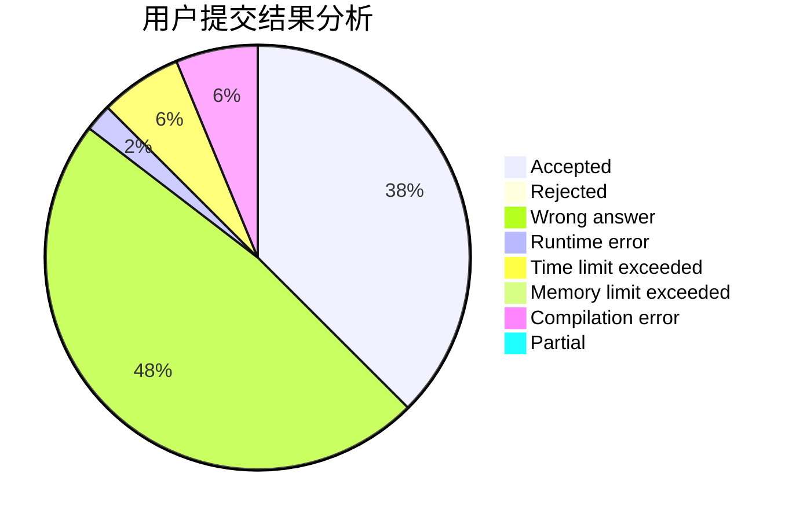
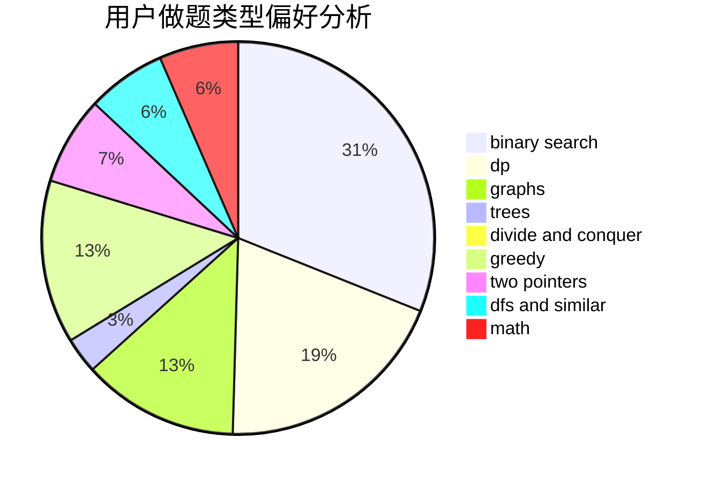

# sd542927172

<!-- tabs:start -->

#### **用户提交结果分析**

#### **用户做题类型偏好分析**

<!-- tabs:end -->
# 推荐题目
[833A](https://codeforces.com/contest/833/problem/A)
[442B](https://codeforces.com/contest/442/problem/B)
[285E](https://codeforces.com/contest/285/problem/E)
[914H](https://codeforces.com/contest/914/problem/H)
[567F](https://codeforces.com/contest/567/problem/F)
[659G](https://codeforces.com/contest/659/problem/G)
[1209F](https://codeforces.com/contest/1209/problem/F)
[193D](https://codeforces.com/contest/193/problem/D)
[13B](https://codeforces.com/contest/13/problem/B)
[1059D](https://codeforces.com/contest/1059/problem/D)
