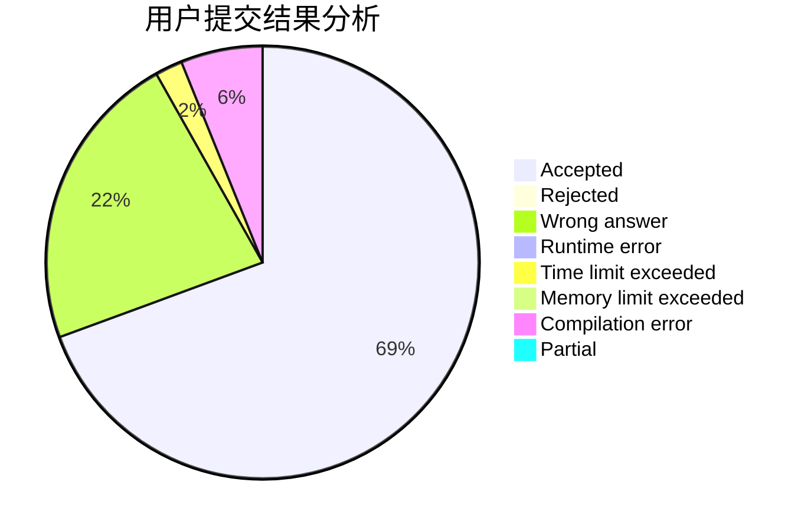
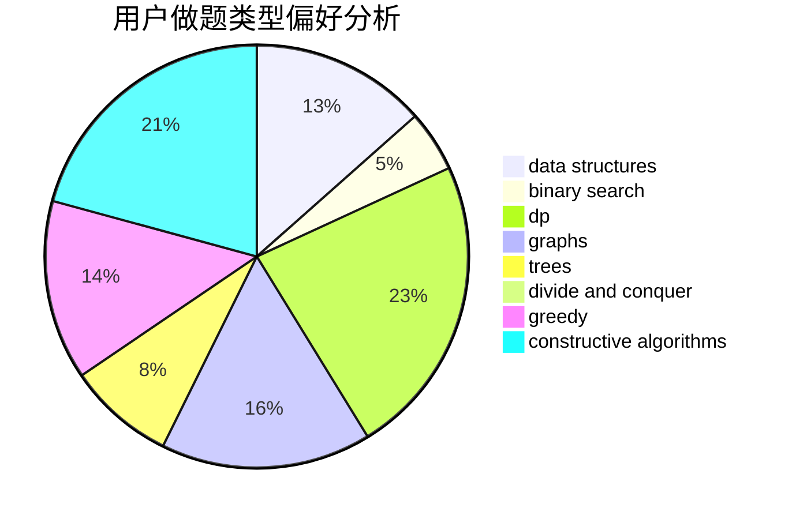
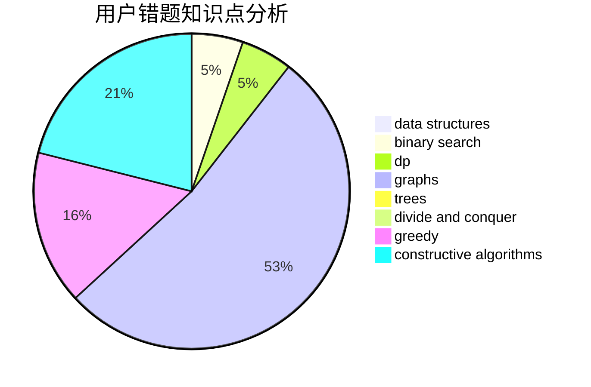

# CCWUCMCTS

<!-- tabs:start -->

#### **用户提交结果分析**

#### **用户做题类型偏好分析**

#### **用户错题知识点分析**

<!-- tabs:end -->
# 推荐题目
[1466I](https://codeforces.com/contest/1466/problem/I)		binary search,
                        data structures,
                        data structures,
                        interactive		  
[1098D](https://codeforces.com/contest/1098/problem/D)		data structures		  
[1477C](https://codeforces.com/contest/1477/problem/C)		constructive algorithms,
                        geometry,
                        greedy,
                        math,
                        sortings		  
[1238E](https://codeforces.com/contest/1238/problem/E)		bitmasks,
                        dp		  
[593D](https://codeforces.com/contest/593/problem/D)		data structures,
                        dfs and similar,
                        graphs,
                        math,
                        trees		  
[591D](https://codeforces.com/contest/591/problem/D)		dsu,graphs,sortings,trees		  
[1157D](https://codeforces.com/contest/1157/problem/D)		constructive algorithms,
                        greedy,
                        math		  
[591C](https://codeforces.com/contest/591/problem/C)		dsu,graphs,sortings,trees		  
[1095C](https://codeforces.com/contest/1095/problem/C)		bitmasks,
                        greedy		  
[1132D](https://codeforces.com/contest/1132/problem/D)		binary search,
                        greedy		  
