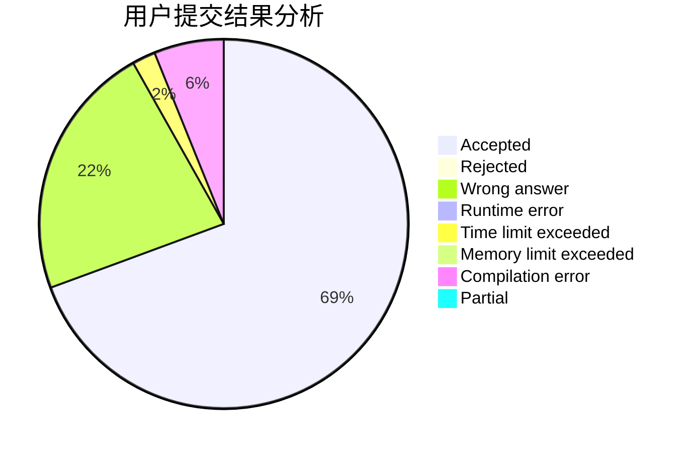
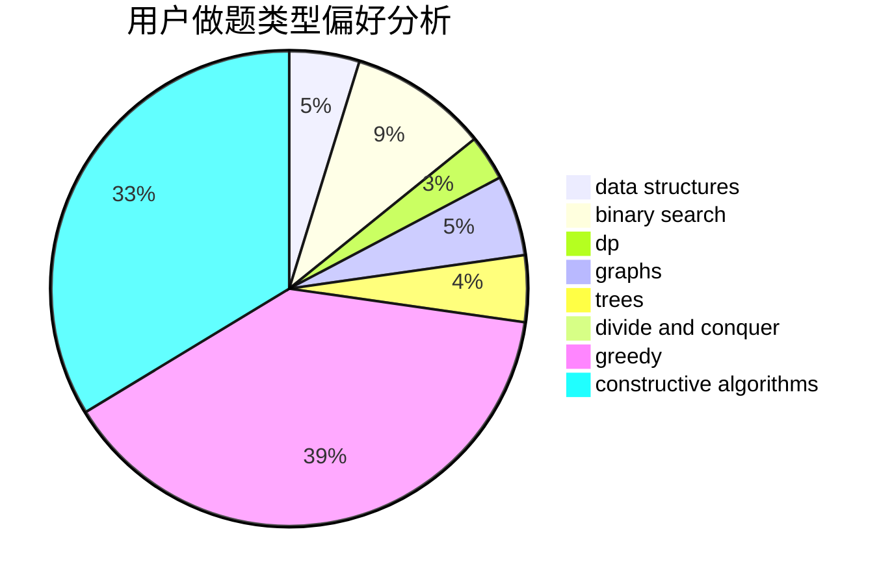
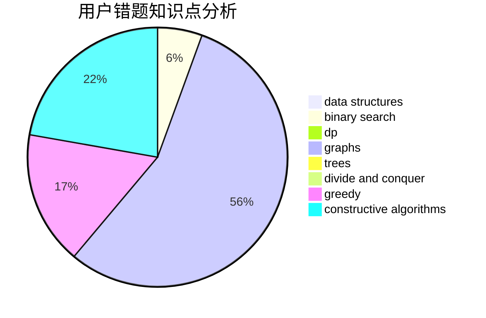

# CCWUCMCTS

<!-- tabs:start -->

#### **用户提交结果分析**

#### **用户做题类型偏好分析**

#### **用户错题知识点分析**

<!-- tabs:end -->
# 推荐题目
[1474B](https://codeforces.com/contest/1474/problem/B)		binary search,
                        constructive algorithms,
                        greedy,
                        math,
                        number theory		  
[1099A](https://codeforces.com/contest/1099/problem/A)		implementation		  
[14862](https://codeforces.com/contest/1486/problem/2)		dsu,graphs,sortings,trees		  
[1243E](https://codeforces.com/contest/1243/problem/E)		dsu,graphs,sortings,trees		  
[612A](https://codeforces.com/contest/612/problem/A)		brute force,
                        implementation,
                        strings		  
[611B](https://codeforces.com/contest/611/problem/B)		bitmasks,
                        brute force,
                        implementation		  
[1159F](https://codeforces.com/contest/1159/problem/F)		dsu,graphs,sortings,trees		  
[611A](https://codeforces.com/contest/611/problem/A)		implementation		  
[1095F](https://codeforces.com/contest/1095/problem/F)		dsu,
                        graphs,
                        greedy		  
[1136C](https://codeforces.com/contest/1136/problem/C)		constructive algorithms,
                        sortings		  
