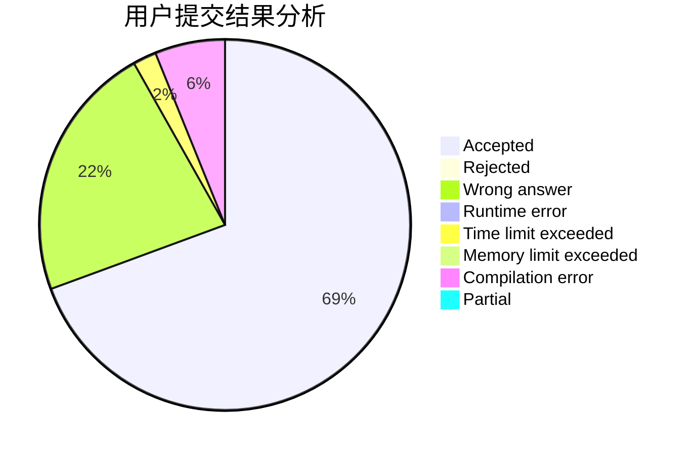
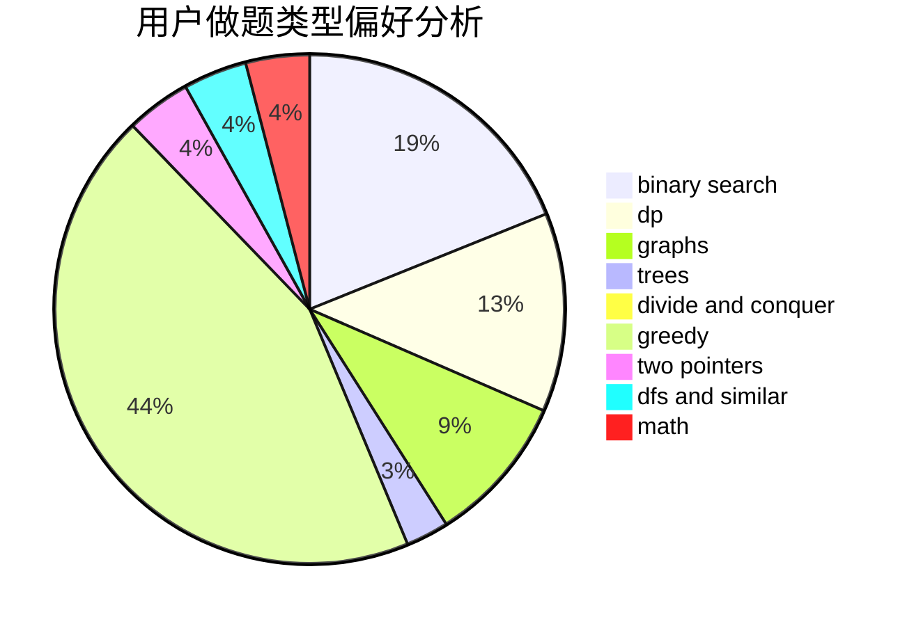

# CCWUCMCTS

<!-- tabs:start -->

#### **用户提交结果分析**

#### **用户做题类型偏好分析**

<!-- tabs:end -->
# 推荐题目
[1474B](https://codeforces.com/contest/1474/problem/B)
[1099A](https://codeforces.com/contest/1099/problem/A)
[14862](https://codeforces.com/contest/1486/problem/2)
[1243E](https://codeforces.com/contest/1243/problem/E)
[612A](https://codeforces.com/contest/612/problem/A)
[611B](https://codeforces.com/contest/611/problem/B)
[1159F](https://codeforces.com/contest/1159/problem/F)
[611A](https://codeforces.com/contest/611/problem/A)
[1095F](https://codeforces.com/contest/1095/problem/F)
[1136C](https://codeforces.com/contest/1136/problem/C)
