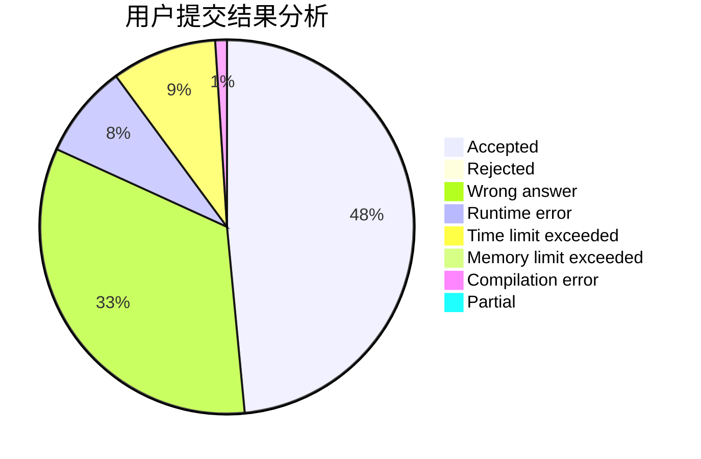
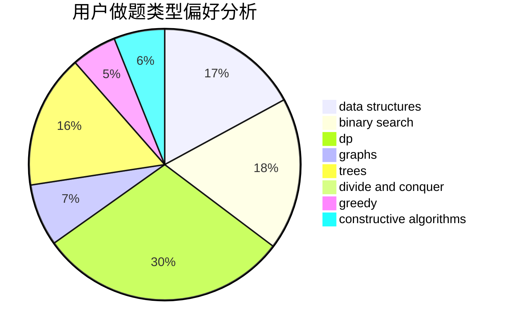
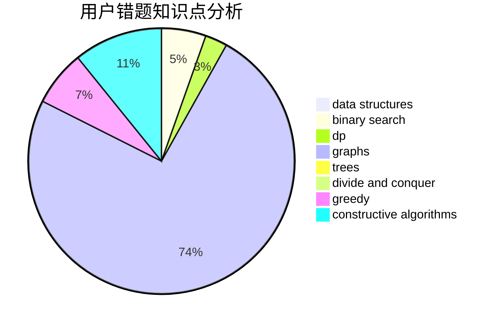

# sdcgvhgj

<!-- tabs:start -->

#### **用户提交结果分析**

#### **用户做题类型偏好分析**

#### **用户错题知识点分析**

<!-- tabs:end -->
# 推荐题目
[75D](https://codeforces.com/contest/75/problem/D)		data structures,
                        dp,
                        greedy,
                        implementation,
                        math,
                        trees		  
[277E](https://codeforces.com/contest/277/problem/E)		flows,
                        trees		  
[1194D](https://codeforces.com/contest/1194/problem/D)		games,
                        math		  
[264E](https://codeforces.com/contest/264/problem/E)		data structures,
                        dp		  
[734D](https://codeforces.com/contest/734/problem/D)		implementation		  
[1359F](https://codeforces.com/contest/1359/problem/F)		binary search,
                        brute force,
                        data structures,
                        geometry,
                        math		  
[1355A](https://codeforces.com/contest/1355/problem/A)		brute force,
                        implementation,
                        math		  
[1085A](https://codeforces.com/contest/1085/problem/A)		implementation,
                        strings		  
[755F](https://codeforces.com/contest/755/problem/F)		bitmasks,
                        dp,
                        greedy		  
[1091F](https://codeforces.com/contest/1091/problem/F)		constructive algorithms,
                        greedy		  
