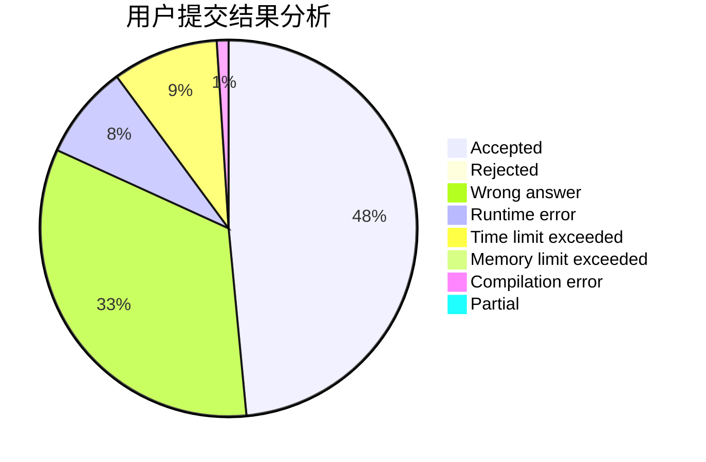
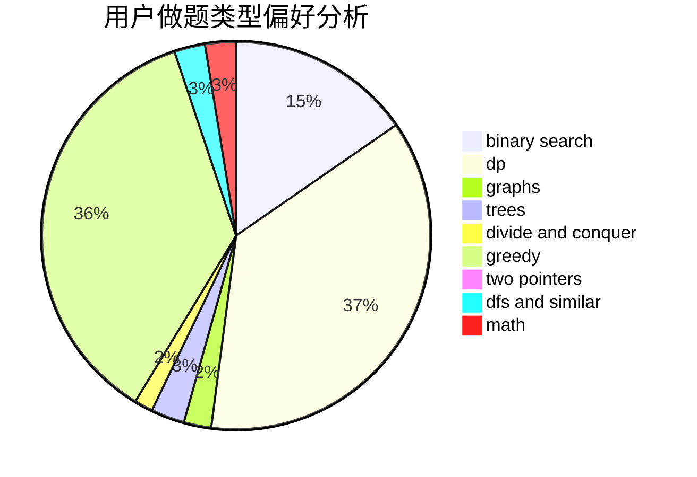

# sdcgvhgj

<!-- tabs:start -->

#### **用户提交结果分析**

#### **用户做题类型偏好分析**

<!-- tabs:end -->
# 推荐题目
[77B](https://codeforces.com/contest/77/problem/B)
[293A](https://codeforces.com/contest/293/problem/A)
[1198F](https://codeforces.com/contest/1198/problem/F)
[280E](https://codeforces.com/contest/280/problem/E)
[755C](https://codeforces.com/contest/755/problem/C)
[1367E](https://codeforces.com/contest/1367/problem/E)
[1361E](https://codeforces.com/contest/1361/problem/E)
[1085F](https://codeforces.com/contest/1085/problem/F)
[774C](https://codeforces.com/contest/774/problem/C)
[10921](https://codeforces.com/contest/1092/problem/1)
