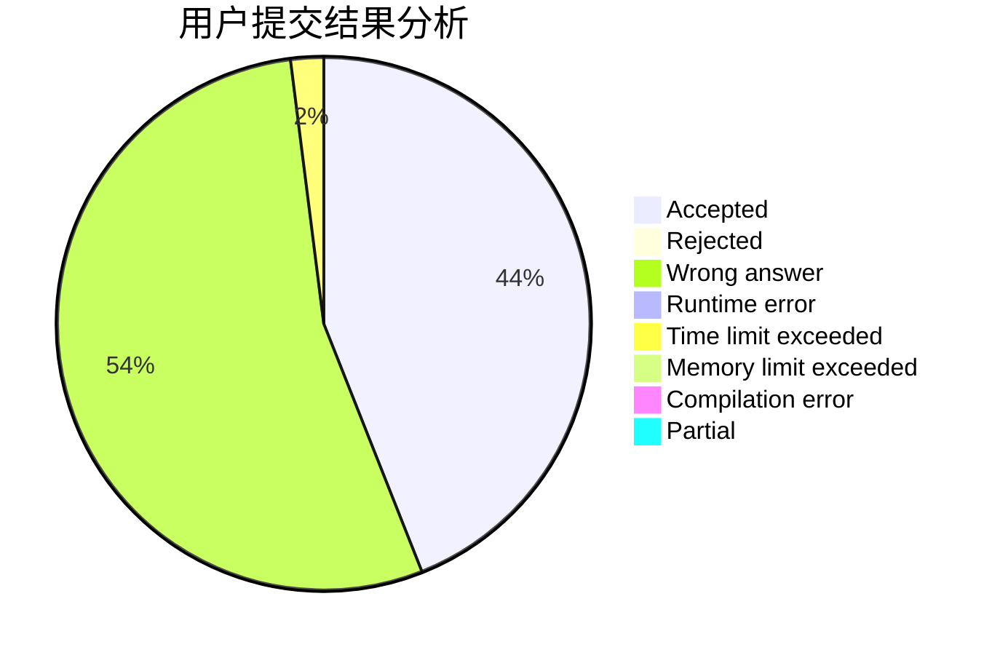
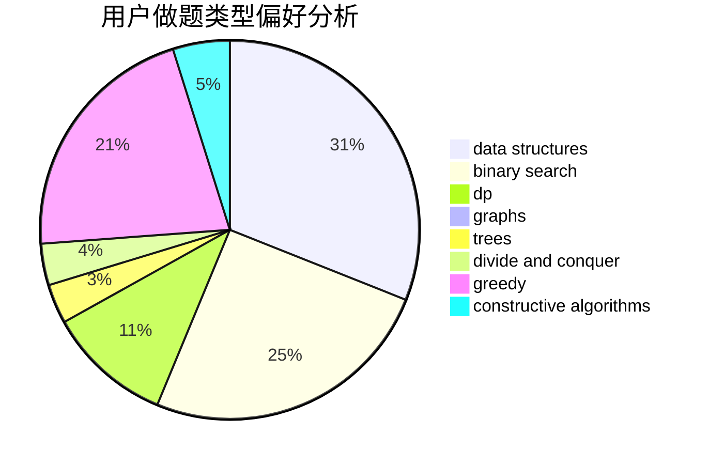

# sdfz171047

<!-- tabs:start -->

#### **用户提交结果分析**

#### **用户做题类型偏好分析**

#### **用户错题知识点分析**

<!-- tabs:end -->
# 推荐题目
[1253D](https://codeforces.com/contest/1253/problem/D)		constructive algorithms,
                        dfs and similar,
                        dsu,
                        graphs,
                        greedy,
                        sortings		  
[683A](https://codeforces.com/contest/683/problem/A)		*special problem,
                        geometry		  
[165D](https://codeforces.com/contest/165/problem/D)		data structures,
                        dsu,
                        trees		  
[343A](https://codeforces.com/contest/343/problem/A)		math,
                        number theory		  
[52B](https://codeforces.com/contest/52/problem/B)		combinatorics		  
[269B](https://codeforces.com/contest/269/problem/B)		dp		  
[842D](https://codeforces.com/contest/842/problem/D)		binary search,
                        data structures		  
[1380E](https://codeforces.com/contest/1380/problem/E)		data structures,
                        dsu,
                        implementation,
                        trees		  
[1227B](https://codeforces.com/contest/1227/problem/B)		constructive algorithms		  
[954B](https://codeforces.com/contest/954/problem/B)		implementation,
                        strings		  
