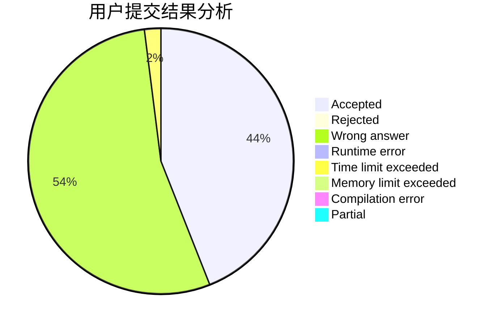
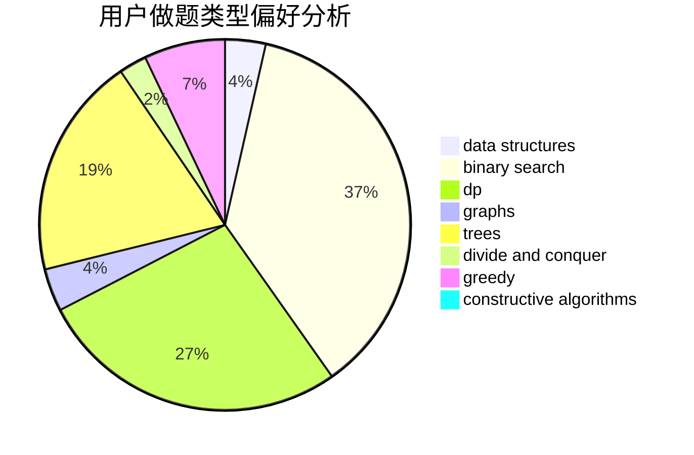

# sdfz171047

<!-- tabs:start -->

#### **用户提交结果分析**

#### **用户做题类型偏好分析**

#### **用户错题知识点分析**

<!-- tabs:end -->
# 推荐题目
[1260F](https://codeforces.com/contest/1260/problem/F)		data structures,
                        trees		  
[707B](https://codeforces.com/contest/707/problem/B)		graphs		  
[190C](https://codeforces.com/contest/190/problem/C)		dfs and similar		  
[36B](https://codeforces.com/contest/36/problem/B)		implementation		  
[553C](https://codeforces.com/contest/553/problem/C)		dfs and similar,
                        dsu,
                        graphs		  
[284E](https://codeforces.com/contest/284/problem/E)		dsu,graphs,sortings,trees		  
[861C](https://codeforces.com/contest/861/problem/C)		dsu,graphs,sortings,trees		  
[138C](https://codeforces.com/contest/138/problem/C)		binary search,
                        data structures,
                        probabilities,
                        sortings		  
[1234F](https://codeforces.com/contest/1234/problem/F)		bitmasks,
                        dp		  
[976A](https://codeforces.com/contest/976/problem/A)		implementation		  
