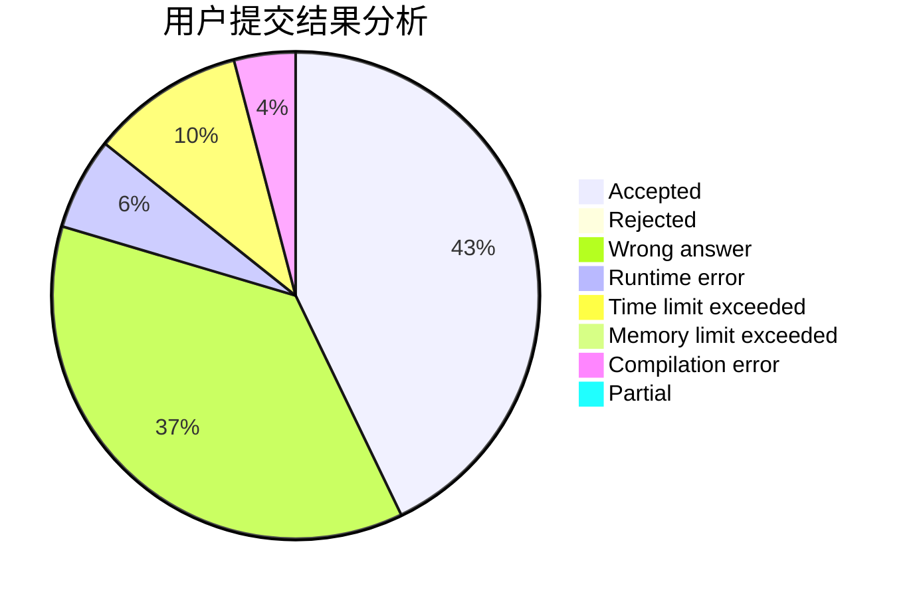
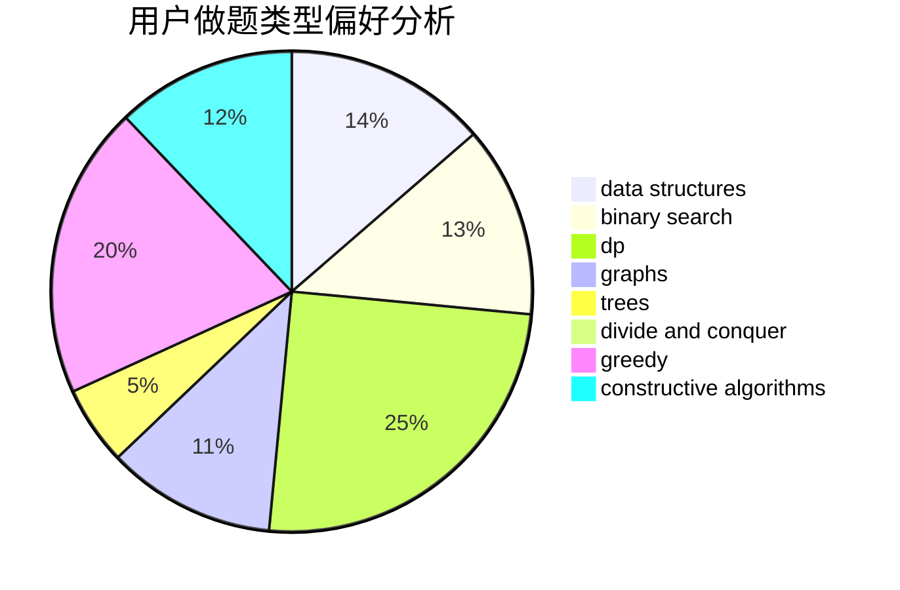
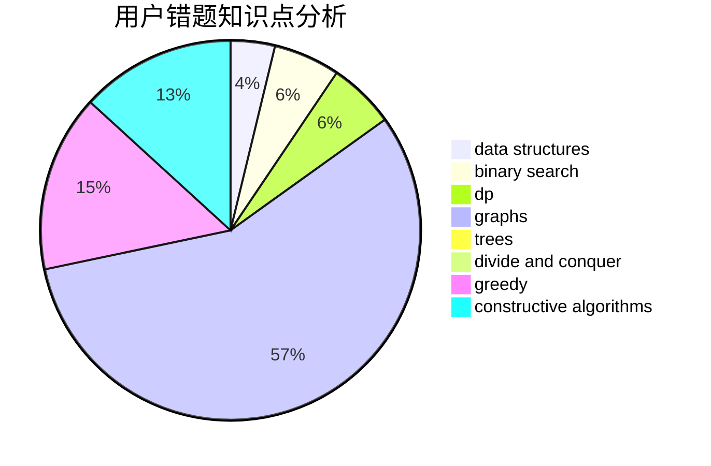

# sdhyabc

<!-- tabs:start -->

#### **用户提交结果分析**

#### **用户做题类型偏好分析**

#### **用户错题知识点分析**

<!-- tabs:end -->
# 推荐题目
[906D](https://codeforces.com/contest/906/problem/D)		chinese remainder theorem,
                        math,
                        number theory		  
[1038E](https://codeforces.com/contest/1038/problem/E)		bitmasks,
                        brute force,
                        dfs and similar,
                        dp,
                        graphs		  
[492C](https://codeforces.com/contest/492/problem/C)		greedy,
                        sortings		  
[1321A](https://codeforces.com/contest/1321/problem/A)		greedy		  
[998E](https://codeforces.com/contest/998/problem/E)		dsu,graphs,sortings,trees		  
[861A](https://codeforces.com/contest/861/problem/A)		dsu,graphs,sortings,trees		  
[767D](https://codeforces.com/contest/767/problem/D)		binary search,
                        data structures,
                        greedy,
                        sortings,
                        two pointers		  
[1225A](https://codeforces.com/contest/1225/problem/A)		math		  
[1214C](https://codeforces.com/contest/1214/problem/C)		data structures,
                        greedy		  
[59A](https://codeforces.com/contest/59/problem/A)		implementation,
                        strings		  
