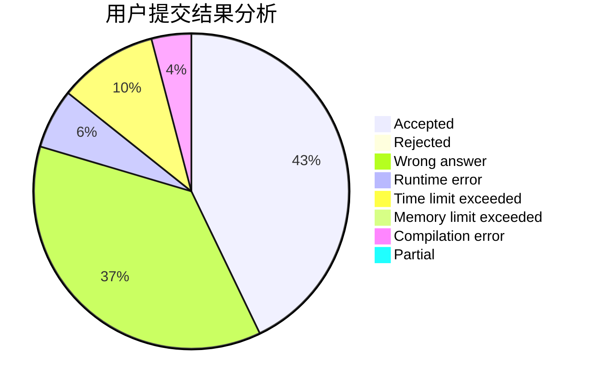
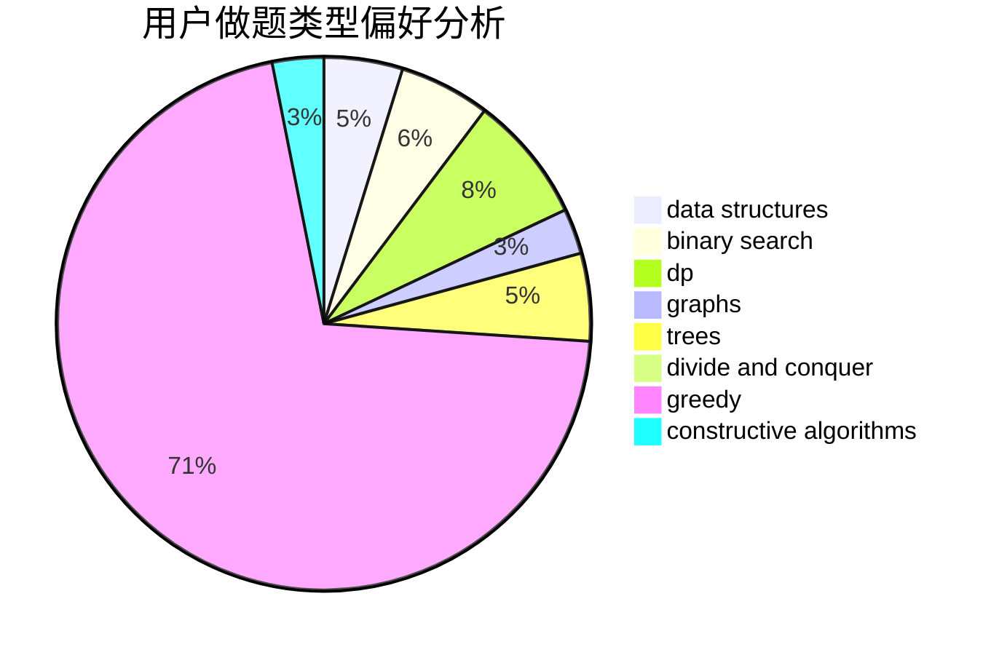
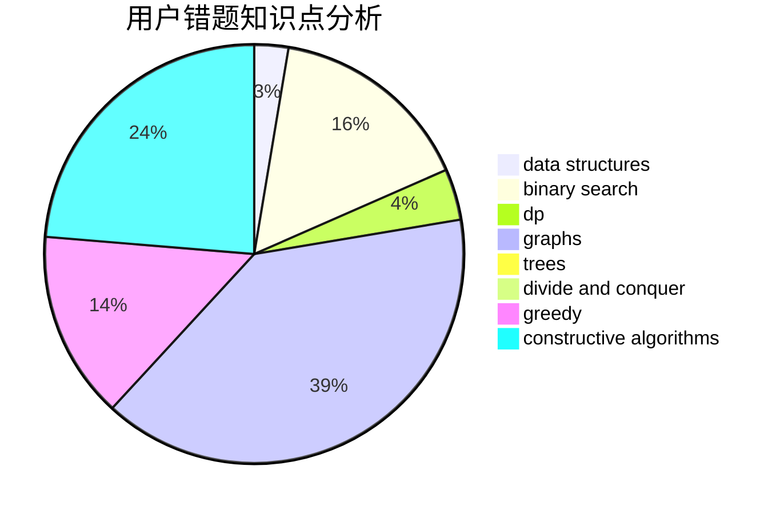

# sdhyabc

<!-- tabs:start -->

#### **用户提交结果分析**

#### **用户做题类型偏好分析**

#### **用户错题知识点分析**

<!-- tabs:end -->
# 推荐题目
[887C](https://codeforces.com/contest/887/problem/C)		brute force,
                        implementation		  
[1038B](https://codeforces.com/contest/1038/problem/B)		constructive algorithms,
                        math		  
[474B](https://codeforces.com/contest/474/problem/B)		binary search,
                        implementation		  
[1311E](https://codeforces.com/contest/1311/problem/E)		brute force,
                        constructive algorithms,
                        trees		  
[983A](https://codeforces.com/contest/983/problem/A)		implementation,
                        math		  
[842B](https://codeforces.com/contest/842/problem/B)		geometry		  
[748C](https://codeforces.com/contest/748/problem/C)		constructive algorithms,
                        math		  
[1217D](https://codeforces.com/contest/1217/problem/D)		constructive algorithms,
                        dfs and similar,
                        graphs		  
[1208F](https://codeforces.com/contest/1208/problem/F)		bitmasks,
                        dfs and similar,
                        dp,
                        greedy		  
[578D](https://codeforces.com/contest/578/problem/D)		dp,
                        greedy		  
