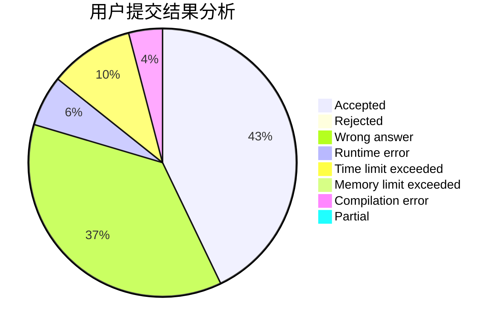
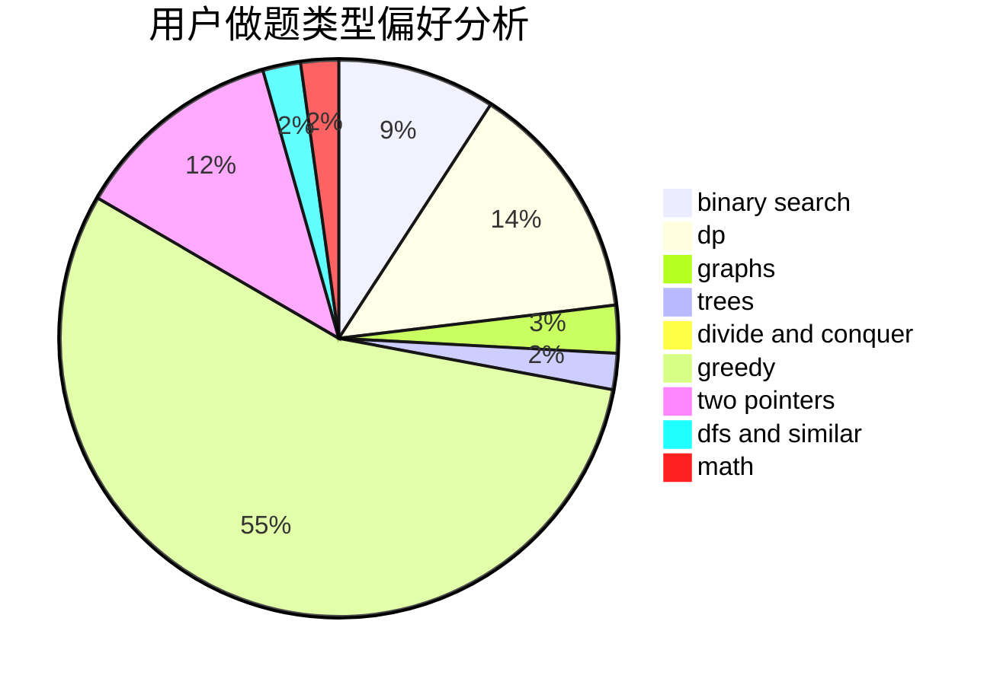

# sdhyabc

<!-- tabs:start -->

#### **用户提交结果分析**

#### **用户做题类型偏好分析**

<!-- tabs:end -->
# 推荐题目
[906D](https://codeforces.com/contest/906/problem/D)
[1038E](https://codeforces.com/contest/1038/problem/E)
[492C](https://codeforces.com/contest/492/problem/C)
[1321A](https://codeforces.com/contest/1321/problem/A)
[998E](https://codeforces.com/contest/998/problem/E)
[861A](https://codeforces.com/contest/861/problem/A)
[767D](https://codeforces.com/contest/767/problem/D)
[1225A](https://codeforces.com/contest/1225/problem/A)
[1214C](https://codeforces.com/contest/1214/problem/C)
[59A](https://codeforces.com/contest/59/problem/A)
