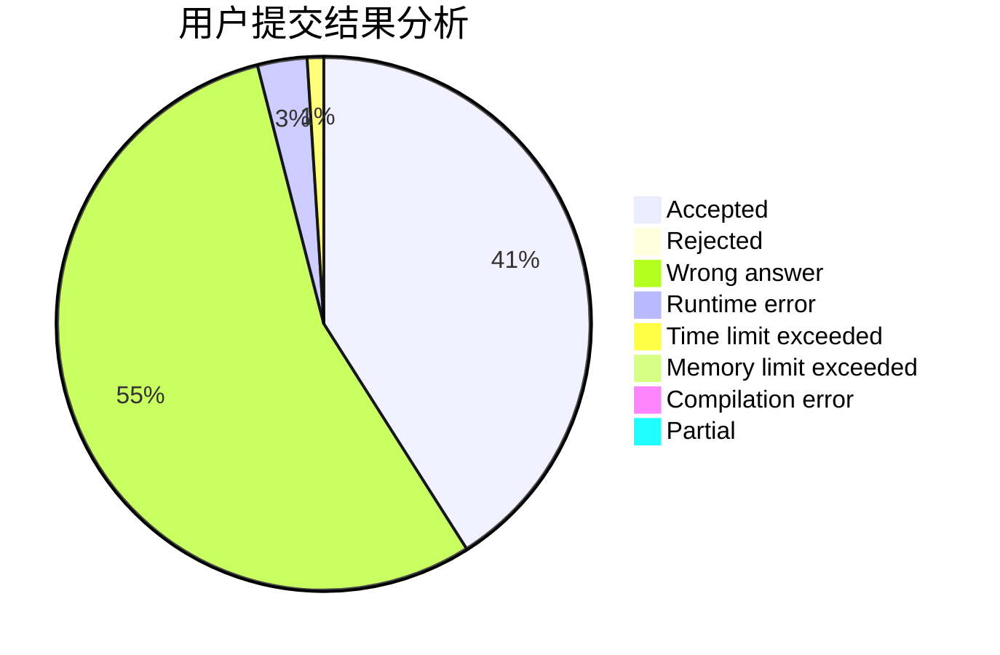
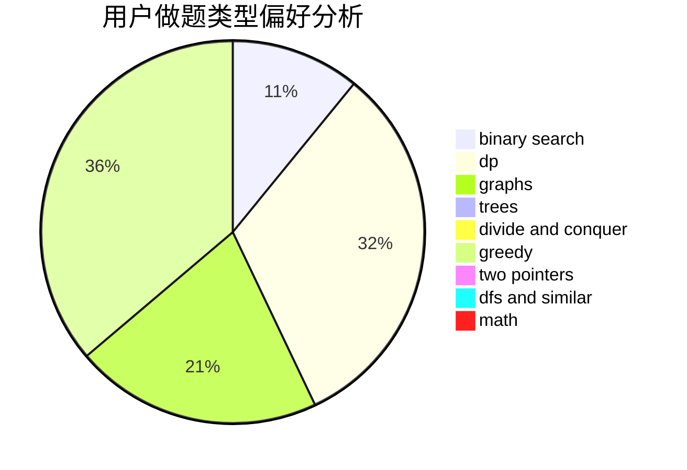

# sdlyswr

<!-- tabs:start -->

#### **用户提交结果分析**

#### **用户做题类型偏好分析**

<!-- tabs:end -->
# 推荐题目
[360D](https://codeforces.com/contest/360/problem/D)
[746C](https://codeforces.com/contest/746/problem/C)
[199B](https://codeforces.com/contest/199/problem/B)
[934A](https://codeforces.com/contest/934/problem/A)
[1491F](https://codeforces.com/contest/1491/problem/F)
[139A](https://codeforces.com/contest/139/problem/A)
[877A](https://codeforces.com/contest/877/problem/A)
[863C](https://codeforces.com/contest/863/problem/C)
[1031D](https://codeforces.com/contest/1031/problem/D)
[506C](https://codeforces.com/contest/506/problem/C)
