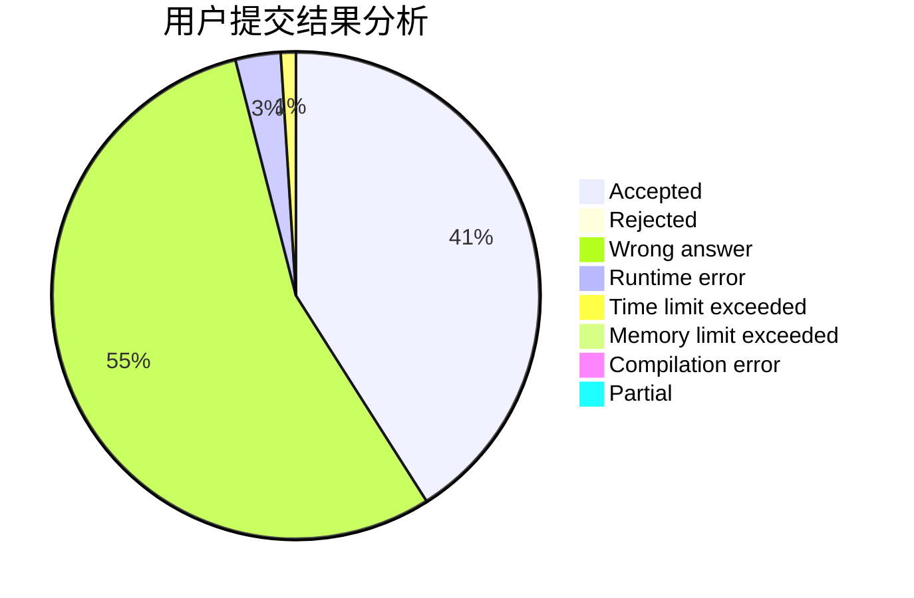
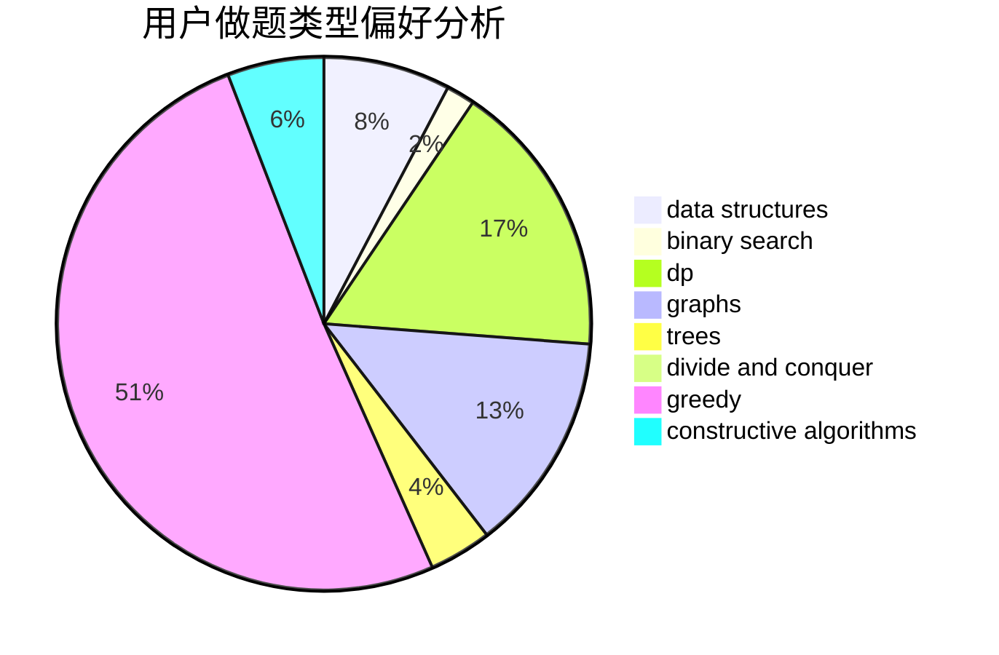
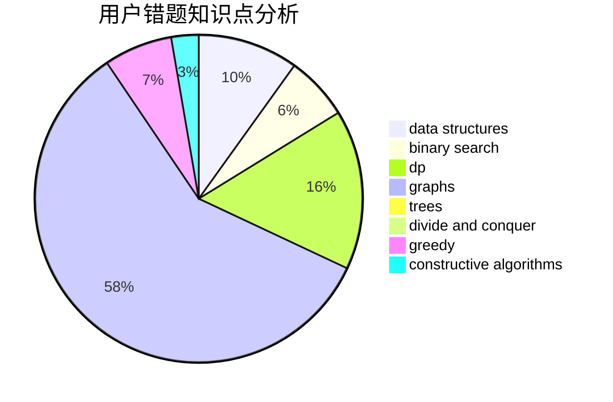

# sdlyswr

<!-- tabs:start -->

#### **用户提交结果分析**

#### **用户做题类型偏好分析**

#### **用户错题知识点分析**

<!-- tabs:end -->
# 推荐题目
[334B](https://codeforces.com/contest/334/problem/B)		sortings		  
[729C](https://codeforces.com/contest/729/problem/C)		binary search,
                        greedy,
                        sortings		  
[171E](https://codeforces.com/contest/171/problem/E)		*special problem		  
[914E](https://codeforces.com/contest/914/problem/E)		bitmasks,
                        data structures,
                        divide and conquer,
                        trees		  
[1484B](https://codeforces.com/contest/1484/problem/B)		dsu,graphs,sortings,trees		  
[1391C](https://codeforces.com/contest/1391/problem/C)		combinatorics,
                        dp,
                        graphs,
                        math		  
[859C](https://codeforces.com/contest/859/problem/C)		dp,
                        games		  
[845B](https://codeforces.com/contest/845/problem/B)		brute force,
                        greedy,
                        implementation		  
[1031A](https://codeforces.com/contest/1031/problem/A)		implementation,
                        math		  
[485D](https://codeforces.com/contest/485/problem/D)		dsu,graphs,sortings,trees		  
