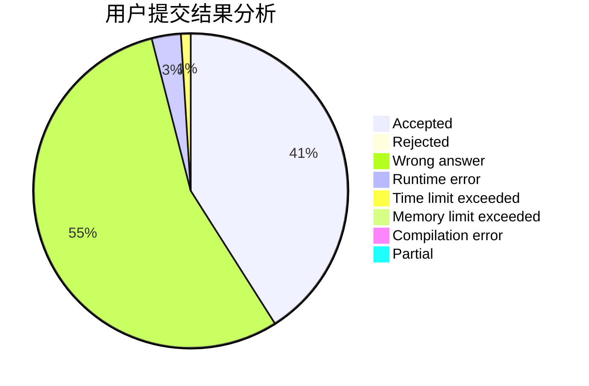
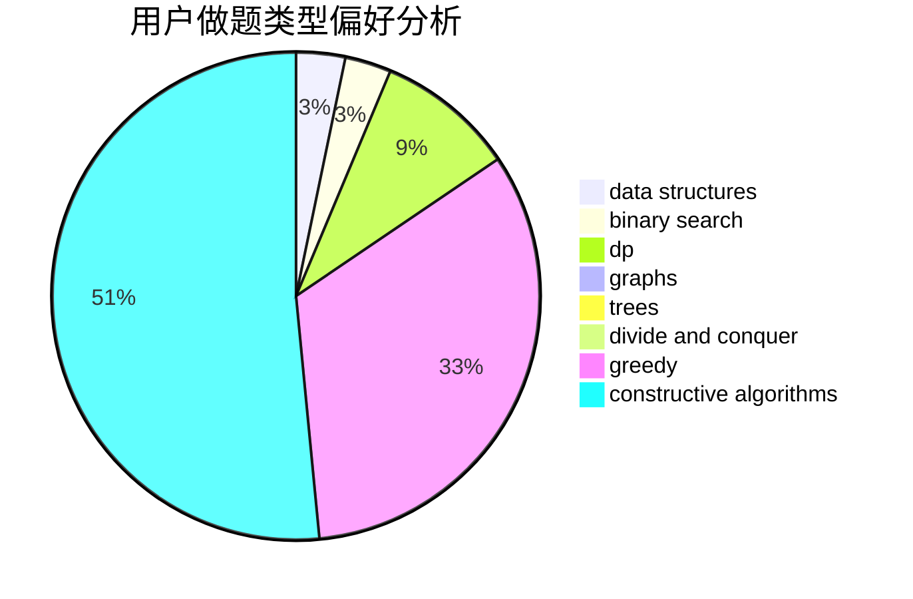
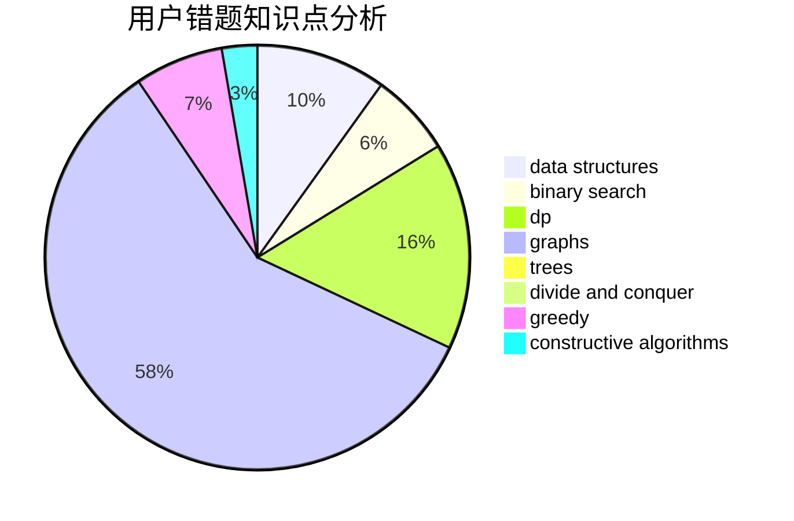

# sdlyswr

<!-- tabs:start -->

#### **用户提交结果分析**

#### **用户做题类型偏好分析**

#### **用户错题知识点分析**

<!-- tabs:end -->
# 推荐题目
[360D](https://codeforces.com/contest/360/problem/D)		number theory		  
[746C](https://codeforces.com/contest/746/problem/C)		constructive algorithms,
                        implementation,
                        math		  
[199B](https://codeforces.com/contest/199/problem/B)		geometry		  
[934A](https://codeforces.com/contest/934/problem/A)		brute force,
                        games		  
[1491F](https://codeforces.com/contest/1491/problem/F)		binary search,
                        constructive algorithms,
                        interactive		  
[139A](https://codeforces.com/contest/139/problem/A)		implementation		  
[877A](https://codeforces.com/contest/877/problem/A)		implementation,
                        strings		  
[863C](https://codeforces.com/contest/863/problem/C)		graphs,
                        implementation		  
[1031D](https://codeforces.com/contest/1031/problem/D)		greedy		  
[506C](https://codeforces.com/contest/506/problem/C)		dsu,graphs,sortings,trees		  
