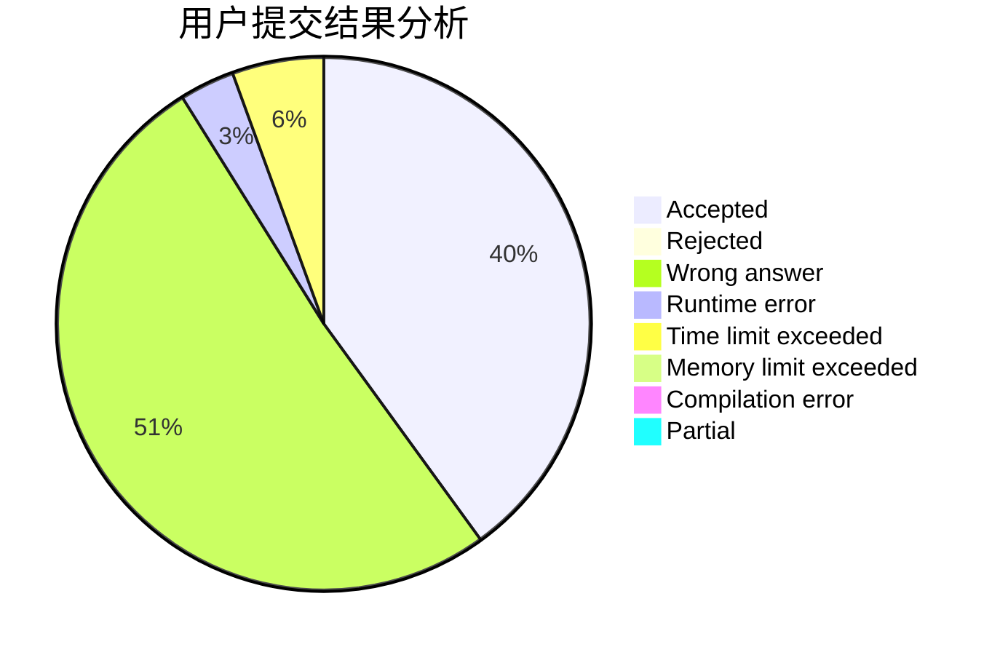
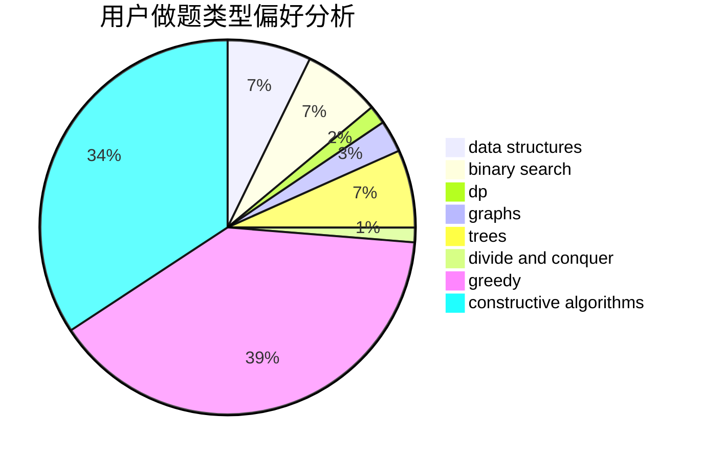
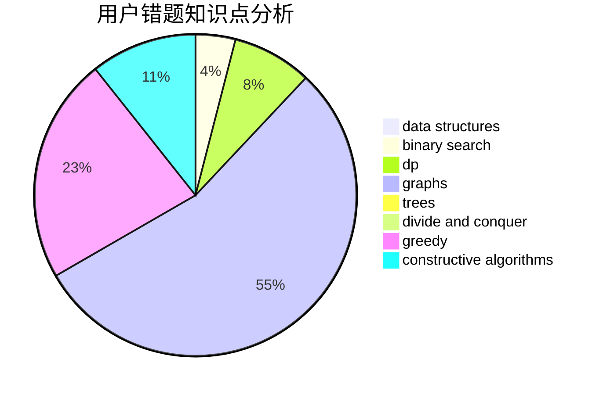

# sdu_lishuo

<!-- tabs:start -->

#### **用户提交结果分析**

#### **用户做题类型偏好分析**

#### **用户错题知识点分析**

<!-- tabs:end -->
# 推荐题目
[1101F](https://codeforces.com/contest/1101/problem/F)		binary search,
                        dp		  
[1040D](https://codeforces.com/contest/1040/problem/D)		dsu,graphs,sortings,trees		  
[957B](https://codeforces.com/contest/957/problem/B)		dsu,graphs,sortings,trees		  
[856F](https://codeforces.com/contest/856/problem/F)		greedy		  
[1339A](https://codeforces.com/contest/1339/problem/A)		brute force,
                        dp,
                        implementation,
                        math		  
[424B](https://codeforces.com/contest/424/problem/B)		binary search,
                        greedy,
                        implementation,
                        sortings		  
[1205E](https://codeforces.com/contest/1205/problem/E)		combinatorics,
                        strings		  
[1060A](https://codeforces.com/contest/1060/problem/A)		brute force		  
[1044D](https://codeforces.com/contest/1044/problem/D)		data structures,
                        dsu		  
[549C](https://codeforces.com/contest/549/problem/C)		games		  
