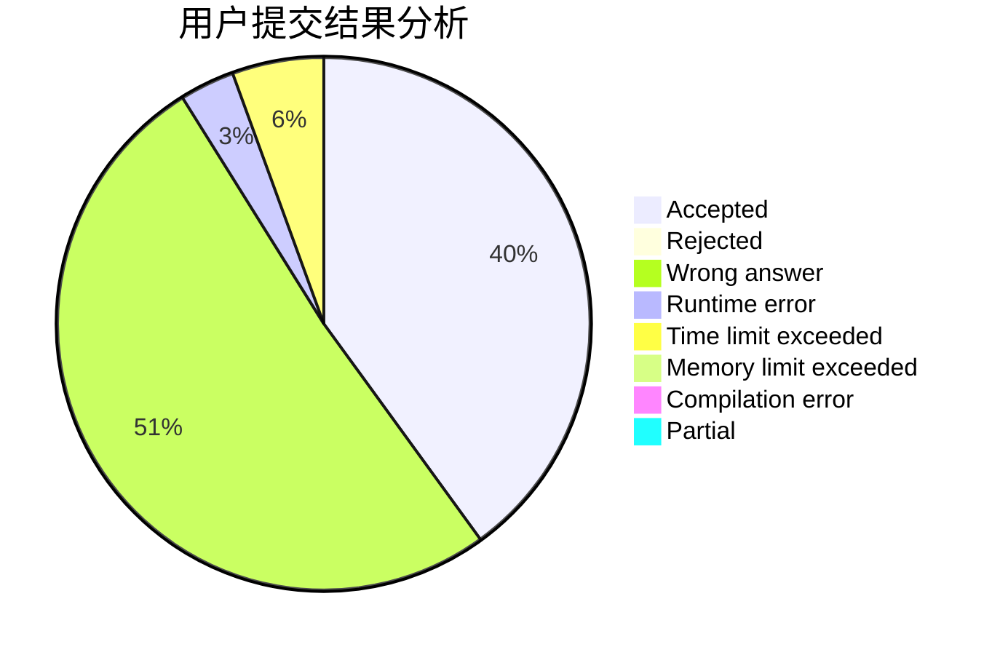
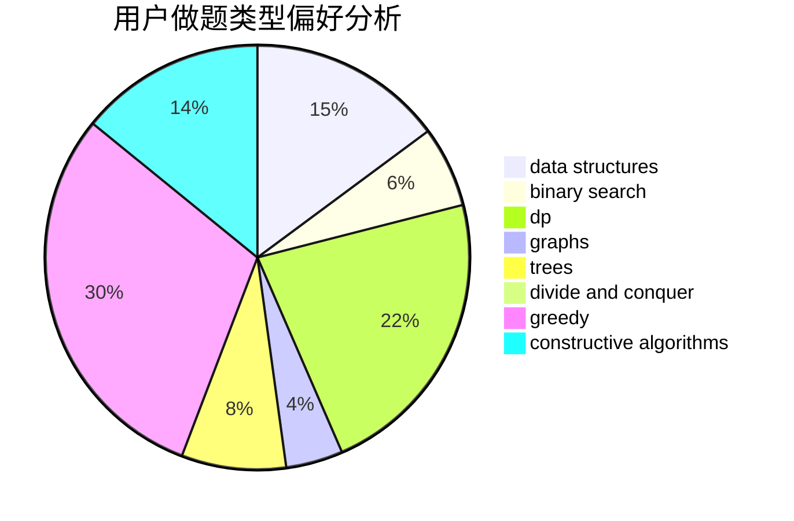
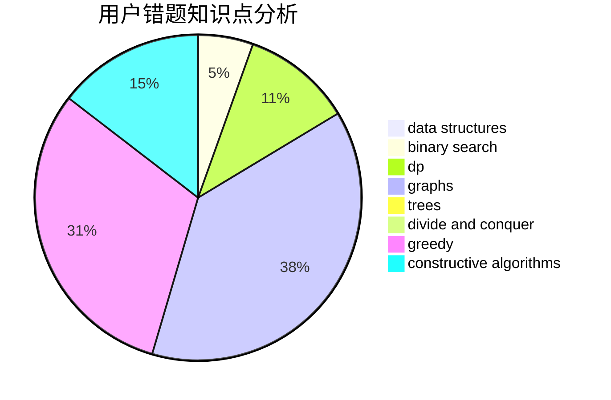

# sdu_lishuo

<!-- tabs:start -->

#### **用户提交结果分析**

#### **用户做题类型偏好分析**

#### **用户错题知识点分析**

<!-- tabs:end -->
# 推荐题目
[1102B](https://codeforces.com/contest/1102/problem/B)		greedy,
                        sortings		  
[1041C](https://codeforces.com/contest/1041/problem/C)		binary search,
                        data structures,
                        greedy,
                        two pointers		  
[978E](https://codeforces.com/contest/978/problem/E)		combinatorics,
                        math		  
[875F](https://codeforces.com/contest/875/problem/F)		dsu,
                        graphs,
                        greedy		  
[1346A](https://codeforces.com/contest/1346/problem/A)		*special problem,
                        math		  
[447A](https://codeforces.com/contest/447/problem/A)		implementation		  
[120H](https://codeforces.com/contest/120/problem/H)		graph matchings		  
[1060D](https://codeforces.com/contest/1060/problem/D)		greedy,
                        math		  
[1045E](https://codeforces.com/contest/1045/problem/E)		constructive algorithms,
                        geometry		  
[574B](https://codeforces.com/contest/574/problem/B)		brute force,
                        dfs and similar,
                        graphs,
                        hashing		  
