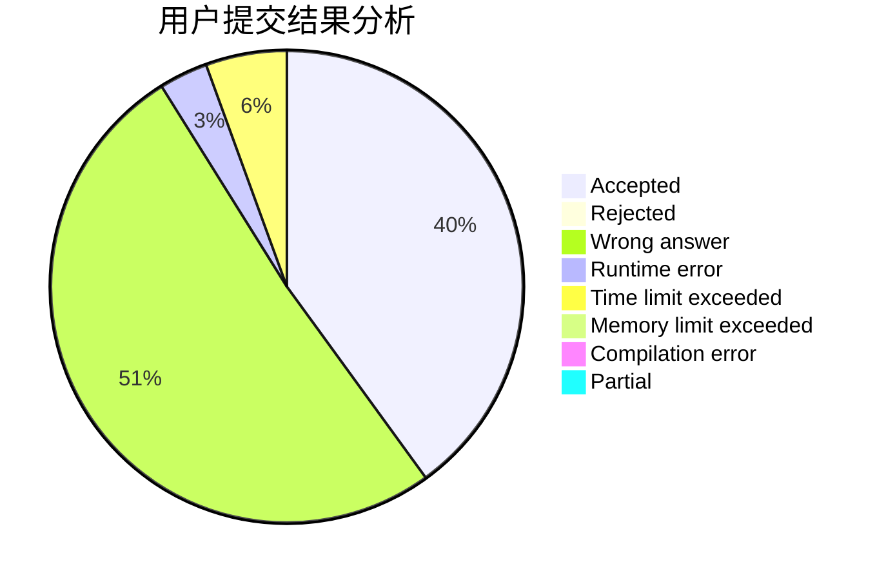
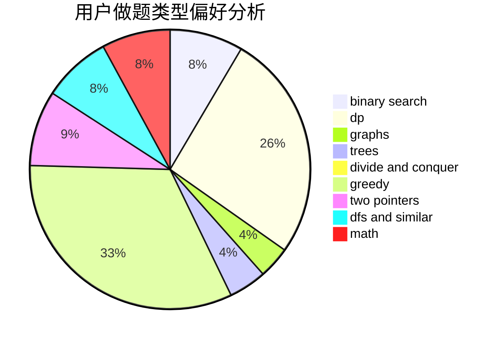

# sdu_lishuo

<!-- tabs:start -->

#### **用户提交结果分析**

#### **用户做题类型偏好分析**

<!-- tabs:end -->
# 推荐题目
[1102B](https://codeforces.com/contest/1102/problem/B)
[1041C](https://codeforces.com/contest/1041/problem/C)
[978E](https://codeforces.com/contest/978/problem/E)
[875F](https://codeforces.com/contest/875/problem/F)
[1346A](https://codeforces.com/contest/1346/problem/A)
[447A](https://codeforces.com/contest/447/problem/A)
[120H](https://codeforces.com/contest/120/problem/H)
[1060D](https://codeforces.com/contest/1060/problem/D)
[1045E](https://codeforces.com/contest/1045/problem/E)
[574B](https://codeforces.com/contest/574/problem/B)
