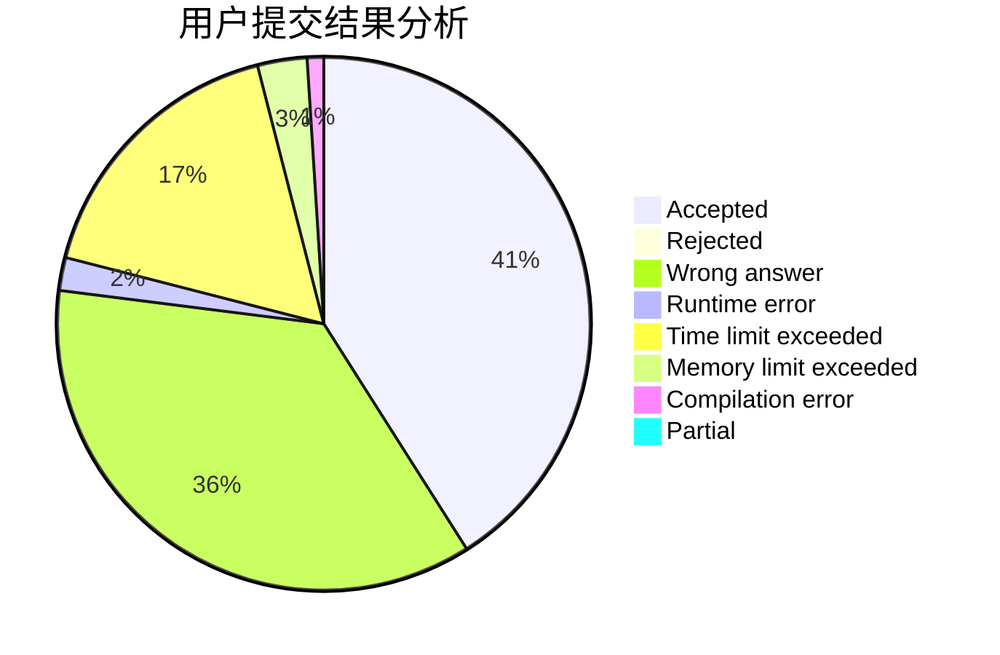
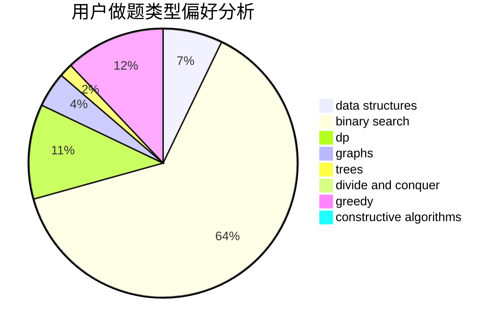

# seamoke

<!-- tabs:start -->

#### **用户提交结果分析**

#### **用户做题类型偏好分析**

#### **用户错题知识点分析**

<!-- tabs:end -->
# 推荐题目
[1424G](https://codeforces.com/contest/1424/problem/G)		data structures,
                        sortings		  
[1099F](https://codeforces.com/contest/1099/problem/F)		binary search,
                        data structures,
                        dfs and similar,
                        dp,
                        games,
                        trees		  
[1293C](https://codeforces.com/contest/1293/problem/C)		dsu,graphs,sortings,trees		  
[710D](https://codeforces.com/contest/710/problem/D)		math,
                        number theory		  
[949E](https://codeforces.com/contest/949/problem/E)		brute force		  
[828C](https://codeforces.com/contest/828/problem/C)		dsu,graphs,sortings,trees		  
[567B](https://codeforces.com/contest/567/problem/B)		implementation		  
[39F](https://codeforces.com/contest/39/problem/F)		implementation		  
[884F](https://codeforces.com/contest/884/problem/F)		flows,
                        graphs,
                        greedy		  
[1017B](https://codeforces.com/contest/1017/problem/B)		implementation,
                        math		  
