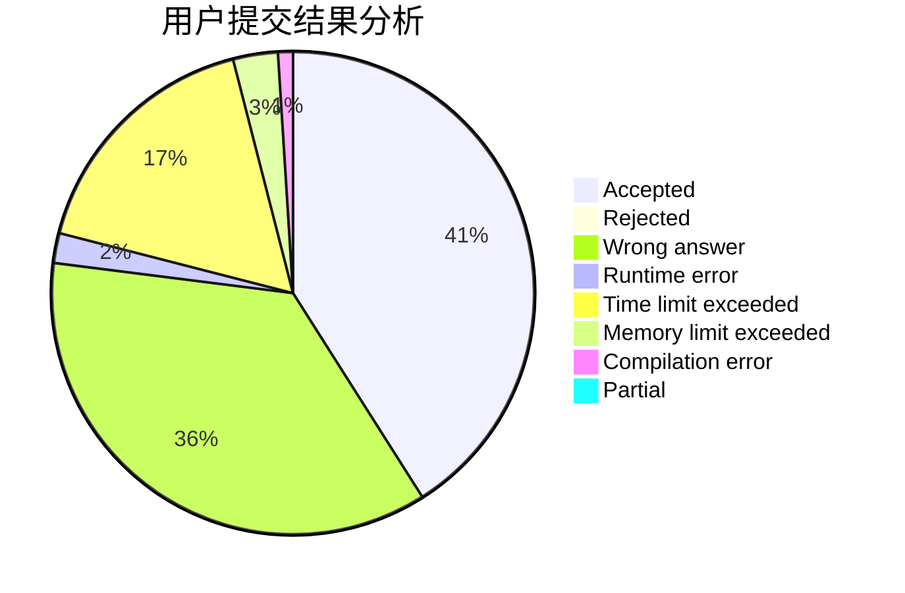
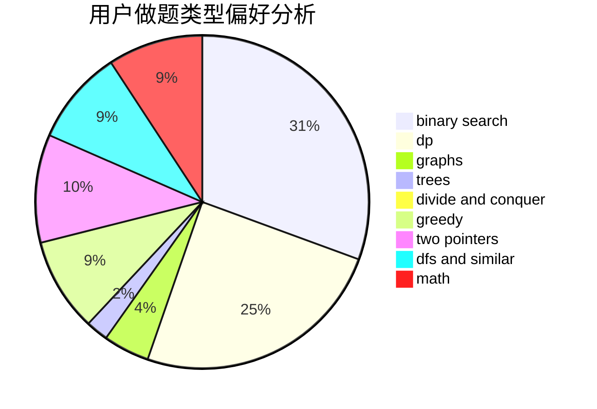

# seamoke

<!-- tabs:start -->

#### **用户提交结果分析**

#### **用户做题类型偏好分析**

<!-- tabs:end -->
# 推荐题目
[1424G](https://codeforces.com/contest/1424/problem/G)
[1099F](https://codeforces.com/contest/1099/problem/F)
[1293C](https://codeforces.com/contest/1293/problem/C)
[710D](https://codeforces.com/contest/710/problem/D)
[949E](https://codeforces.com/contest/949/problem/E)
[828C](https://codeforces.com/contest/828/problem/C)
[567B](https://codeforces.com/contest/567/problem/B)
[39F](https://codeforces.com/contest/39/problem/F)
[884F](https://codeforces.com/contest/884/problem/F)
[1017B](https://codeforces.com/contest/1017/problem/B)
