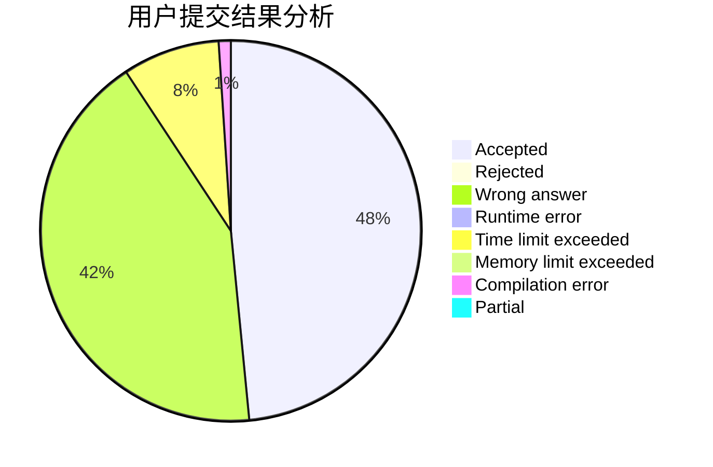
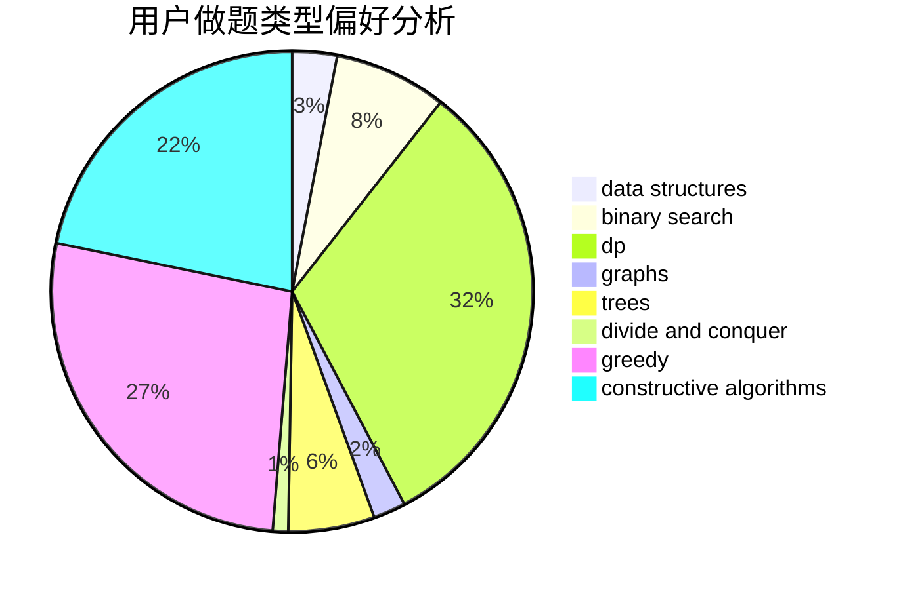
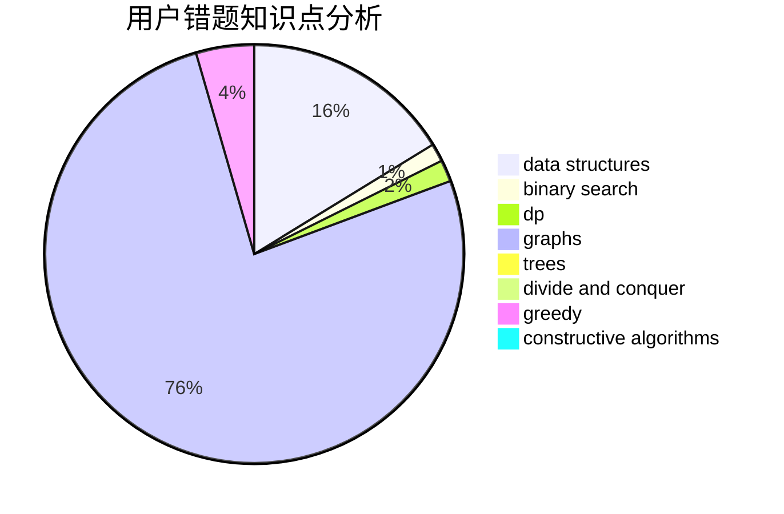

# semhhh

<!-- tabs:start -->

#### **用户提交结果分析**

#### **用户做题类型偏好分析**

#### **用户错题知识点分析**

<!-- tabs:end -->
# 推荐题目
[1452G](https://codeforces.com/contest/1452/problem/G)		data structures,
                        dfs and similar,
                        greedy,
                        trees		  
[497B](https://codeforces.com/contest/497/problem/B)		dsu,graphs,sortings,trees		  
[816B](https://codeforces.com/contest/816/problem/B)		binary search,
                        data structures,
                        implementation		  
[733A](https://codeforces.com/contest/733/problem/A)		implementation		  
[468E](https://codeforces.com/contest/468/problem/E)		dp,
                        graph matchings,
                        math,
                        meet-in-the-middle		  
[39B](https://codeforces.com/contest/39/problem/B)		greedy		  
[1334F](https://codeforces.com/contest/1334/problem/F)		binary search,
                        data structures,
                        dp,
                        greedy		  
[714B](https://codeforces.com/contest/714/problem/B)		implementation,
                        sortings		  
[501C](https://codeforces.com/contest/501/problem/C)		constructive algorithms,
                        data structures,
                        greedy,
                        sortings,
                        trees		  
[297C](https://codeforces.com/contest/297/problem/C)		constructive algorithms		  
