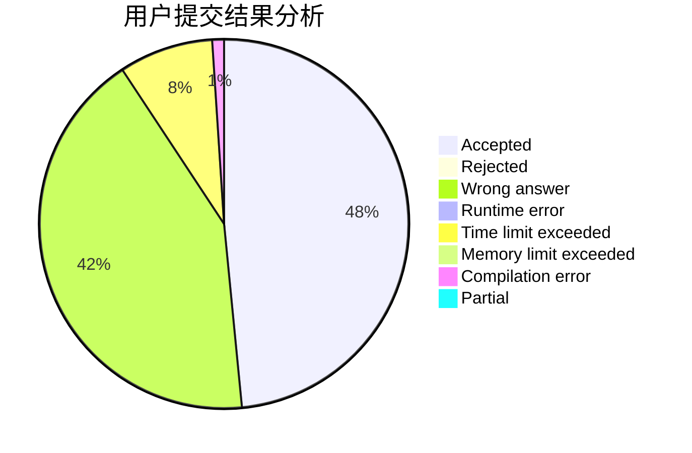
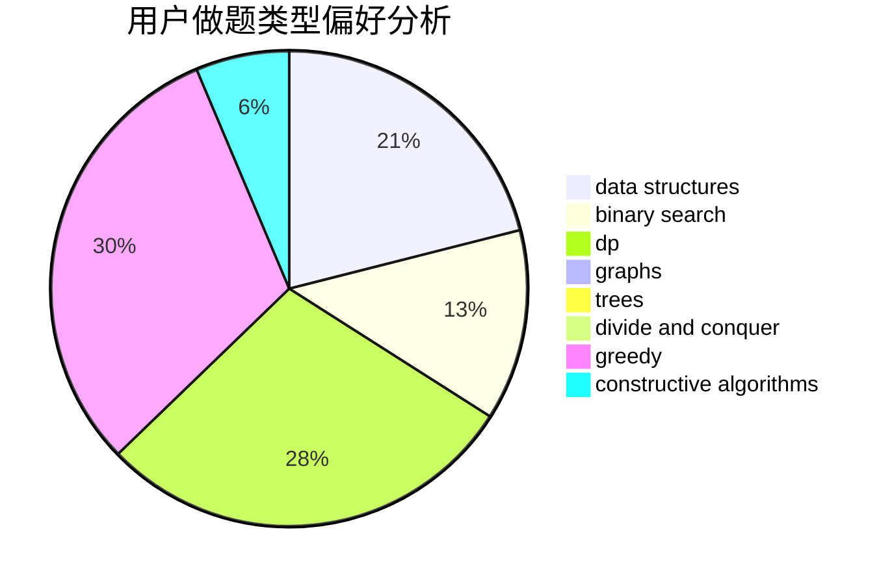
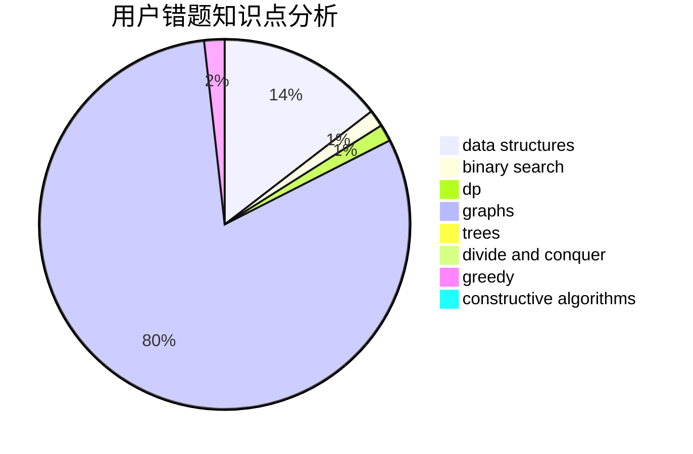

# semhhh

<!-- tabs:start -->

#### **用户提交结果分析**

#### **用户做题类型偏好分析**

#### **用户错题知识点分析**

<!-- tabs:end -->
# 推荐题目
[1462B](https://codeforces.com/contest/1462/problem/B)		dp,
                        implementation,
                        strings		  
[516C](https://codeforces.com/contest/516/problem/C)		dsu,graphs,sortings,trees		  
[835C](https://codeforces.com/contest/835/problem/C)		dp,
                        implementation		  
[750F](https://codeforces.com/contest/750/problem/F)		constructive algorithms,
                        implementation,
                        interactive,
                        trees		  
[489A](https://codeforces.com/contest/489/problem/A)		greedy,
                        implementation,
                        sortings		  
[425C](https://codeforces.com/contest/425/problem/C)		data structures,
                        dp		  
[1341E](https://codeforces.com/contest/1341/problem/E)		dsu,graphs,sortings,trees		  
[733A](https://codeforces.com/contest/733/problem/A)		implementation		  
[523A](https://codeforces.com/contest/523/problem/A)		*special problem,
                        implementation		  
[314B](https://codeforces.com/contest/314/problem/B)		binary search,
                        dfs and similar,
                        strings		  
