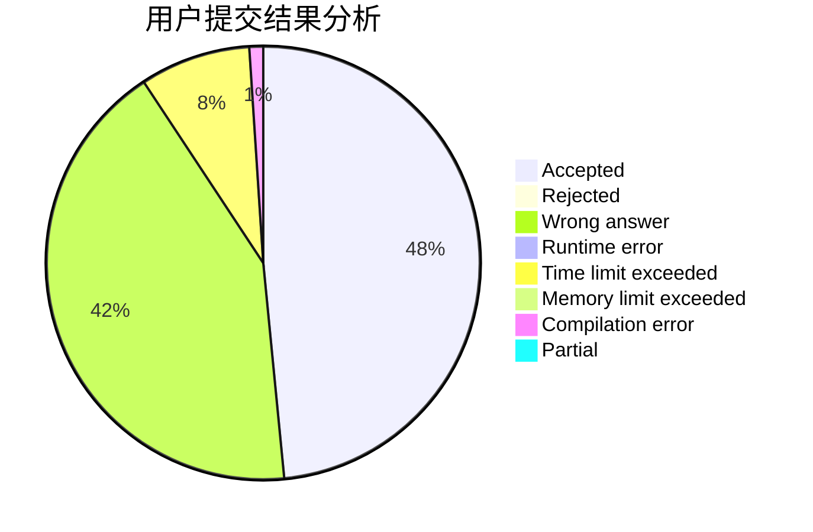
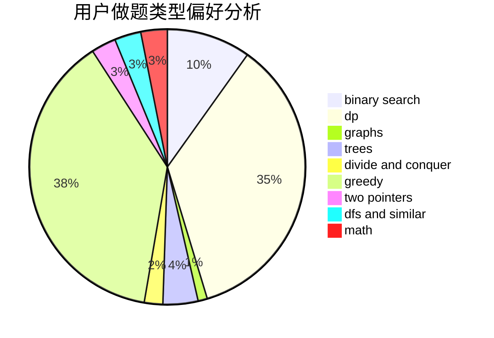

# semhhh

<!-- tabs:start -->

#### **用户提交结果分析**

#### **用户做题类型偏好分析**

<!-- tabs:end -->
# 推荐题目
[1462B](https://codeforces.com/contest/1462/problem/B)
[516C](https://codeforces.com/contest/516/problem/C)
[835C](https://codeforces.com/contest/835/problem/C)
[750F](https://codeforces.com/contest/750/problem/F)
[489A](https://codeforces.com/contest/489/problem/A)
[425C](https://codeforces.com/contest/425/problem/C)
[1341E](https://codeforces.com/contest/1341/problem/E)
[733A](https://codeforces.com/contest/733/problem/A)
[523A](https://codeforces.com/contest/523/problem/A)
[314B](https://codeforces.com/contest/314/problem/B)
