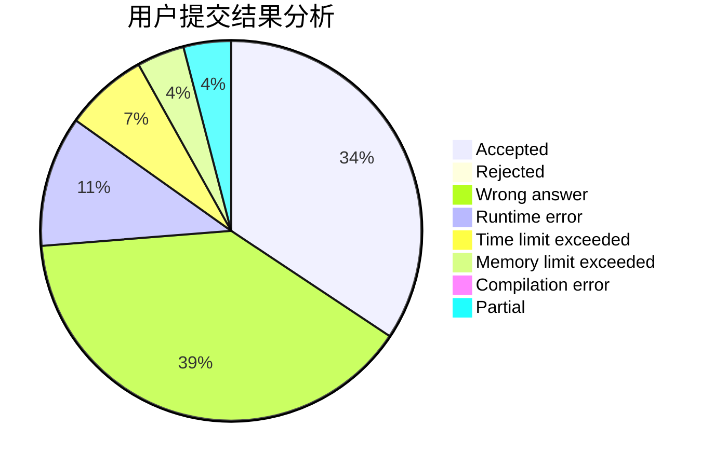
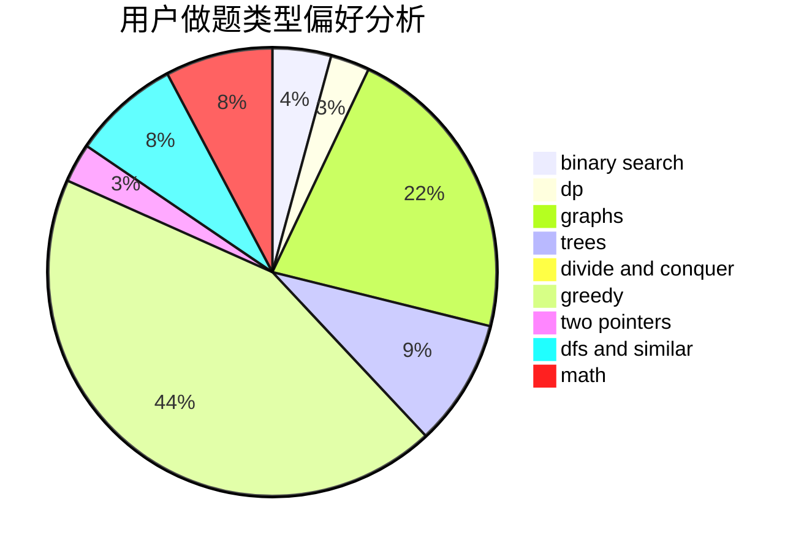

# shangcheng

<!-- tabs:start -->

#### **用户提交结果分析**

#### **用户做题类型偏好分析**

<!-- tabs:end -->
# 推荐题目
[1286B](https://codeforces.com/contest/1286/problem/B)
[822A](https://codeforces.com/contest/822/problem/A)
[1346D](https://codeforces.com/contest/1346/problem/D)
[2A](https://codeforces.com/contest/2/problem/A)
[592D](https://codeforces.com/contest/592/problem/D)
[11631](https://codeforces.com/contest/1163/problem/1)
[486E](https://codeforces.com/contest/486/problem/E)
[950B](https://codeforces.com/contest/950/problem/B)
[305B](https://codeforces.com/contest/305/problem/B)
[160C](https://codeforces.com/contest/160/problem/C)
