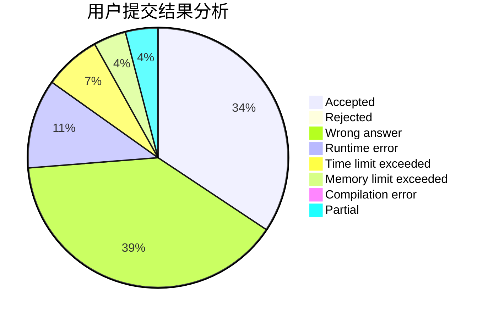
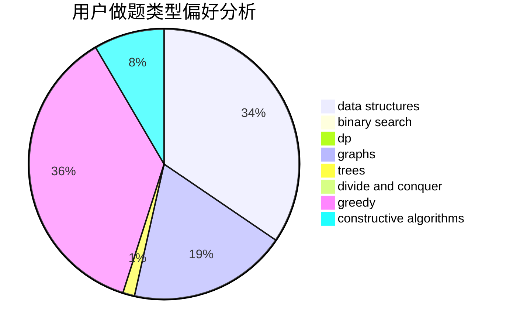
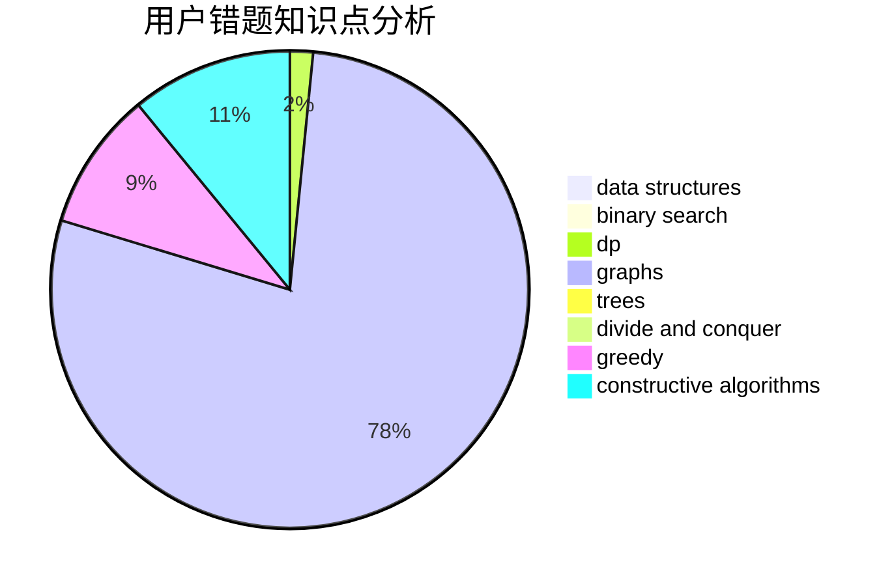

# shangcheng

<!-- tabs:start -->

#### **用户提交结果分析**

#### **用户做题类型偏好分析**

#### **用户错题知识点分析**

<!-- tabs:end -->
# 推荐题目
[1280B](https://codeforces.com/contest/1280/problem/B)		implementation,
                        math		  
[805D](https://codeforces.com/contest/805/problem/D)		dsu,graphs,sortings,trees		  
[1339D](https://codeforces.com/contest/1339/problem/D)		dsu,graphs,sortings,trees		  
[284B](https://codeforces.com/contest/284/problem/B)		brute force,
                        implementation		  
[573B](https://codeforces.com/contest/573/problem/B)		binary search,
                        data structures,
                        dp,
                        math		  
[115B](https://codeforces.com/contest/115/problem/B)		greedy,
                        sortings		  
[467C](https://codeforces.com/contest/467/problem/C)		dp,
                        implementation		  
[930C](https://codeforces.com/contest/930/problem/C)		data structures,
                        dp		  
[290B](https://codeforces.com/contest/290/problem/B)		*special problem,
                        implementation		  
[1509E](https://codeforces.com/contest/1509/problem/E)		dsu,graphs,sortings,trees		  
