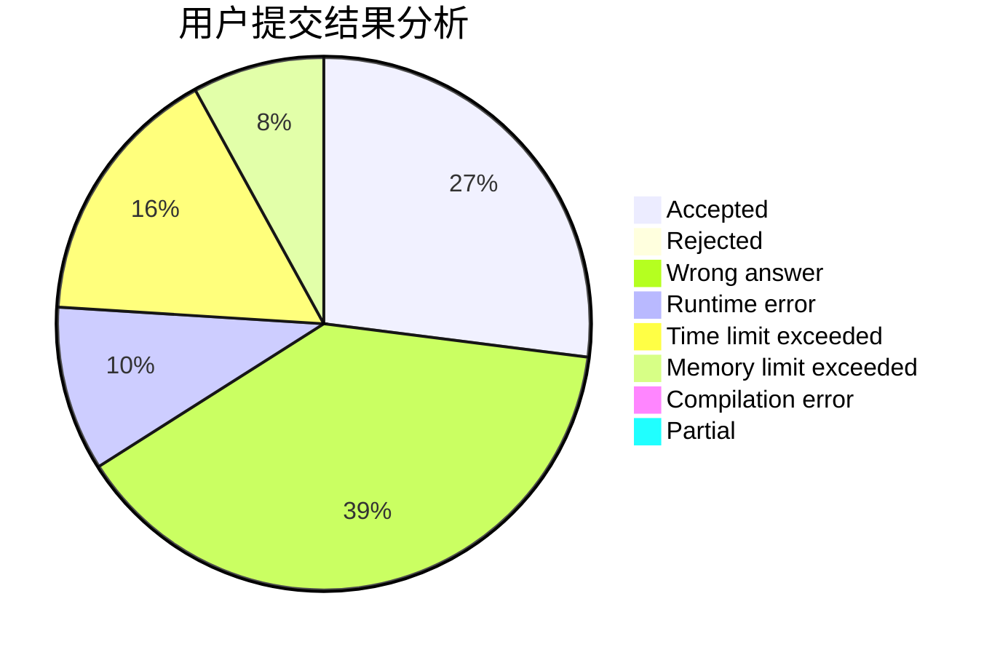
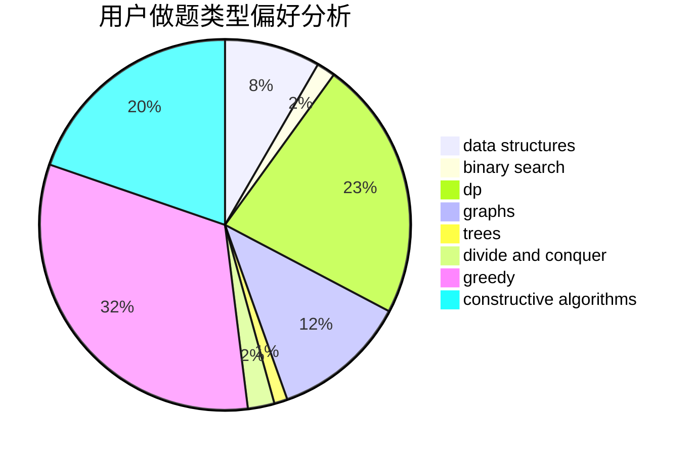

# shao0320

<!-- tabs:start -->

#### **用户提交结果分析**

#### **用户做题类型偏好分析**

#### **用户错题知识点分析**

<!-- tabs:end -->
# 推荐题目
[1436A](https://codeforces.com/contest/1436/problem/A)		math		  
[1168E](https://codeforces.com/contest/1168/problem/E)		constructive algorithms,
                        math		  
[865D](https://codeforces.com/contest/865/problem/D)		constructive algorithms,
                        data structures,
                        greedy		  
[887F](https://codeforces.com/contest/887/problem/F)		greedy,
                        sortings		  
[510D](https://codeforces.com/contest/510/problem/D)		bitmasks,
                        brute force,
                        dp,
                        math		  
[811C](https://codeforces.com/contest/811/problem/C)		dp,
                        implementation		  
[1075A](https://codeforces.com/contest/1075/problem/A)		implementation,
                        math		  
[731C](https://codeforces.com/contest/731/problem/C)		dfs and similar,
                        dsu,
                        graphs,
                        greedy		  
[802O](https://codeforces.com/contest/802/problem/O)		binary search,
                        data structures,
                        flows		  
[730J](https://codeforces.com/contest/730/problem/J)		dp		  
