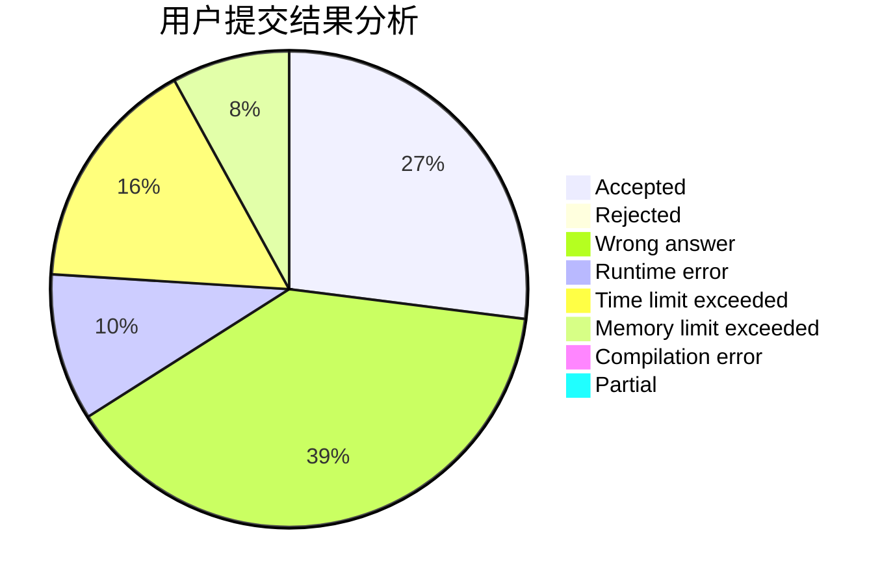
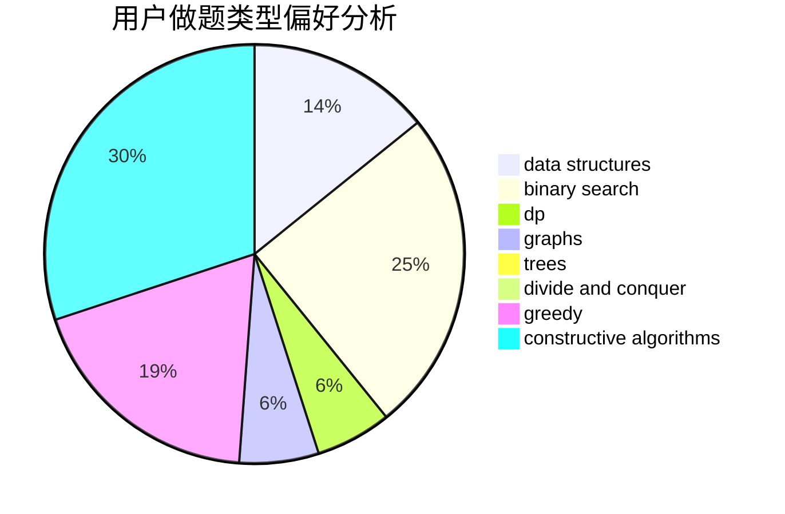

# shao0320

<!-- tabs:start -->

#### **用户提交结果分析**

#### **用户做题类型偏好分析**

#### **用户错题知识点分析**

<!-- tabs:end -->
# 推荐题目
[14461](https://codeforces.com/contest/1446/problem/1)		dsu,graphs,sortings,trees		  
[1173A](https://codeforces.com/contest/1173/problem/A)		greedy		  
[886A](https://codeforces.com/contest/886/problem/A)		brute force		  
[907B](https://codeforces.com/contest/907/problem/B)		implementation		  
[534B](https://codeforces.com/contest/534/problem/B)		dp,
                        greedy,
                        math		  
[830A](https://codeforces.com/contest/830/problem/A)		binary search,
                        brute force,
                        dp,
                        greedy,
                        sortings		  
[1076C](https://codeforces.com/contest/1076/problem/C)		binary search,
                        math		  
[749D](https://codeforces.com/contest/749/problem/D)		binary search,
                        data structures		  
[818E](https://codeforces.com/contest/818/problem/E)		binary search,
                        data structures,
                        number theory,
                        two pointers		  
[749A](https://codeforces.com/contest/749/problem/A)		greedy,
                        implementation,
                        math,
                        number theory		  
