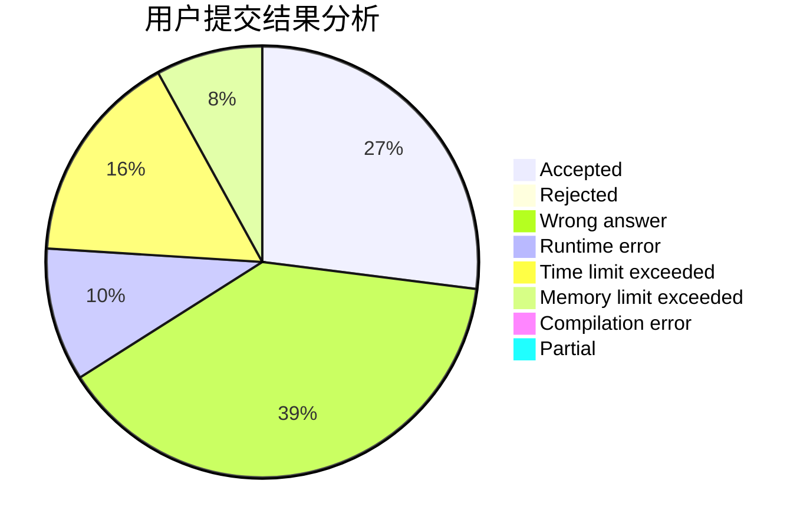
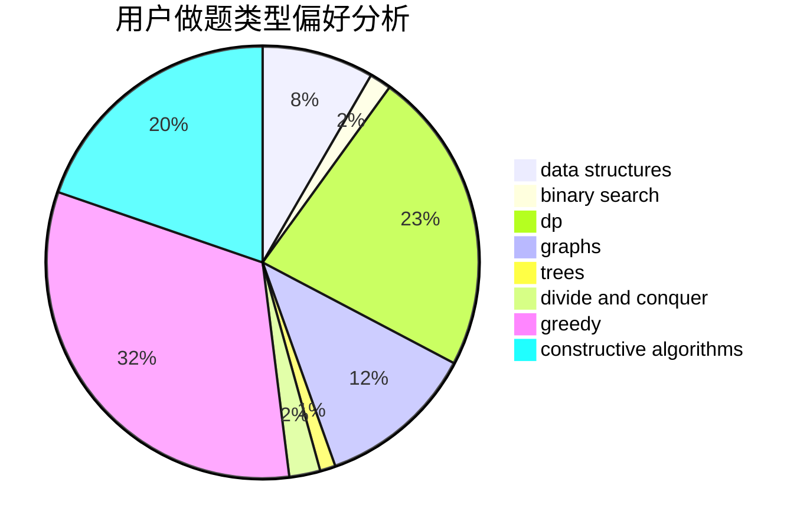

# shao0320
<!-- tabs:start -->
#### **用户提交结果分析**

#### **用户做题类型偏好分析**

#### **用户错题知识点分析**

<!-- tabs:end -->
# 推荐题目
[Reorder](http://codeforces.com/problemset/problem/1436/A)		math		  
[Xor Permutations](http://codeforces.com/problemset/problem/1168/E)		constructive algorithms,
                        math		  
[Pouring Rain](http://codeforces.com/problemset/problem/667/A)		geometry,
                        math		  
[Good String](http://codeforces.com/problemset/problem/1165/C)		greedy		  
[Sasha and Interesting Fact from Graph Theory](https://codeforces.com/contest/1113/problem/F)		brute force,
                        combinatorics,
                        dp,
                        math,
                        trees		  
[No Monotone Triples](http://codeforces.com/problemset/problem/1332/G)		data structures		  
[Distinguish I from X](http://codeforces.com/problemset/problem/1356/A1)		*special problem		  
[Ratings and Reality Shows](http://codeforces.com/problemset/problem/887/D)		data structures,
                        two pointers		  
[Row of Models](http://codeforces.com/problemset/problem/887/F)		greedy,
                        sortings		  
[Interval Cubing](http://codeforces.com/problemset/problem/311/D)		data structures,
                        math		  
<!-- tabs:start -->
#### **data structures**
[Reorder](http://codeforces.com/problemset/problem/1332/G)		data structures		  
[Xor Permutations](http://codeforces.com/problemset/problem/887/D)		data structures,
                        two pointers		  
[Pouring Rain](http://codeforces.com/problemset/problem/311/D)		data structures,
                        math		  
[Good String](http://codeforces.com/problemset/problem/1137/F)		data structures,
                        trees		  
[Sasha and Interesting Fact from Graph Theory](https://codeforces.com/contest/1298/problem/E)		binary search,
                        data structures,
                        implementation		  
[No Monotone Triples](http://codeforces.com/problemset/problem/802/O)		binary search,
                        data structures,
                        flows		  
[Distinguish I from X](http://codeforces.com/problemset/problem/865/D)		constructive algorithms,
                        data structures,
                        greedy		  
[Ratings and Reality Shows](https://codeforces.com/contest/1150/problem/E)		data structures,
                        implementation,
                        trees		  
[Row of Models](http://codeforces.com/problemset/problem/1479/B1)		constructive algorithms,
                        data structures,
                        dp,
                        greedy,
                        implementation		  
[Interval Cubing](http://codeforces.com/problemset/problem/1175/B)		data structures,
                        expression parsing,
                        implementation		  
#### **binary search**
[Reorder](https://codeforces.com/contest/1345/problem/F)		binary search,
                        greedy,
                        math		  
[Xor Permutations](http://codeforces.com/problemset/problem/1355/E)		binary search,
                        greedy,
                        math,
                        sortings,
                        ternary search		  
[Pouring Rain](https://codeforces.com/contest/1298/problem/E)		binary search,
                        data structures,
                        implementation		  
[Good String](http://codeforces.com/problemset/problem/802/O)		binary search,
                        data structures,
                        flows		  
[Sasha and Interesting Fact from Graph Theory](http://codeforces.com/problemset/problem/1098/C)		binary search,
                        constructive algorithms,
                        dfs and similar,
                        graphs,
                        greedy,
                        trees		  
[No Monotone Triples](http://codeforces.com/problemset/problem/653/D)		binary search,
                        flows,
                        graphs		  
[Distinguish I from X](http://codeforces.com/problemset/problem/1492/C)		binary search,
                        data structures,
                        dp,
                        greedy,
                        two pointers		  
[Ratings and Reality Shows](http://codeforces.com/problemset/problem/1463/D)		binary search,
                        constructive algorithms,
                        greedy,
                        two pointers		  
[Row of Models](http://codeforces.com/problemset/problem/1490/G)		binary search,
                        data structures,
                        math		  
[Interval Cubing](http://codeforces.com/problemset/problem/1479/D)		binary search,
                        bitmasks,
                        brute force,
                        data structures,
                        probabilities,
                        trees		  
#### **dp**
[Reorder](https://codeforces.com/contest/1113/problem/F)		brute force,
                        combinatorics,
                        dp,
                        math,
                        trees		  
[Xor Permutations](http://codeforces.com/problemset/problem/1307/C)		brute force,
                        dp,
                        math,
                        strings		  
[Pouring Rain](http://codeforces.com/problemset/problem/1221/G)		bitmasks,
                        brute force,
                        combinatorics,
                        dp,
                        meet-in-the-middle		  
[Good String](http://codeforces.com/problemset/problem/1042/B)		bitmasks,
                        brute force,
                        dp,
                        implementation		  
[Sasha and Interesting Fact from Graph Theory](http://codeforces.com/problemset/problem/510/D)		bitmasks,
                        brute force,
                        dp,
                        math		  
[No Monotone Triples](https://codeforces.com/contest/1293/problem/E)		combinatorics,
                        dfs and similar,
                        dp,
                        greedy,
                        trees		  
[Distinguish I from X](http://codeforces.com/problemset/problem/1392/D)		dp,
                        greedy		  
[Ratings and Reality Shows](http://codeforces.com/problemset/problem/811/C)		dp,
                        implementation		  
[Row of Models](http://codeforces.com/problemset/problem/1479/B1)		constructive algorithms,
                        data structures,
                        dp,
                        greedy,
                        implementation		  
[Interval Cubing](http://codeforces.com/problemset/problem/730/J)		dp		  
#### **graph**
[Reorder](http://codeforces.com/problemset/problem/731/C)		dfs and similar,
                        dsu,
                        graphs,
                        greedy		  
[Xor Permutations](http://codeforces.com/problemset/problem/1098/C)		binary search,
                        constructive algorithms,
                        dfs and similar,
                        graphs,
                        greedy,
                        trees		  
[Pouring Rain](http://codeforces.com/problemset/problem/653/D)		binary search,
                        flows,
                        graphs		  
[Good String](http://codeforces.com/problemset/problem/1169/B)		graphs,
                        implementation		  
[Sasha and Interesting Fact from Graph Theory](http://codeforces.com/problemset/problem/1487/C)		brute force,
                        constructive algorithms,
                        dfs and similar,
                        graphs,
                        greedy,
                        implementation,
                        math		  
[No Monotone Triples](http://codeforces.com/problemset/problem/1437/C)		dp,
                        flows,
                        graph matchings,
                        greedy,
                        math,
                        sortings		  
[Distinguish I from X](http://codeforces.com/problemset/problem/1470/D)		constructive algorithms,
                        dfs and similar,
                        graph matchings,
                        graphs,
                        greedy		  
[Ratings and Reality Shows](http://codeforces.com/problemset/problem/1476/C)		dp,
                        graphs,
                        greedy		  
[Row of Models](http://codeforces.com/problemset/problem/1304/D)		constructive algorithms,
                        graphs,
                        greedy,
                        two pointers		  
[Interval Cubing](http://codeforces.com/problemset/problem/1475/C)		combinatorics,
                        graphs,
                        math		  
#### **trees**
[Reorder](https://codeforces.com/contest/1113/problem/F)		brute force,
                        combinatorics,
                        dp,
                        math,
                        trees		  
[Xor Permutations](http://codeforces.com/problemset/problem/1137/F)		data structures,
                        trees		  
[Pouring Rain](http://codeforces.com/problemset/problem/1085/D)		constructive algorithms,
                        implementation,
                        trees		  
[Good String](https://codeforces.com/contest/1293/problem/E)		combinatorics,
                        dfs and similar,
                        dp,
                        greedy,
                        trees		  
[Sasha and Interesting Fact from Graph Theory](http://codeforces.com/problemset/problem/1098/C)		binary search,
                        constructive algorithms,
                        dfs and similar,
                        graphs,
                        greedy,
                        trees		  
[No Monotone Triples](https://codeforces.com/contest/1150/problem/E)		data structures,
                        implementation,
                        trees		  
[Distinguish I from X](http://codeforces.com/problemset/problem/472/D)		dfs and similar,
                        dsu,
                        shortest paths,
                        trees		  
[Ratings and Reality Shows](http://codeforces.com/problemset/problem/1466/D)		data structures,
                        greedy,
                        sortings,
                        trees		  
[Row of Models](http://codeforces.com/problemset/problem/1479/D)		binary search,
                        bitmasks,
                        brute force,
                        data structures,
                        probabilities,
                        trees		  
[Interval Cubing](http://codeforces.com/problemset/problem/1511/C)		brute force,
                        data structures,
                        implementation,
                        trees		  
#### **divide and conquer**
[Reorder](http://codeforces.com/problemset/problem/1461/D)		binary search,
                        brute force,
                        data structures,
                        divide and conquer,
                        implementation,
                        sortings		  
[Xor Permutations](http://codeforces.com/problemset/problem/1466/G)		combinatorics,
                        divide and conquer,
                        hashing,
                        math,
                        string suffix structures,
                        strings		  
[Pouring Rain](http://codeforces.com/problemset/problem/1490/D)		dfs and similar,
                        divide and conquer,
                        implementation		  
[Good String](https://codeforces.com/contest/1483/problem/C)		data structures,
                        divide and conquer,
                        dp		  
[Sasha and Interesting Fact from Graph Theory](http://codeforces.com/problemset/problem/1491/E)		brute force,
                        dfs and similar,
                        divide and conquer,
                        number theory,
                        trees		  
[No Monotone Triples](http://codeforces.com/problemset/problem/1303/G)		data structures,
                        divide and conquer,
                        geometry,
                        trees		  
[Distinguish I from X](http://codeforces.com/problemset/problem/1494/D)		constructive algorithms,
                        data structures,
                        dfs and similar,
                        divide and conquer,
                        dsu,
                        greedy,
                        sortings,
                        trees		  
[Ratings and Reality Shows](http://codeforces.com/problemset/problem/1482/E)		data structures,
                        divide and conquer,
                        dp		  
[Row of Models](http://codeforces.com/problemset/problem/566/C)		dfs and similar,
                        divide and conquer,
                        trees		  
[Interval Cubing](http://codeforces.com/problemset/problem/1428/F)		binary search,
                        data structures,
                        divide and conquer,
                        dp,
                        two pointers		  
#### **greedy**
[Reorder](http://codeforces.com/problemset/problem/1165/C)		greedy		  
[Xor Permutations](http://codeforces.com/problemset/problem/887/F)		greedy,
                        sortings		  
[Pouring Rain](http://codeforces.com/problemset/problem/731/C)		dfs and similar,
                        dsu,
                        graphs,
                        greedy		  
[Good String](https://codeforces.com/contest/1345/problem/F)		binary search,
                        greedy,
                        math		  
[Sasha and Interesting Fact from Graph Theory](http://codeforces.com/problemset/problem/515/D)		constructive algorithms,
                        greedy		  
[No Monotone Triples](http://codeforces.com/problemset/problem/1355/E)		binary search,
                        greedy,
                        math,
                        sortings,
                        ternary search		  
[Distinguish I from X](https://codeforces.com/contest/1293/problem/E)		combinatorics,
                        dfs and similar,
                        dp,
                        greedy,
                        trees		  
[Ratings and Reality Shows](http://codeforces.com/problemset/problem/865/D)		constructive algorithms,
                        data structures,
                        greedy		  
[Row of Models](http://codeforces.com/problemset/problem/1098/C)		binary search,
                        constructive algorithms,
                        dfs and similar,
                        graphs,
                        greedy,
                        trees		  
[Interval Cubing](http://codeforces.com/problemset/problem/1392/D)		dp,
                        greedy		  
#### **constructive algorithms**
[Reorder](http://codeforces.com/problemset/problem/1168/E)		constructive algorithms,
                        math		  
[Xor Permutations](http://codeforces.com/problemset/problem/715/A)		constructive algorithms,
                        math		  
[Pouring Rain](http://codeforces.com/problemset/problem/515/D)		constructive algorithms,
                        greedy		  
[Good String](http://codeforces.com/problemset/problem/1085/D)		constructive algorithms,
                        implementation,
                        trees		  
[Sasha and Interesting Fact from Graph Theory](http://codeforces.com/problemset/problem/865/D)		constructive algorithms,
                        data structures,
                        greedy		  
[No Monotone Triples](http://codeforces.com/problemset/problem/1098/C)		binary search,
                        constructive algorithms,
                        dfs and similar,
                        graphs,
                        greedy,
                        trees		  
[Distinguish I from X](http://codeforces.com/problemset/problem/1479/B1)		constructive algorithms,
                        data structures,
                        dp,
                        greedy,
                        implementation		  
[Ratings and Reality Shows](http://codeforces.com/problemset/problem/1270/C)		bitmasks,
                        constructive algorithms,
                        math		  
[Row of Models](http://codeforces.com/problemset/problem/1493/A)		constructive algorithms,
                        greedy		  
[Interval Cubing](http://codeforces.com/problemset/problem/1463/D)		binary search,
                        constructive algorithms,
                        greedy,
                        two pointers		  
#### **sortings**
[Reorder](http://codeforces.com/problemset/problem/887/F)		greedy,
                        sortings		  
[Xor Permutations](http://codeforces.com/problemset/problem/1355/E)		binary search,
                        greedy,
                        math,
                        sortings,
                        ternary search		  
[Pouring Rain](https://codeforces.com/contest/418/problem/B)		bitmasks,
                        dp,
                        greedy,
                        sortings		  
[Good String](http://codeforces.com/problemset/problem/1466/D)		data structures,
                        greedy,
                        sortings,
                        trees		  
[Sasha and Interesting Fact from Graph Theory](https://codeforces.com/contest/1496/problem/C)		geometry,
                        greedy,
                        math,
                        sortings		  
[No Monotone Triples](http://codeforces.com/problemset/problem/1495/A)		geometry,
                        greedy,
                        math,
                        sortings		  
[Distinguish I from X](http://codeforces.com/problemset/problem/1497/A)		brute force,
                        data structures,
                        greedy,
                        sortings		  
[Ratings and Reality Shows](http://codeforces.com/problemset/problem/1427/A)		math,
                        sortings		  
[Row of Models](http://codeforces.com/problemset/problem/1461/D)		binary search,
                        brute force,
                        data structures,
                        divide and conquer,
                        implementation,
                        sortings		  
[Interval Cubing](http://codeforces.com/problemset/problem/1437/C)		dp,
                        flows,
                        graph matchings,
                        greedy,
                        math,
                        sortings		  
<!-- tabs:end -->
