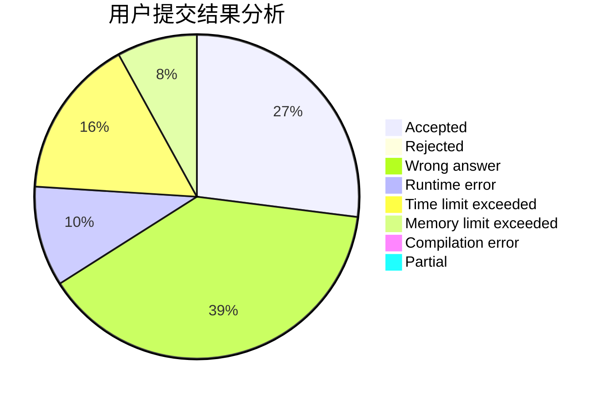
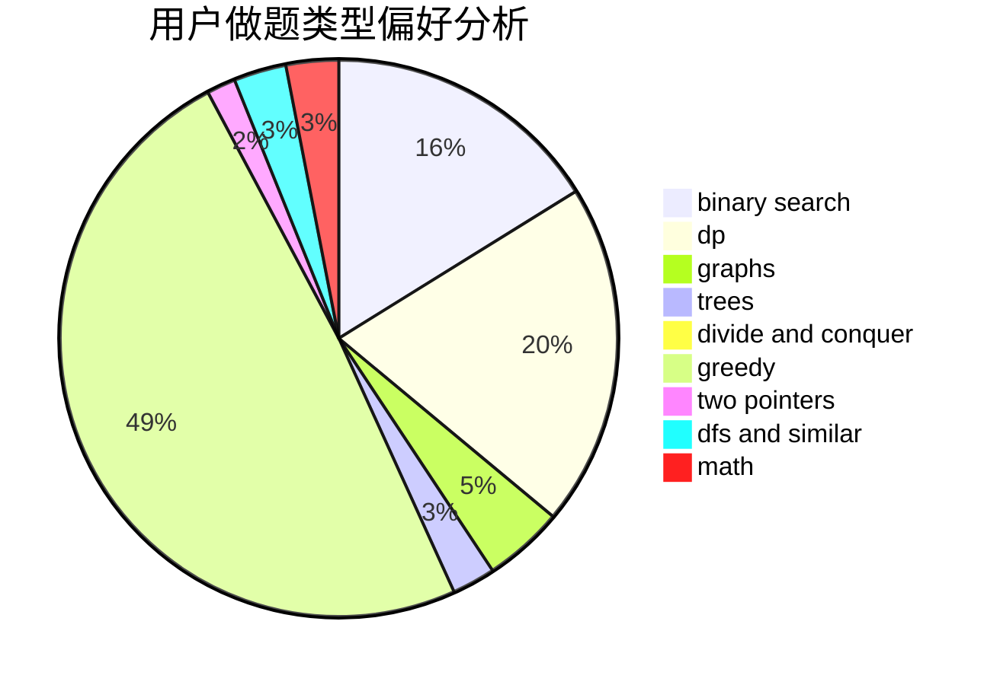

# shao0320

<!-- tabs:start -->

#### **用户提交结果分析**

#### **用户做题类型偏好分析**

<!-- tabs:end -->
# 推荐题目
[14461](https://codeforces.com/contest/1446/problem/1)
[1173A](https://codeforces.com/contest/1173/problem/A)
[886A](https://codeforces.com/contest/886/problem/A)
[907B](https://codeforces.com/contest/907/problem/B)
[534B](https://codeforces.com/contest/534/problem/B)
[830A](https://codeforces.com/contest/830/problem/A)
[1076C](https://codeforces.com/contest/1076/problem/C)
[749D](https://codeforces.com/contest/749/problem/D)
[818E](https://codeforces.com/contest/818/problem/E)
[749A](https://codeforces.com/contest/749/problem/A)
