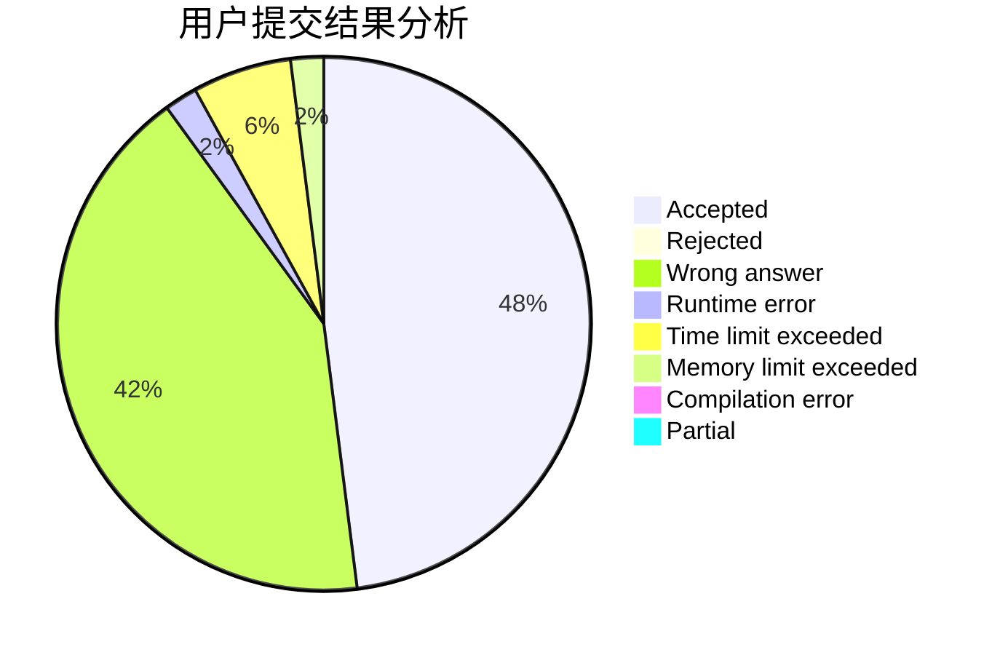
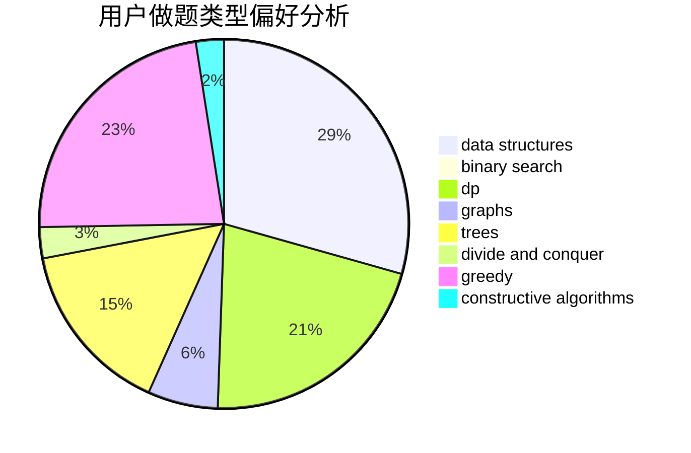
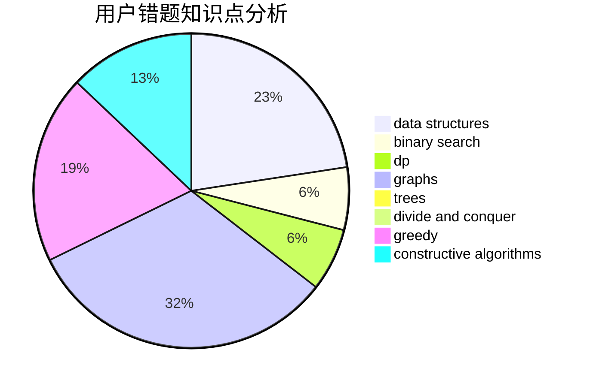

# shaosy

<!-- tabs:start -->

#### **用户提交结果分析**

#### **用户做题类型偏好分析**

#### **用户错题知识点分析**

<!-- tabs:end -->
# 推荐题目
[311A](https://codeforces.com/contest/311/problem/A)		constructive algorithms,
                        implementation		  
[814D](https://codeforces.com/contest/814/problem/D)		dfs and similar,
                        dp,
                        geometry,
                        greedy,
                        trees		  
[359C](https://codeforces.com/contest/359/problem/C)		math,
                        number theory		  
[136C](https://codeforces.com/contest/136/problem/C)		dsu,graphs,sortings,trees		  
[1213F](https://codeforces.com/contest/1213/problem/F)		data structures,
                        dfs and similar,
                        dsu,
                        graphs,
                        greedy,
                        implementation,
                        strings		  
[274A](https://codeforces.com/contest/274/problem/A)		binary search,
                        greedy,
                        sortings		  
[1060E](https://codeforces.com/contest/1060/problem/E)		dfs and similar,
                        dp,
                        trees		  
[215A](https://codeforces.com/contest/215/problem/A)		brute force,
                        implementation		  
[989D](https://codeforces.com/contest/989/problem/D)		binary search,
                        geometry,
                        math,
                        sortings,
                        two pointers		  
[1382E](https://codeforces.com/contest/1382/problem/E)		dsu,graphs,sortings,trees		  
