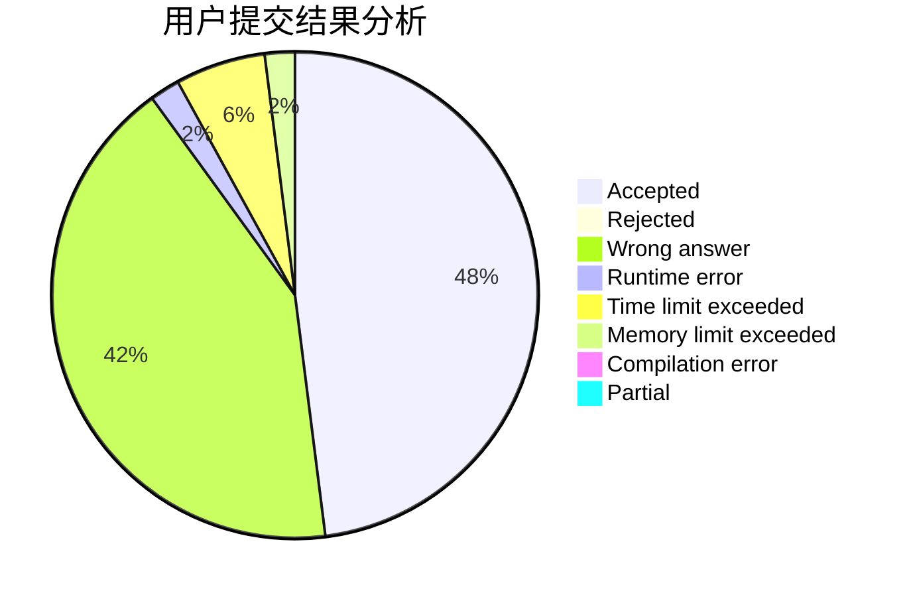
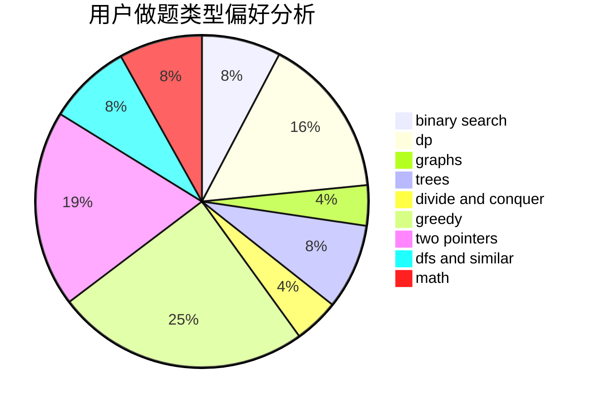

# shaosy

<!-- tabs:start -->

#### **用户提交结果分析**

#### **用户做题类型偏好分析**

<!-- tabs:end -->
# 推荐题目
[311A](https://codeforces.com/contest/311/problem/A)
[814D](https://codeforces.com/contest/814/problem/D)
[359C](https://codeforces.com/contest/359/problem/C)
[136C](https://codeforces.com/contest/136/problem/C)
[1213F](https://codeforces.com/contest/1213/problem/F)
[274A](https://codeforces.com/contest/274/problem/A)
[1060E](https://codeforces.com/contest/1060/problem/E)
[215A](https://codeforces.com/contest/215/problem/A)
[989D](https://codeforces.com/contest/989/problem/D)
[1382E](https://codeforces.com/contest/1382/problem/E)
