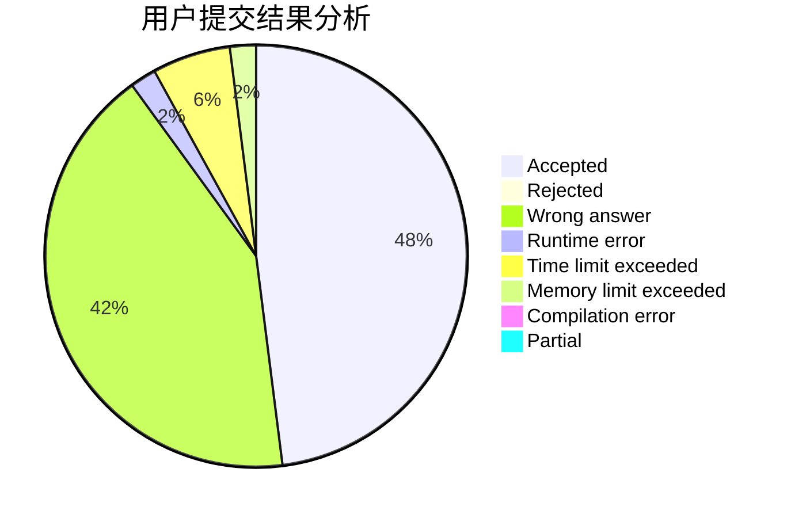
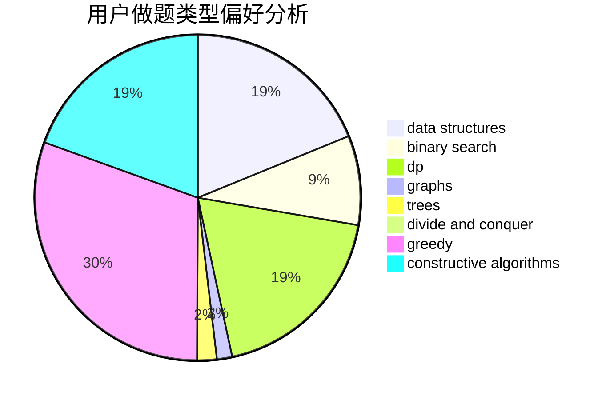
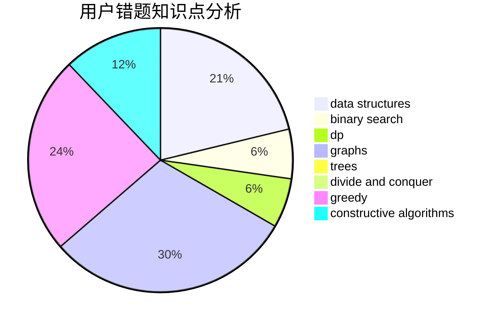

# shaosy
<!-- tabs:start -->
#### **用户提交结果分析**

#### **用户做题类型偏好分析**

#### **用户错题知识点分析**

<!-- tabs:end -->
# 推荐题目
[Paint the Tree](http://codeforces.com/problemset/problem/1244/D)		brute force,
                        constructive algorithms,
                        dp,
                        graphs,
                        implementation,
                        trees		  
[The Great Julya Calendar](http://codeforces.com/problemset/problem/331/C3)		dp		  
[Shaass and Painter Robot](http://codeforces.com/problemset/problem/294/D)		brute force,
                        implementation,
                        number theory		  
[Line](http://codeforces.com/problemset/problem/7/C)		math,
                        number theory		  
[Johnny and Contribution](https://codeforces.com/contest/1362/problem/D)		constructive algorithms,
                        graphs,
                        greedy,
                        sortings		  
[K Balanced Teams](http://codeforces.com/problemset/problem/1133/E)		dp,
                        sortings,
                        two pointers		  
[Diverse Strings](http://codeforces.com/problemset/problem/1144/A)		implementation,
                        strings		  
[Equality](http://codeforces.com/problemset/problem/1038/A)		implementation,
                        strings		  
[Hard Work](http://codeforces.com/problemset/problem/61/B)		strings		  
[Shashlik Cooking](http://codeforces.com/problemset/problem/1040/B)		dp,
                        greedy,
                        math		  
<!-- tabs:start -->
#### **data structures**
[Paint the Tree](http://codeforces.com/problemset/problem/524/E)		data structures,
                        sortings		  
[The Great Julya Calendar](http://codeforces.com/problemset/problem/1044/D)		data structures,
                        dsu		  
[Shaass and Painter Robot](http://codeforces.com/problemset/problem/986/E)		brute force,
                        data structures,
                        math,
                        number theory,
                        trees		  
[Line](http://codeforces.com/problemset/problem/442/C)		data structures,
                        greedy		  
[Johnny and Contribution](http://codeforces.com/problemset/problem/19/D)		data structures		  
[K Balanced Teams](http://codeforces.com/problemset/problem/587/C)		data structures,
                        trees		  
[Diverse Strings](http://codeforces.com/problemset/problem/1418/G)		data structures,
                        divide and conquer,
                        hashing,
                        two pointers		  
[Equality](http://codeforces.com/problemset/problem/1051/G)		data structures,
                        dsu,
                        greedy		  
[Hard Work](http://codeforces.com/problemset/problem/609/E)		data structures,
                        dfs and similar,
                        dsu,
                        graphs,
                        trees		  
[Shashlik Cooking](http://codeforces.com/problemset/problem/704/E)		data structures,
                        geometry,
                        trees		  
#### **binary search**
[Paint the Tree](http://codeforces.com/problemset/problem/96/B)		binary search,
                        bitmasks,
                        brute force		  
[The Great Julya Calendar](http://codeforces.com/problemset/problem/255/D)		binary search,
                        implementation,
                        math		  
[Shaass and Painter Robot](https://codeforces.com/contest/807/problem/E)		binary search,
                        constructive algorithms,
                        greedy,
                        math		  
[Line](http://codeforces.com/problemset/problem/1208/B)		binary search,
                        brute force,
                        implementation,
                        two pointers		  
[Johnny and Contribution](http://codeforces.com/problemset/problem/1178/H)		binary search,
                        flows,
                        graphs		  
[K Balanced Teams](http://codeforces.com/problemset/problem/1166/D)		binary search,
                        brute force,
                        greedy,
                        math		  
[Diverse Strings](http://codeforces.com/problemset/problem/1217/C)		binary search,
                        bitmasks,
                        brute force		  
[Equality](http://codeforces.com/problemset/problem/1492/C)		binary search,
                        data structures,
                        dp,
                        greedy,
                        two pointers		  
[Hard Work](http://codeforces.com/problemset/problem/1463/D)		binary search,
                        constructive algorithms,
                        greedy,
                        two pointers		  
[Shashlik Cooking](http://codeforces.com/problemset/problem/1490/G)		binary search,
                        data structures,
                        math		  
#### **dp**
[Paint the Tree](http://codeforces.com/problemset/problem/1244/D)		brute force,
                        constructive algorithms,
                        dp,
                        graphs,
                        implementation,
                        trees		  
[The Great Julya Calendar](http://codeforces.com/problemset/problem/331/C3)		dp		  
[Shaass and Painter Robot](http://codeforces.com/problemset/problem/1133/E)		dp,
                        sortings,
                        two pointers		  
[Line](http://codeforces.com/problemset/problem/1040/B)		dp,
                        greedy,
                        math		  
[Johnny and Contribution](http://codeforces.com/problemset/problem/1349/F2)		dp,
                        fft,
                        math		  
[K Balanced Teams](http://codeforces.com/problemset/problem/1498/D)		dfs and similar,
                        dp,
                        graphs,
                        implementation		  
[Diverse Strings](http://codeforces.com/problemset/problem/1492/C)		binary search,
                        data structures,
                        dp,
                        greedy,
                        two pointers		  
[Equality](https://codeforces.com/contest/1457/problem/C)		brute force,
                        dp,
                        implementation		  
[Hard Work](http://codeforces.com/problemset/problem/1491/C)		brute force,
                        data structures,
                        dp,
                        greedy,
                        implementation		  
[Shashlik Cooking](http://codeforces.com/problemset/problem/1437/C)		dp,
                        flows,
                        graph matchings,
                        greedy,
                        math,
                        sortings		  
#### **graph**
[Paint the Tree](http://codeforces.com/problemset/problem/1244/D)		brute force,
                        constructive algorithms,
                        dp,
                        graphs,
                        implementation,
                        trees		  
[The Great Julya Calendar](https://codeforces.com/contest/1362/problem/D)		constructive algorithms,
                        graphs,
                        greedy,
                        sortings		  
[Shaass and Painter Robot](http://codeforces.com/problemset/problem/908/F)		graphs,
                        greedy,
                        implementation		  
[Line](http://codeforces.com/problemset/problem/1178/H)		binary search,
                        flows,
                        graphs		  
[Johnny and Contribution](http://codeforces.com/problemset/problem/609/E)		data structures,
                        dfs and similar,
                        dsu,
                        graphs,
                        trees		  
[K Balanced Teams](http://codeforces.com/problemset/problem/1062/D)		dfs and similar,
                        graphs,
                        implementation,
                        math		  
[Diverse Strings](http://codeforces.com/problemset/problem/1498/D)		dfs and similar,
                        dp,
                        graphs,
                        implementation		  
[Equality](http://codeforces.com/problemset/problem/1487/C)		brute force,
                        constructive algorithms,
                        dfs and similar,
                        graphs,
                        greedy,
                        implementation,
                        math		  
[Hard Work](http://codeforces.com/problemset/problem/1437/C)		dp,
                        flows,
                        graph matchings,
                        greedy,
                        math,
                        sortings		  
[Shashlik Cooking](http://codeforces.com/problemset/problem/1470/D)		constructive algorithms,
                        dfs and similar,
                        graph matchings,
                        graphs,
                        greedy		  
#### **trees**
[Paint the Tree](http://codeforces.com/problemset/problem/1244/D)		brute force,
                        constructive algorithms,
                        dp,
                        graphs,
                        implementation,
                        trees		  
[The Great Julya Calendar](http://codeforces.com/problemset/problem/986/E)		brute force,
                        data structures,
                        math,
                        number theory,
                        trees		  
[Shaass and Painter Robot](http://codeforces.com/problemset/problem/587/C)		data structures,
                        trees		  
[Line](http://codeforces.com/problemset/problem/609/E)		data structures,
                        dfs and similar,
                        dsu,
                        graphs,
                        trees		  
[Johnny and Contribution](http://codeforces.com/problemset/problem/704/E)		data structures,
                        geometry,
                        trees		  
[K Balanced Teams](http://codeforces.com/problemset/problem/1479/D)		binary search,
                        bitmasks,
                        brute force,
                        data structures,
                        probabilities,
                        trees		  
[Diverse Strings](http://codeforces.com/problemset/problem/1511/C)		brute force,
                        data structures,
                        implementation,
                        trees		  
[Equality](http://codeforces.com/problemset/problem/1499/F)		combinatorics,
                        dfs and similar,
                        dp,
                        trees		  
[Hard Work](http://codeforces.com/problemset/problem/1491/E)		brute force,
                        dfs and similar,
                        divide and conquer,
                        number theory,
                        trees		  
[Shashlik Cooking](http://codeforces.com/problemset/problem/1466/D)		data structures,
                        greedy,
                        sortings,
                        trees		  
#### **divide and conquer**
[Paint the Tree](http://codeforces.com/problemset/problem/1418/G)		data structures,
                        divide and conquer,
                        hashing,
                        two pointers		  
[The Great Julya Calendar](http://codeforces.com/problemset/problem/1461/D)		binary search,
                        brute force,
                        data structures,
                        divide and conquer,
                        implementation,
                        sortings		  
[Shaass and Painter Robot](http://codeforces.com/problemset/problem/1466/G)		combinatorics,
                        divide and conquer,
                        hashing,
                        math,
                        string suffix structures,
                        strings		  
[Line](http://codeforces.com/problemset/problem/1490/D)		dfs and similar,
                        divide and conquer,
                        implementation		  
[Johnny and Contribution](https://codeforces.com/contest/1483/problem/C)		data structures,
                        divide and conquer,
                        dp		  
[K Balanced Teams](http://codeforces.com/problemset/problem/1491/E)		brute force,
                        dfs and similar,
                        divide and conquer,
                        number theory,
                        trees		  
[Diverse Strings](http://codeforces.com/problemset/problem/1303/G)		data structures,
                        divide and conquer,
                        geometry,
                        trees		  
[Equality](http://codeforces.com/problemset/problem/1494/D)		constructive algorithms,
                        data structures,
                        dfs and similar,
                        divide and conquer,
                        dsu,
                        greedy,
                        sortings,
                        trees		  
[Hard Work](http://codeforces.com/problemset/problem/1482/E)		data structures,
                        divide and conquer,
                        dp		  
[Shashlik Cooking](http://codeforces.com/problemset/problem/566/C)		dfs and similar,
                        divide and conquer,
                        trees		  
#### **greedy**
[Paint the Tree](https://codeforces.com/contest/1362/problem/D)		constructive algorithms,
                        graphs,
                        greedy,
                        sortings		  
[The Great Julya Calendar](http://codeforces.com/problemset/problem/1040/B)		dp,
                        greedy,
                        math		  
[Shaass and Painter Robot](http://codeforces.com/problemset/problem/442/C)		data structures,
                        greedy		  
[Line](https://codeforces.com/contest/807/problem/E)		binary search,
                        constructive algorithms,
                        greedy,
                        math		  
[Johnny and Contribution](http://codeforces.com/problemset/problem/908/F)		graphs,
                        greedy,
                        implementation		  
[K Balanced Teams](http://codeforces.com/problemset/problem/980/C)		games,
                        greedy		  
[Diverse Strings](http://codeforces.com/problemset/problem/1060/B)		greedy		  
[Equality](http://codeforces.com/problemset/problem/1051/G)		data structures,
                        dsu,
                        greedy		  
[Hard Work](http://codeforces.com/problemset/problem/1437/A)		brute force,
                        constructive algorithms,
                        greedy,
                        math		  
[Shashlik Cooking](http://codeforces.com/problemset/problem/1166/D)		binary search,
                        brute force,
                        greedy,
                        math		  
#### **constructive algorithms**
[Paint the Tree](http://codeforces.com/problemset/problem/1244/D)		brute force,
                        constructive algorithms,
                        dp,
                        graphs,
                        implementation,
                        trees		  
[The Great Julya Calendar](https://codeforces.com/contest/1362/problem/D)		constructive algorithms,
                        graphs,
                        greedy,
                        sortings		  
[Shaass and Painter Robot](https://codeforces.com/contest/1130/problem/E)		constructive algorithms		  
[Line](https://codeforces.com/contest/807/problem/E)		binary search,
                        constructive algorithms,
                        greedy,
                        math		  
[Johnny and Contribution](http://codeforces.com/problemset/problem/1028/E)		constructive algorithms		  
[K Balanced Teams](http://codeforces.com/problemset/problem/1437/A)		brute force,
                        constructive algorithms,
                        greedy,
                        math		  
[Diverse Strings](http://codeforces.com/problemset/problem/1375/B)		constructive algorithms,
                        greedy		  
[Equality](http://codeforces.com/problemset/problem/1421/C)		constructive algorithms,
                        strings		  
[Hard Work](http://codeforces.com/problemset/problem/1493/A)		constructive algorithms,
                        greedy		  
[Shashlik Cooking](http://codeforces.com/problemset/problem/1463/D)		binary search,
                        constructive algorithms,
                        greedy,
                        two pointers		  
#### **sortings**
[Paint the Tree](https://codeforces.com/contest/1362/problem/D)		constructive algorithms,
                        graphs,
                        greedy,
                        sortings		  
[The Great Julya Calendar](http://codeforces.com/problemset/problem/1133/E)		dp,
                        sortings,
                        two pointers		  
[Shaass and Painter Robot](http://codeforces.com/problemset/problem/524/E)		data structures,
                        sortings		  
[Line](http://codeforces.com/problemset/problem/538/F)		brute force,
                        data structures,
                        math,
                        sortings		  
[Johnny and Contribution](http://codeforces.com/problemset/problem/1041/A)		greedy,
                        implementation,
                        sortings		  
[K Balanced Teams](http://codeforces.com/problemset/problem/1106/C)		greedy,
                        implementation,
                        math,
                        sortings		  
[Diverse Strings](https://codeforces.com/contest/1496/problem/C)		geometry,
                        greedy,
                        math,
                        sortings		  
[Equality](http://codeforces.com/problemset/problem/1495/A)		geometry,
                        greedy,
                        math,
                        sortings		  
[Hard Work](http://codeforces.com/problemset/problem/1497/A)		brute force,
                        data structures,
                        greedy,
                        sortings		  
[Shashlik Cooking](http://codeforces.com/problemset/problem/1427/A)		math,
                        sortings		  
<!-- tabs:end -->
