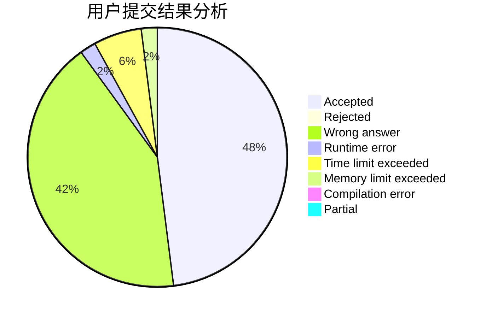
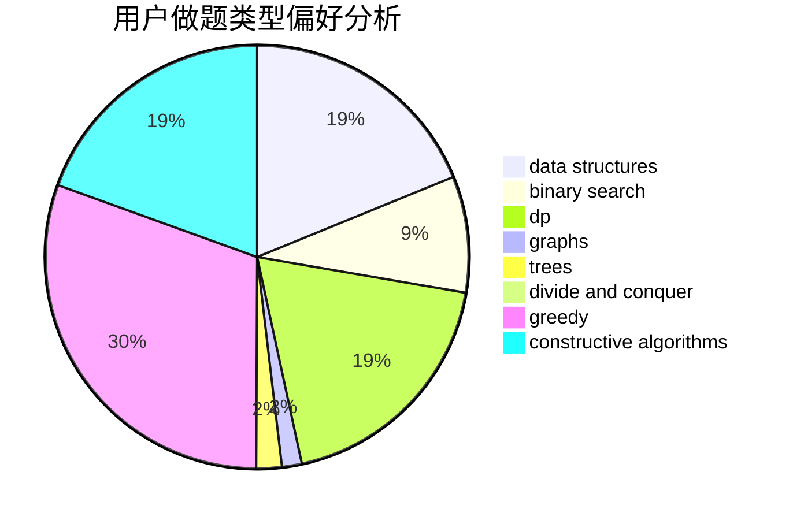
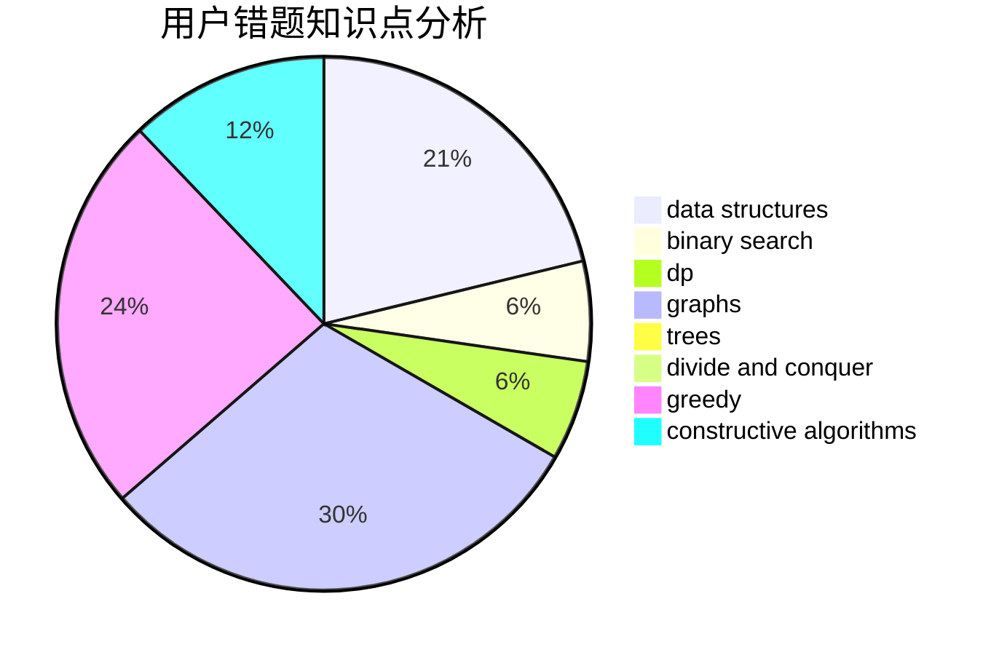

# shaosy

<!-- tabs:start -->

#### **用户提交结果分析**

#### **用户做题类型偏好分析**

#### **用户错题知识点分析**

<!-- tabs:end -->
# 推荐题目
[294D](https://codeforces.com/contest/294/problem/D)		brute force,
                        implementation,
                        number theory		  
[7C](https://codeforces.com/contest/7/problem/C)		math,
                        number theory		  
[331C3](https://codeforces.com/contest/331C/problem/3)		dp		  
[1362D](https://codeforces.com/contest/1362/problem/D)		dsu,graphs,sortings,trees		  
[1208B](https://codeforces.com/contest/1208/problem/B)		binary search,
                        brute force,
                        implementation,
                        two pointers		  
[255D](https://codeforces.com/contest/255/problem/D)		binary search,
                        implementation,
                        math		  
[1060B](https://codeforces.com/contest/1060/problem/B)		greedy		  
[18A](https://codeforces.com/contest/18/problem/A)		brute force,
                        geometry		  
[96B](https://codeforces.com/contest/96/problem/B)		binary search,
                        bitmasks,
                        brute force		  
[1374A](https://codeforces.com/contest/1374/problem/A)		math		  
