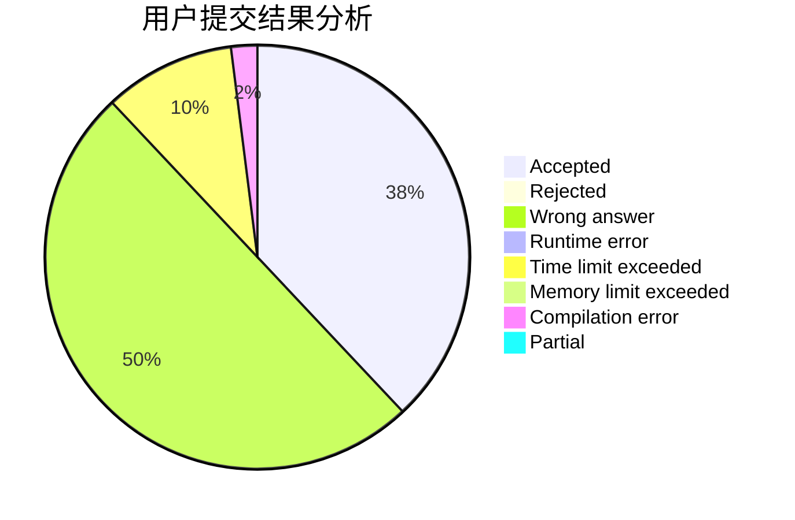
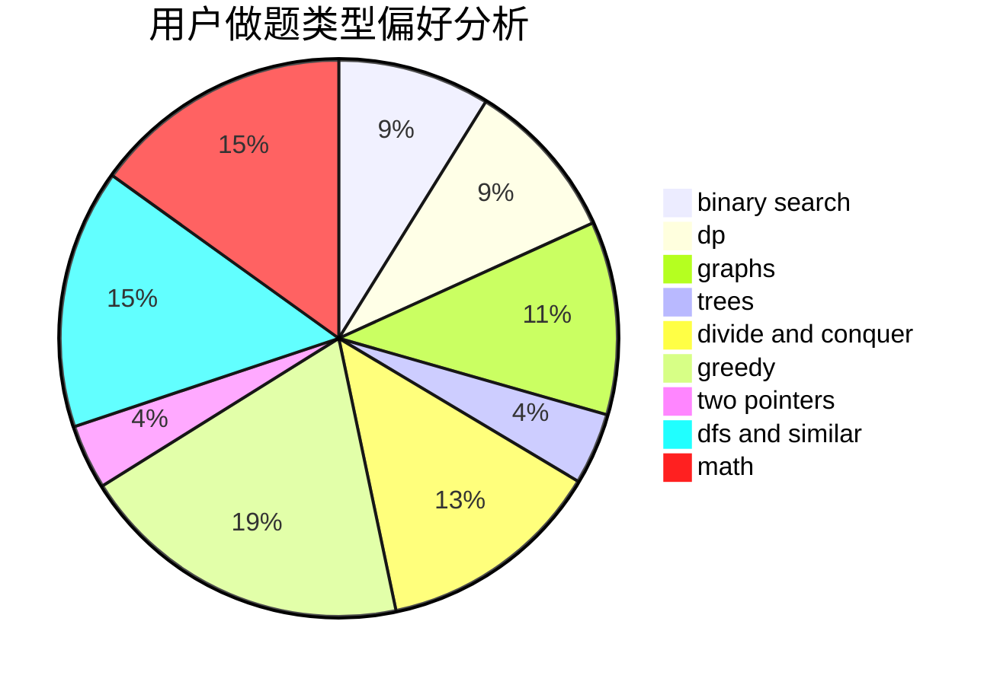

# CC_LOVE_ZZ

<!-- tabs:start -->

#### **用户提交结果分析**

#### **用户做题类型偏好分析**

<!-- tabs:end -->
# 推荐题目
[1321B](https://codeforces.com/contest/1321/problem/B)
[1204A](https://codeforces.com/contest/1204/problem/A)
[1070D](https://codeforces.com/contest/1070/problem/D)
[614D](https://codeforces.com/contest/614/problem/D)
[165A](https://codeforces.com/contest/165/problem/A)
[283E](https://codeforces.com/contest/283/problem/E)
[614A](https://codeforces.com/contest/614/problem/A)
[472A](https://codeforces.com/contest/472/problem/A)
[613A](https://codeforces.com/contest/613/problem/A)
[476E](https://codeforces.com/contest/476/problem/E)
