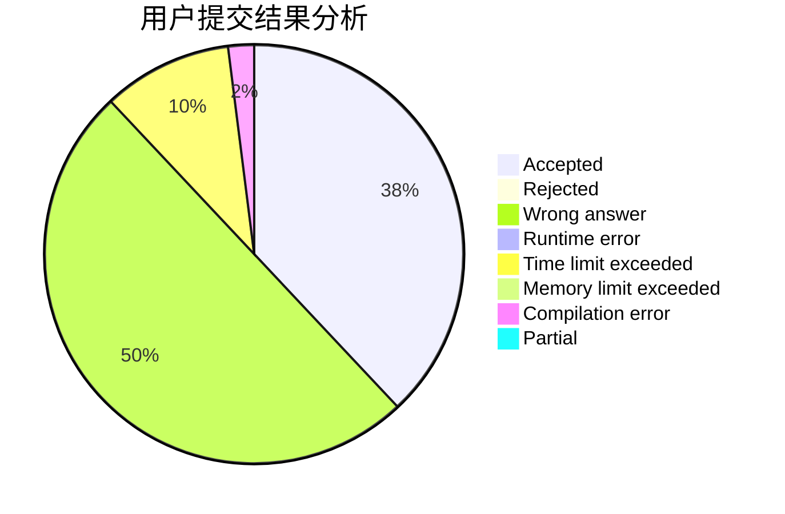
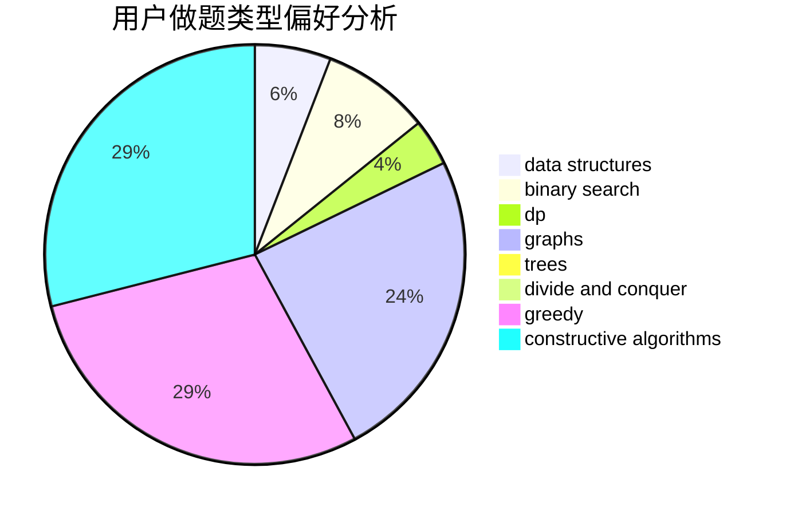

# CC_LOVE_ZZ

<!-- tabs:start -->

#### **用户提交结果分析**

#### **用户做题类型偏好分析**

#### **用户错题知识点分析**

<!-- tabs:end -->
# 推荐题目
[1311F](https://codeforces.com/contest/1311/problem/F)		data structures,
                        divide and conquer,
                        implementation,
                        sortings		  
[11C](https://codeforces.com/contest/11/problem/C)		implementation		  
[1070A](https://codeforces.com/contest/1070/problem/A)		dp,
                        graphs,
                        number theory,
                        shortest paths		  
[597C](https://codeforces.com/contest/597/problem/C)		data structures,
                        dp		  
[1510E](https://codeforces.com/contest/1510/problem/E)		nan		  
[268D](https://codeforces.com/contest/268/problem/D)		dp		  
[597B](https://codeforces.com/contest/597/problem/B)		dp,
                        greedy,
                        sortings		  
[44G](https://codeforces.com/contest/44/problem/G)		data structures,
                        implementation		  
[596A](https://codeforces.com/contest/596/problem/A)		geometry,
                        implementation		  
[455D](https://codeforces.com/contest/455/problem/D)		data structures		  
