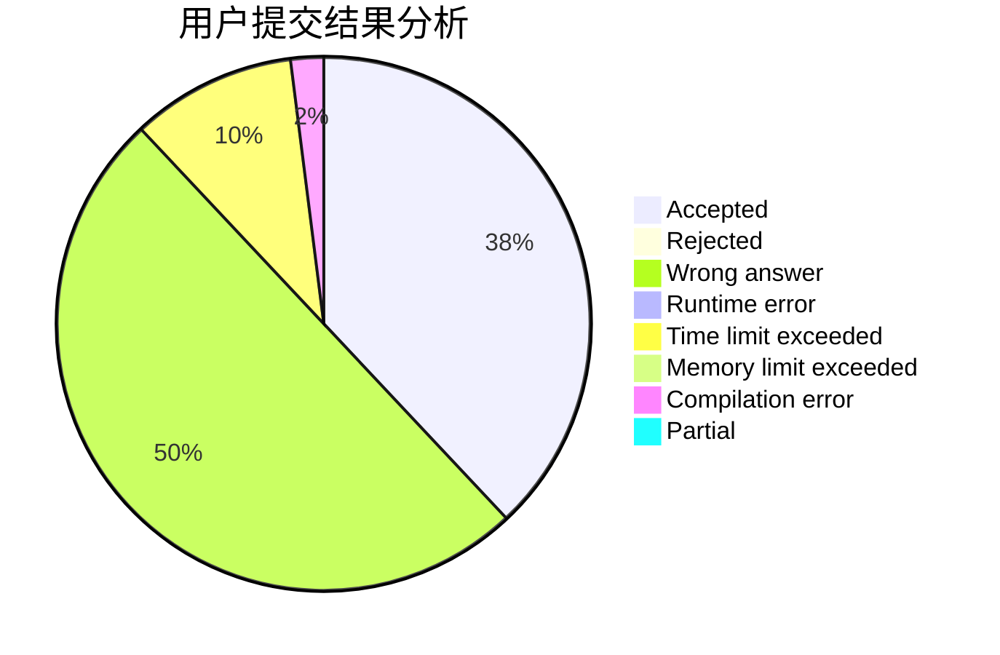
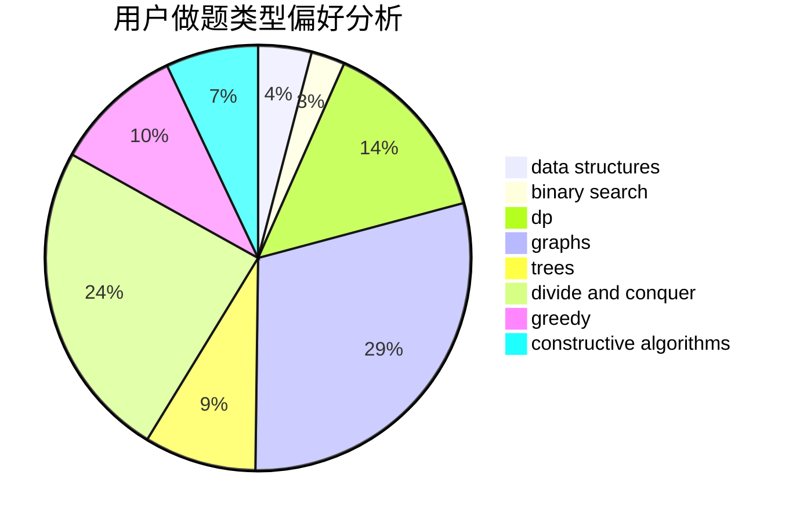

# CC_LOVE_ZZ

<!-- tabs:start -->

#### **用户提交结果分析**

#### **用户做题类型偏好分析**

#### **用户错题知识点分析**

<!-- tabs:end -->
# 推荐题目
[1321B](https://codeforces.com/contest/1321/problem/B)		dsu,graphs,sortings,trees		  
[1204A](https://codeforces.com/contest/1204/problem/A)		math		  
[1070D](https://codeforces.com/contest/1070/problem/D)		greedy		  
[614D](https://codeforces.com/contest/614/problem/D)		dsu,graphs,sortings,trees		  
[165A](https://codeforces.com/contest/165/problem/A)		implementation		  
[283E](https://codeforces.com/contest/283/problem/E)		combinatorics,
                        data structures,
                        math		  
[614A](https://codeforces.com/contest/614/problem/A)		brute force,
                        implementation		  
[472A](https://codeforces.com/contest/472/problem/A)		math,
                        number theory		  
[613A](https://codeforces.com/contest/613/problem/A)		binary search,
                        geometry,
                        ternary search		  
[476E](https://codeforces.com/contest/476/problem/E)		dp,
                        strings		  
