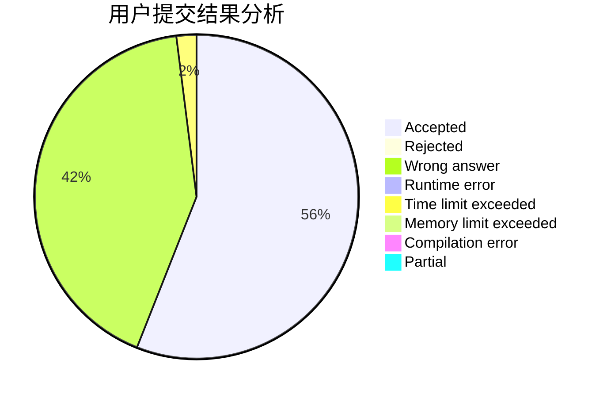
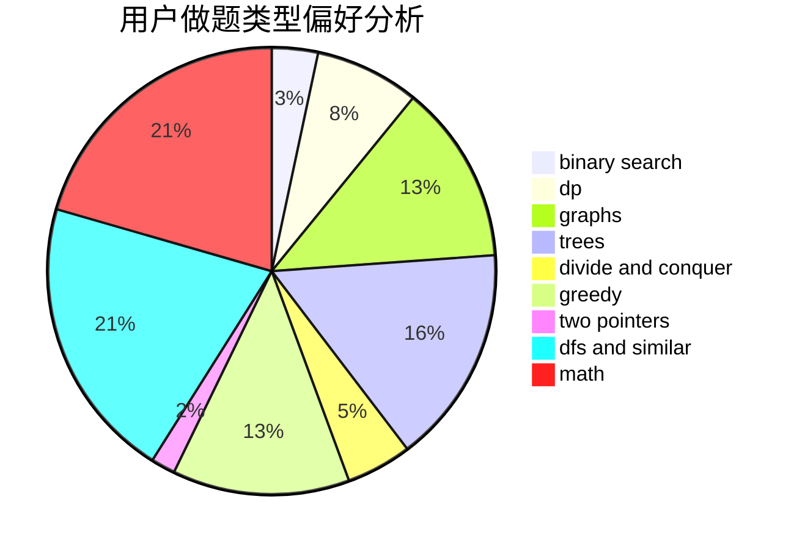

# shaozechen1999

<!-- tabs:start -->

#### **用户提交结果分析**

#### **用户做题类型偏好分析**

<!-- tabs:end -->
# 推荐题目
[1408E](https://codeforces.com/contest/1408/problem/E)
[95A](https://codeforces.com/contest/95/problem/A)
[1059B](https://codeforces.com/contest/1059/problem/B)
[287C](https://codeforces.com/contest/287/problem/C)
[566C](https://codeforces.com/contest/566/problem/C)
[12A](https://codeforces.com/contest/12/problem/A)
[939D](https://codeforces.com/contest/939/problem/D)
[1095E](https://codeforces.com/contest/1095/problem/E)
[1136E](https://codeforces.com/contest/1136/problem/E)
[497B](https://codeforces.com/contest/497/problem/B)
