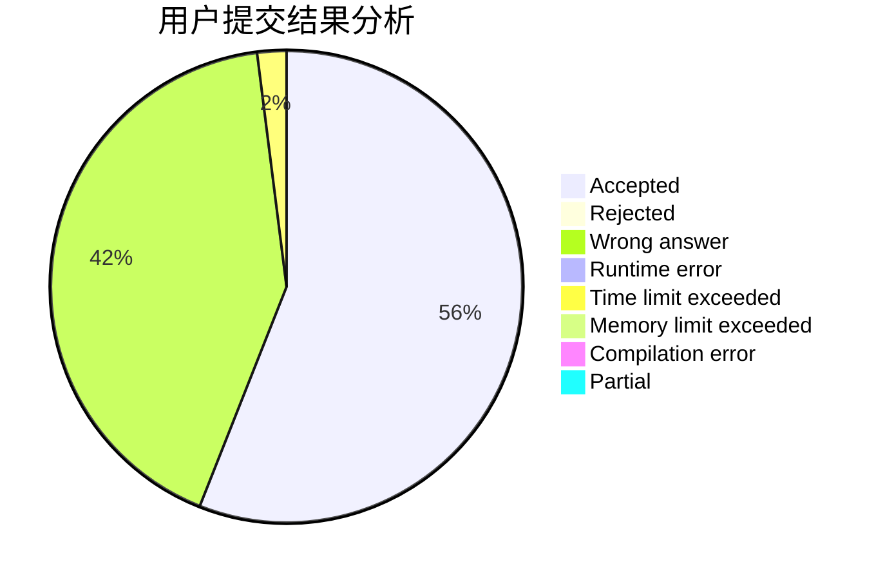
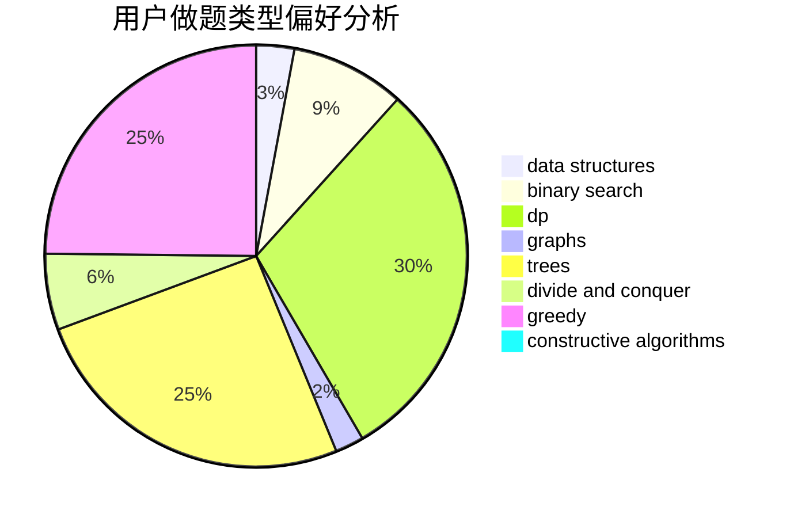

# shaozechen1999

<!-- tabs:start -->

#### **用户提交结果分析**

#### **用户做题类型偏好分析**

#### **用户错题知识点分析**

<!-- tabs:end -->
# 推荐题目
[1408E](https://codeforces.com/contest/1408/problem/E)		data structures,
                        dsu,
                        graphs,
                        greedy,
                        sortings,
                        trees		  
[95A](https://codeforces.com/contest/95/problem/A)		implementation,
                        strings		  
[1059B](https://codeforces.com/contest/1059/problem/B)		implementation		  
[287C](https://codeforces.com/contest/287/problem/C)		dsu,graphs,sortings,trees		  
[566C](https://codeforces.com/contest/566/problem/C)		dfs and similar,
                        divide and conquer,
                        trees		  
[12A](https://codeforces.com/contest/12/problem/A)		implementation		  
[939D](https://codeforces.com/contest/939/problem/D)		dfs and similar,
                        dsu,
                        graphs,
                        greedy,
                        strings		  
[1095E](https://codeforces.com/contest/1095/problem/E)		implementation		  
[1136E](https://codeforces.com/contest/1136/problem/E)		binary search,
                        data structures		  
[497B](https://codeforces.com/contest/497/problem/B)		dsu,graphs,sortings,trees		  
