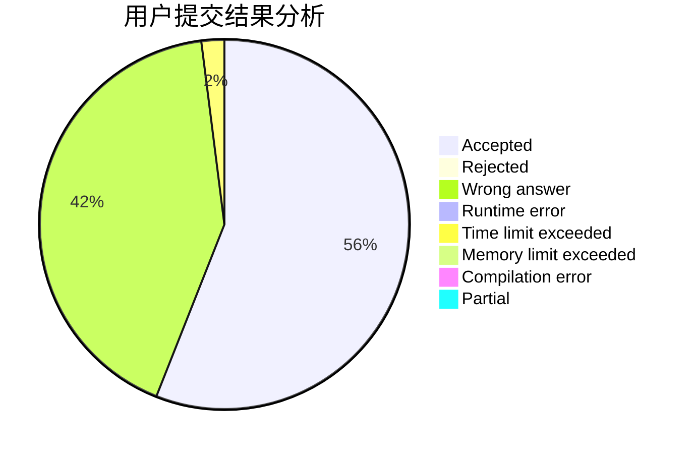
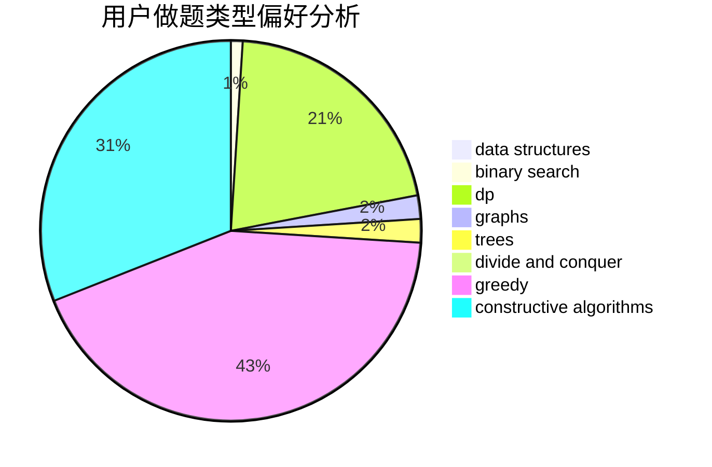
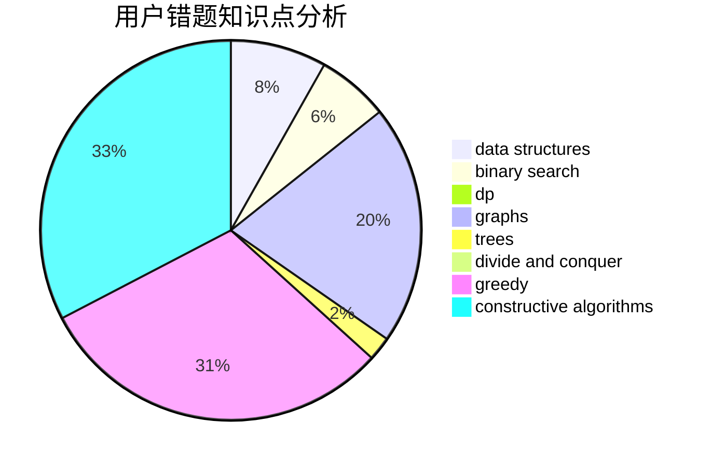

# shaozechen1999

<!-- tabs:start -->

#### **用户提交结果分析**

#### **用户做题类型偏好分析**

#### **用户错题知识点分析**

<!-- tabs:end -->
# 推荐题目
[1399D](https://codeforces.com/contest/1399/problem/D)		constructive algorithms,
                        data structures,
                        greedy,
                        implementation		  
[938B](https://codeforces.com/contest/938/problem/B)		brute force,
                        greedy		  
[1058D](https://codeforces.com/contest/1058/problem/D)		dsu,graphs,sortings,trees		  
[271A](https://codeforces.com/contest/271/problem/A)		brute force		  
[540B](https://codeforces.com/contest/540/problem/B)		greedy,
                        implementation		  
[1292F](https://codeforces.com/contest/1292/problem/F)		bitmasks,
                        combinatorics,
                        dp		  
[919C](https://codeforces.com/contest/919/problem/C)		brute force,
                        implementation		  
[1095B](https://codeforces.com/contest/1095/problem/B)		implementation		  
[1132F](https://codeforces.com/contest/1132/problem/F)		dp		  
[477B](https://codeforces.com/contest/477/problem/B)		dsu,graphs,sortings,trees		  
