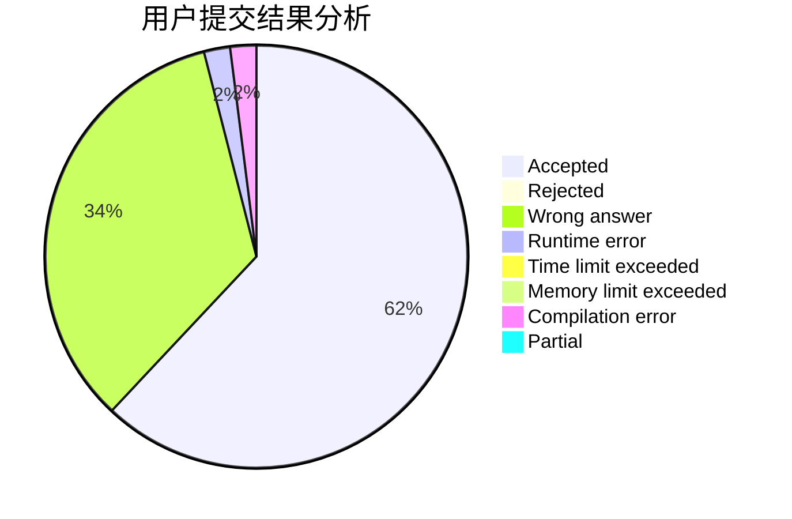
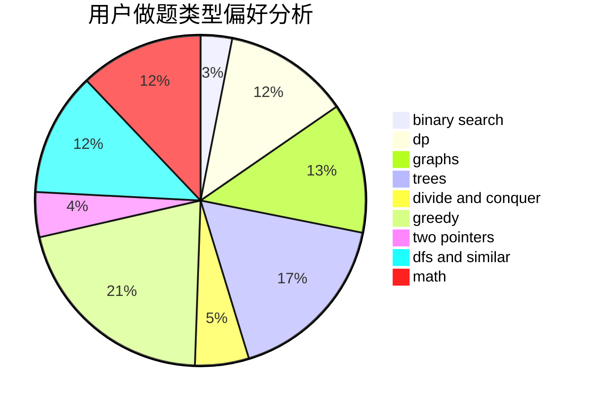

# shaozhihang_01

<!-- tabs:start -->

#### **用户提交结果分析**

#### **用户做题类型偏好分析**

<!-- tabs:end -->
# 推荐题目
[1315D](https://codeforces.com/contest/1315/problem/D)
[990F](https://codeforces.com/contest/990/problem/F)
[519D](https://codeforces.com/contest/519/problem/D)
[20A](https://codeforces.com/contest/20/problem/A)
[220C](https://codeforces.com/contest/220/problem/C)
[2C](https://codeforces.com/contest/2/problem/C)
[1230F](https://codeforces.com/contest/1230/problem/F)
[227A](https://codeforces.com/contest/227/problem/A)
[1141B](https://codeforces.com/contest/1141/problem/B)
[986A](https://codeforces.com/contest/986/problem/A)
