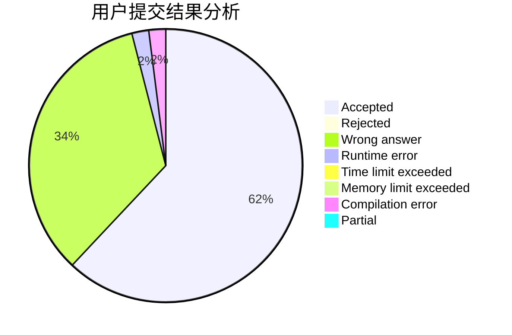
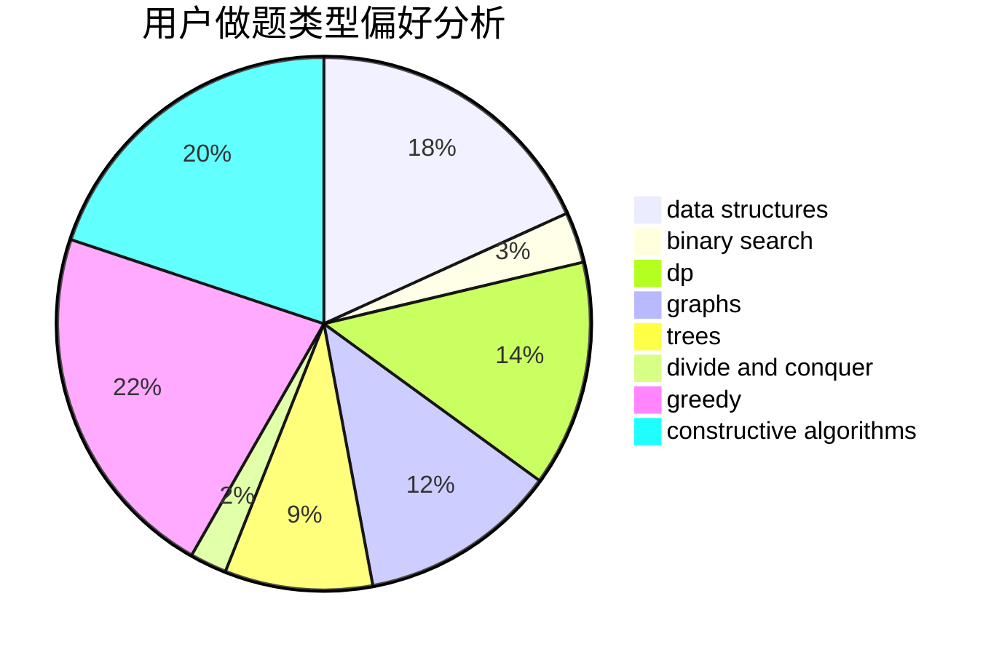
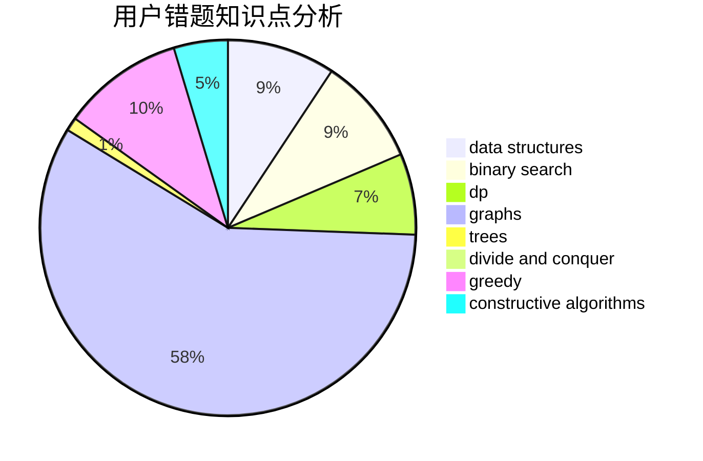

# shaozhihang_01

<!-- tabs:start -->

#### **用户提交结果分析**

#### **用户做题类型偏好分析**

#### **用户错题知识点分析**

<!-- tabs:end -->
# 推荐题目
[1315D](https://codeforces.com/contest/1315/problem/D)		dsu,graphs,sortings,trees		  
[990F](https://codeforces.com/contest/990/problem/F)		dfs and similar,
                        dp,
                        greedy,
                        trees		  
[519D](https://codeforces.com/contest/519/problem/D)		data structures,
                        dp,
                        two pointers		  
[20A](https://codeforces.com/contest/20/problem/A)		implementation		  
[220C](https://codeforces.com/contest/220/problem/C)		data structures		  
[2C](https://codeforces.com/contest/2/problem/C)		geometry		  
[1230F](https://codeforces.com/contest/1230/problem/F)		dsu,graphs,sortings,trees		  
[227A](https://codeforces.com/contest/227/problem/A)		geometry		  
[1141B](https://codeforces.com/contest/1141/problem/B)		implementation		  
[986A](https://codeforces.com/contest/986/problem/A)		graphs,
                        greedy,
                        number theory,
                        shortest paths		  
