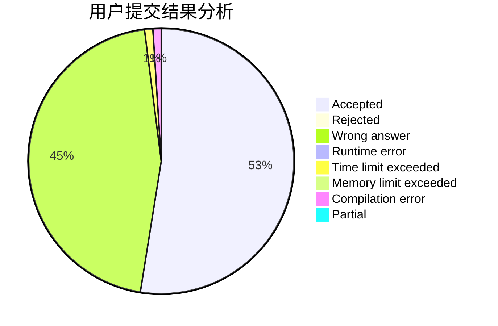
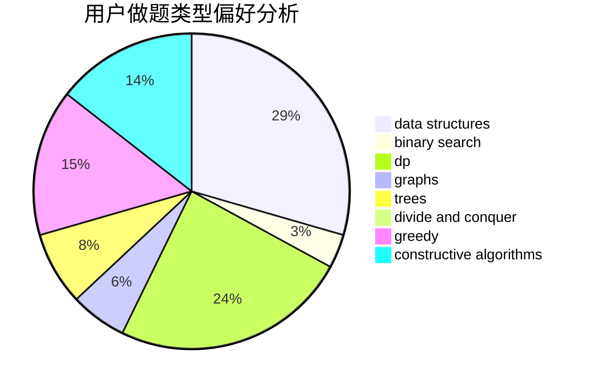
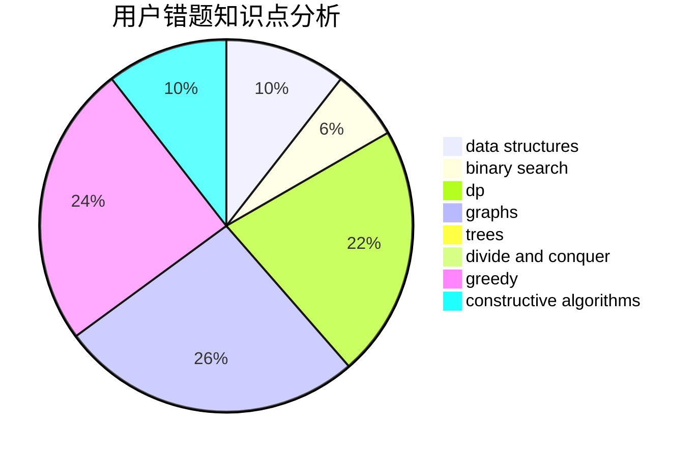

# shark162799

<!-- tabs:start -->

#### **用户提交结果分析**

#### **用户做题类型偏好分析**

#### **用户错题知识点分析**

<!-- tabs:end -->
# 推荐题目
[848C](https://codeforces.com/contest/848/problem/C)		data structures,
                        divide and conquer		  
[12131](https://codeforces.com/contest/1213/problem/1)		dsu,graphs,sortings,trees		  
[346E](https://codeforces.com/contest/346/problem/E)		math,
                        number theory		  
[454A](https://codeforces.com/contest/454/problem/A)		implementation		  
[388E](https://codeforces.com/contest/388/problem/E)		geometry		  
[767D](https://codeforces.com/contest/767/problem/D)		binary search,
                        data structures,
                        greedy,
                        sortings,
                        two pointers		  
[956A](https://codeforces.com/contest/956/problem/A)		dsu,graphs,sortings,trees		  
[665F](https://codeforces.com/contest/665/problem/F)		data structures,
                        dp,
                        math,
                        number theory,
                        sortings,
                        two pointers		  
[550C](https://codeforces.com/contest/550/problem/C)		brute force,
                        dp,
                        math		  
[1008D](https://codeforces.com/contest/1008/problem/D)		dsu,graphs,sortings,trees		  
