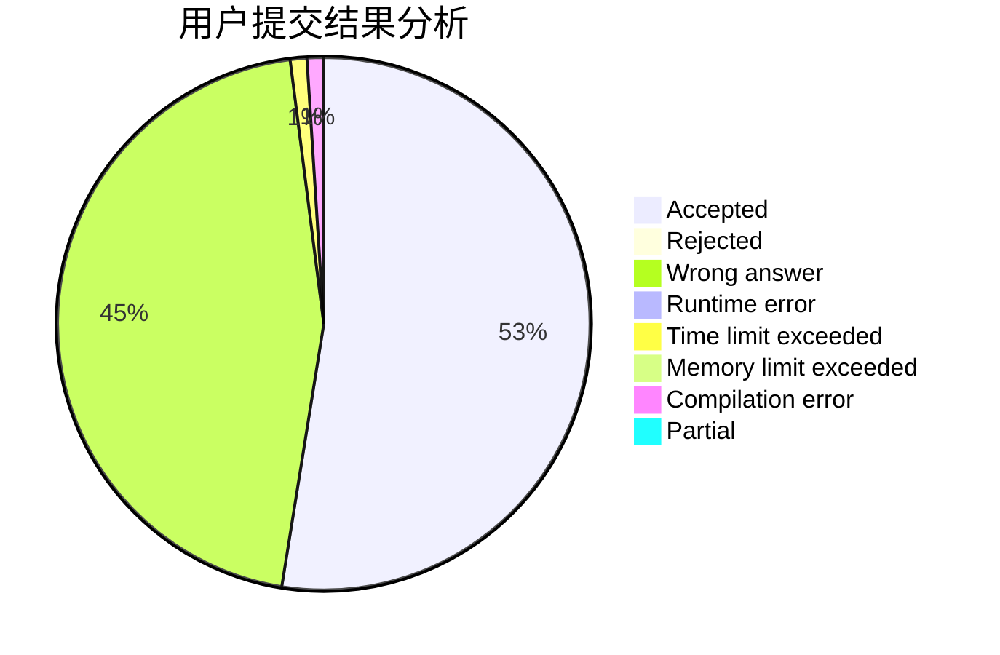
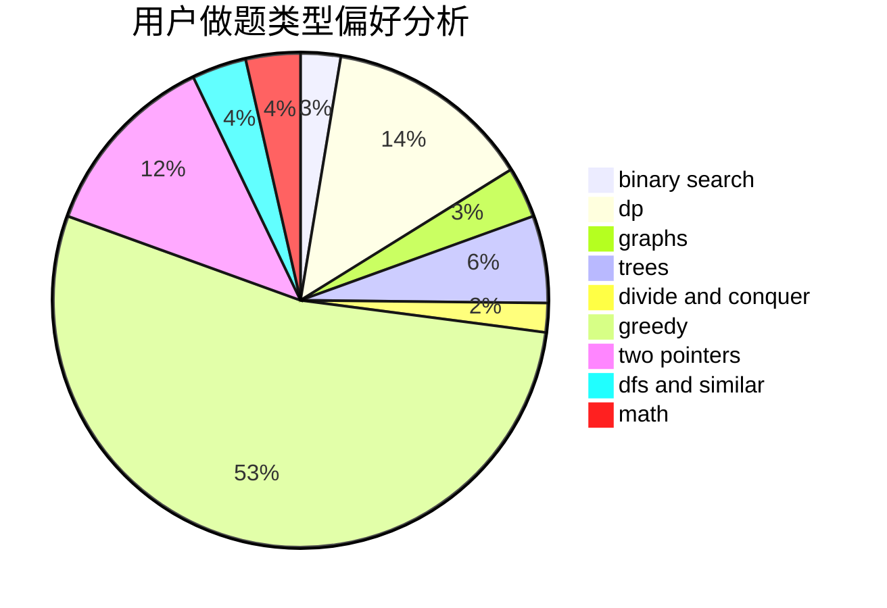

# shark162799

<!-- tabs:start -->

#### **用户提交结果分析**

#### **用户做题类型偏好分析**

<!-- tabs:end -->
# 推荐题目
[848C](https://codeforces.com/contest/848/problem/C)
[12131](https://codeforces.com/contest/1213/problem/1)
[346E](https://codeforces.com/contest/346/problem/E)
[454A](https://codeforces.com/contest/454/problem/A)
[388E](https://codeforces.com/contest/388/problem/E)
[767D](https://codeforces.com/contest/767/problem/D)
[956A](https://codeforces.com/contest/956/problem/A)
[665F](https://codeforces.com/contest/665/problem/F)
[550C](https://codeforces.com/contest/550/problem/C)
[1008D](https://codeforces.com/contest/1008/problem/D)
