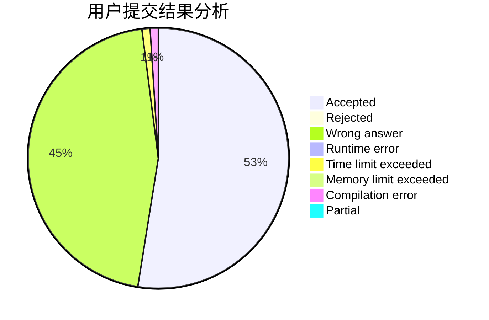
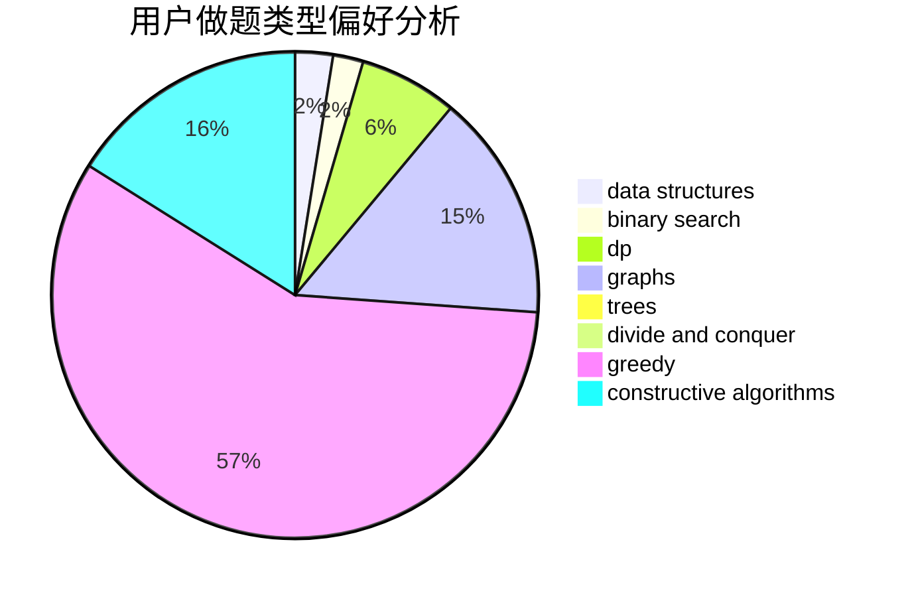
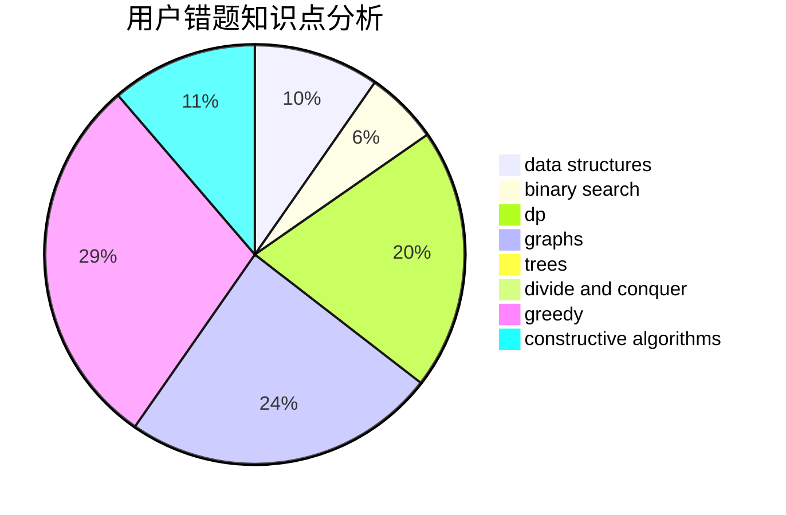

# shark162799

<!-- tabs:start -->

#### **用户提交结果分析**

#### **用户做题类型偏好分析**

#### **用户错题知识点分析**

<!-- tabs:end -->
# 推荐题目
[830C](https://codeforces.com/contest/830/problem/C)		brute force,
                        data structures,
                        implementation,
                        math,
                        number theory,
                        sortings,
                        two pointers		  
[1207C](https://codeforces.com/contest/1207/problem/C)		dp,
                        greedy		  
[317C](https://codeforces.com/contest/317/problem/C)		constructive algorithms,
                        dfs and similar,
                        graphs,
                        trees		  
[434A](https://codeforces.com/contest/434/problem/A)		dsu,graphs,sortings,trees		  
[360D](https://codeforces.com/contest/360/problem/D)		number theory		  
[748C](https://codeforces.com/contest/748/problem/C)		constructive algorithms,
                        math		  
[934B](https://codeforces.com/contest/934/problem/B)		constructive algorithms,
                        implementation		  
[633D](https://codeforces.com/contest/633/problem/D)		brute force,
                        dp,
                        hashing,
                        implementation,
                        math		  
[526D](https://codeforces.com/contest/526/problem/D)		hashing,
                        string suffix structures,
                        strings		  
[1008A](https://codeforces.com/contest/1008/problem/A)		implementation,
                        strings		  
