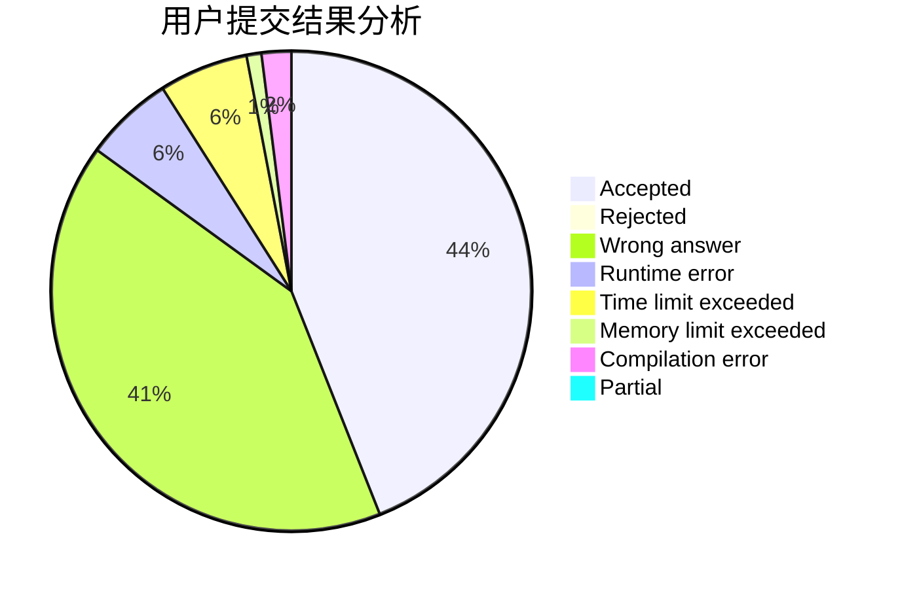
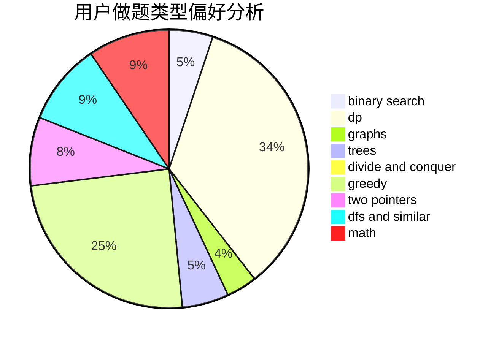

# shb123

<!-- tabs:start -->

#### **用户提交结果分析**

#### **用户做题类型偏好分析**

<!-- tabs:end -->
# 推荐题目
[750F](https://codeforces.com/contest/750/problem/F)
[789C](https://codeforces.com/contest/789/problem/C)
[645D](https://codeforces.com/contest/645/problem/D)
[334B](https://codeforces.com/contest/334/problem/B)
[476C](https://codeforces.com/contest/476/problem/C)
[1250A](https://codeforces.com/contest/1250/problem/A)
[117D](https://codeforces.com/contest/117/problem/D)
[389A](https://codeforces.com/contest/389/problem/A)
[988C](https://codeforces.com/contest/988/problem/C)
[1336A](https://codeforces.com/contest/1336/problem/A)
