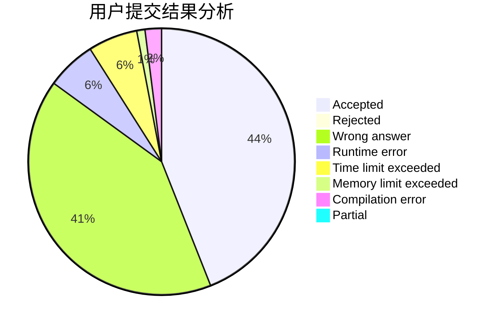
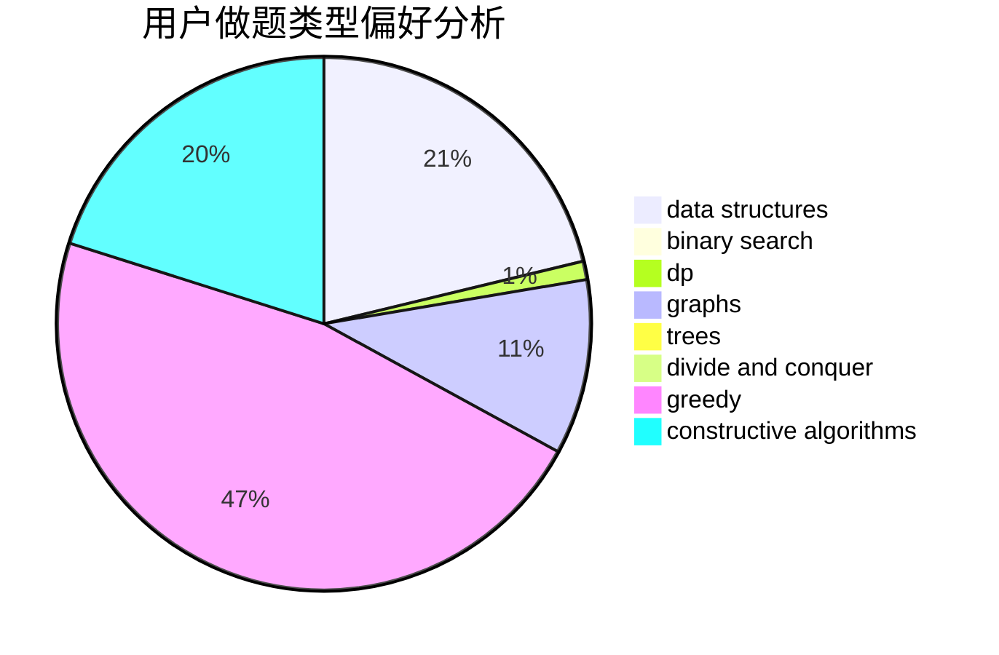
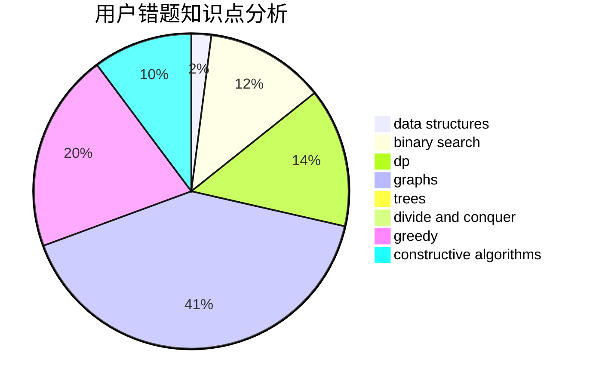

# shb123

<!-- tabs:start -->

#### **用户提交结果分析**

#### **用户做题类型偏好分析**

#### **用户错题知识点分析**

<!-- tabs:end -->
# 推荐题目
[750F](https://codeforces.com/contest/750/problem/F)		constructive algorithms,
                        implementation,
                        interactive,
                        trees		  
[789C](https://codeforces.com/contest/789/problem/C)		dsu,graphs,sortings,trees		  
[645D](https://codeforces.com/contest/645/problem/D)		binary search,
                        dp,
                        graphs		  
[334B](https://codeforces.com/contest/334/problem/B)		sortings		  
[476C](https://codeforces.com/contest/476/problem/C)		math		  
[1250A](https://codeforces.com/contest/1250/problem/A)		implementation		  
[117D](https://codeforces.com/contest/117/problem/D)		divide and conquer,
                        math		  
[389A](https://codeforces.com/contest/389/problem/A)		greedy,
                        math		  
[988C](https://codeforces.com/contest/988/problem/C)		implementation,
                        sortings		  
[1336A](https://codeforces.com/contest/1336/problem/A)		dfs and similar,
                        dp,
                        greedy,
                        sortings,
                        trees		  
