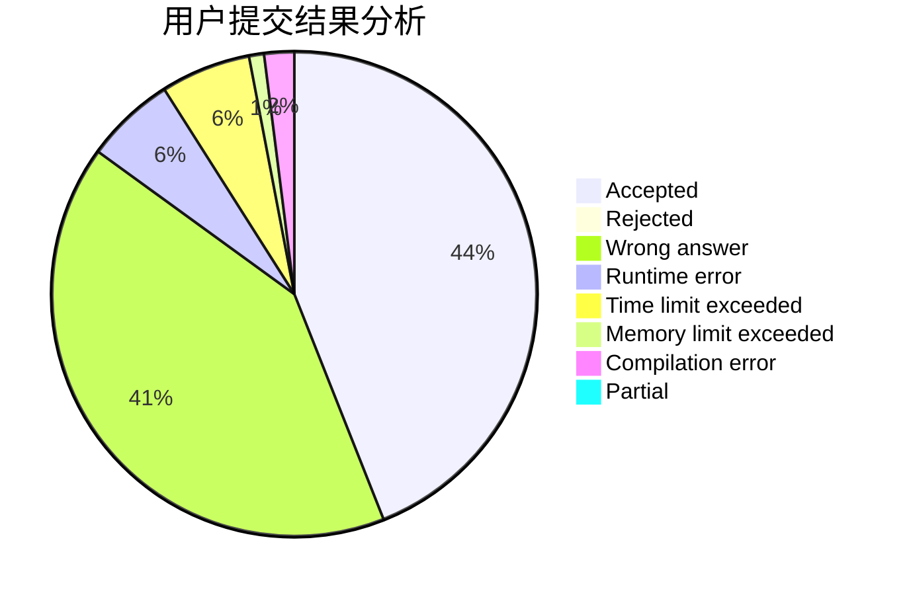
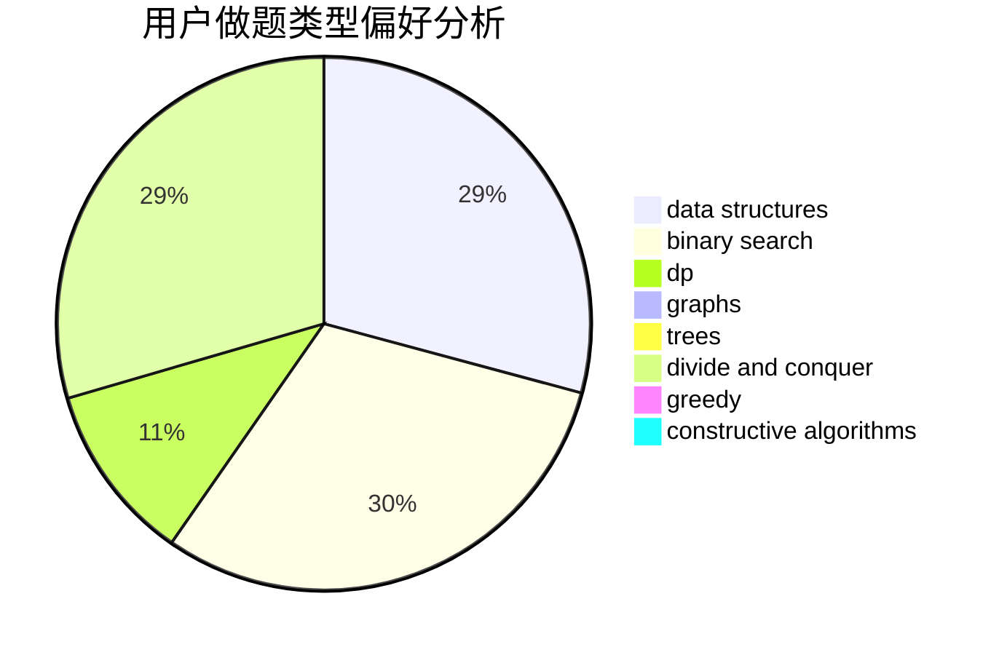
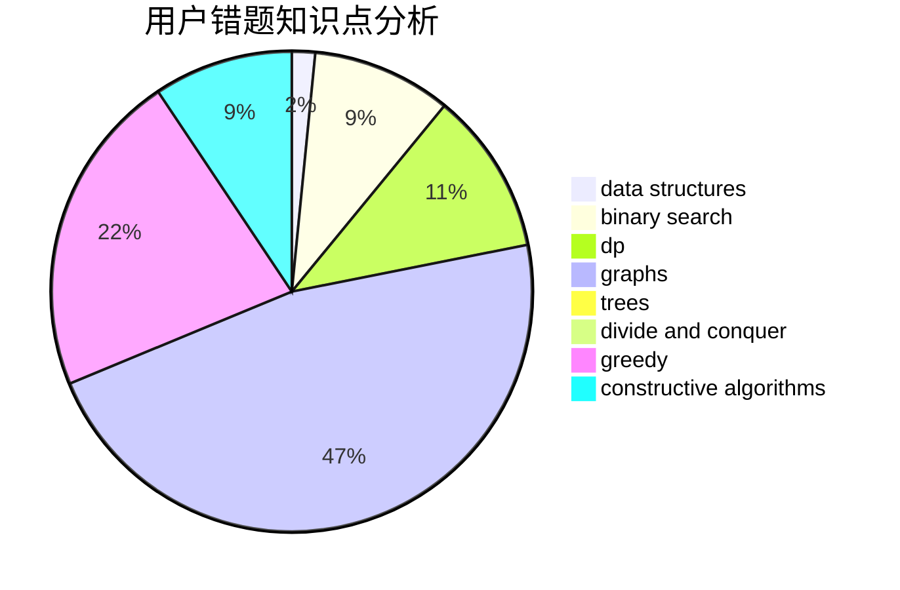

# shb123

<!-- tabs:start -->

#### **用户提交结果分析**

#### **用户做题类型偏好分析**

#### **用户错题知识点分析**

<!-- tabs:end -->
# 推荐题目
[733A](https://codeforces.com/contest/733/problem/A)		implementation		  
[76B](https://codeforces.com/contest/76/problem/B)		greedy,
                        two pointers		  
[621B](https://codeforces.com/contest/621/problem/B)		combinatorics,
                        implementation		  
[311B](https://codeforces.com/contest/311/problem/B)		data structures,
                        dp		  
[455B](https://codeforces.com/contest/455/problem/B)		dfs and similar,
                        dp,
                        games,
                        implementation,
                        strings,
                        trees		  
[1244F](https://codeforces.com/contest/1244/problem/F)		constructive algorithms,
                        implementation		  
[1176F](https://codeforces.com/contest/1176/problem/F)		dp,
                        implementation,
                        sortings		  
[360E](https://codeforces.com/contest/360/problem/E)		graphs,
                        greedy,
                        shortest paths		  
[966E](https://codeforces.com/contest/966/problem/E)		dsu,graphs,sortings,trees		  
[1330A](https://codeforces.com/contest/1330/problem/A)		implementation		  
