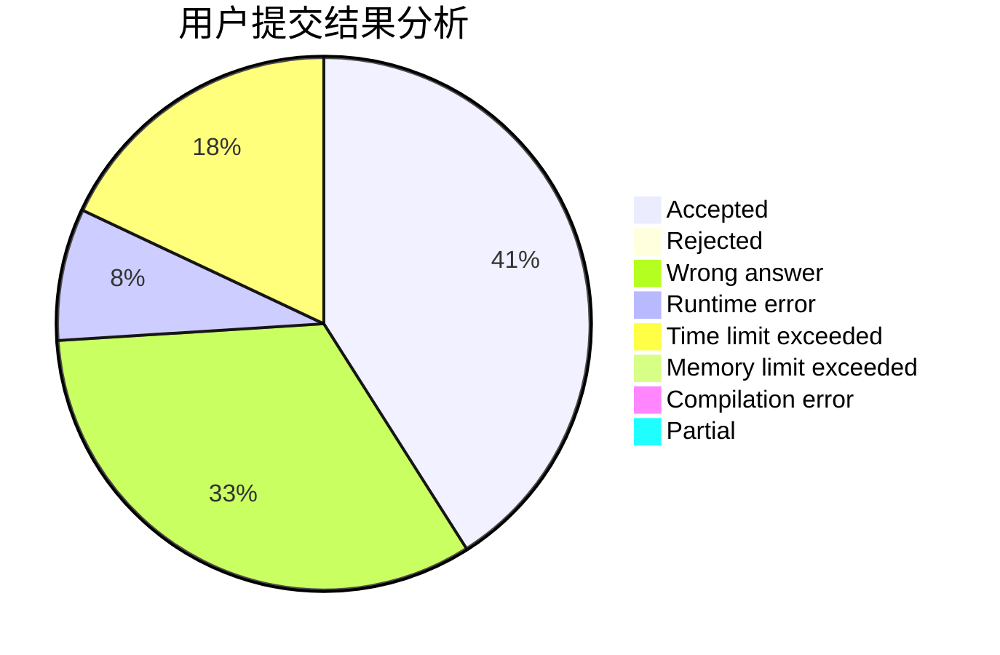
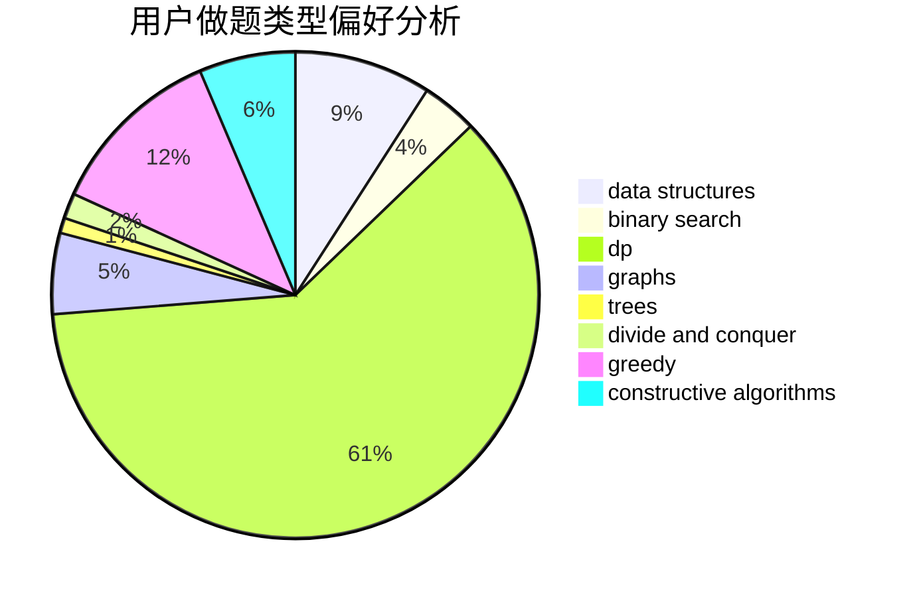

# shehebe

<!-- tabs:start -->

#### **用户提交结果分析**

#### **用户做题类型偏好分析**

#### **用户错题知识点分析**

<!-- tabs:end -->
# 推荐题目
[818D](https://codeforces.com/contest/818/problem/D)		data structures,
                        implementation		  
[1004C](https://codeforces.com/contest/1004/problem/C)		constructive algorithms,
                        implementation		  
[329B](https://codeforces.com/contest/329/problem/B)		dfs and similar,
                        shortest paths		  
[136C](https://codeforces.com/contest/136/problem/C)		dsu,graphs,sortings,trees		  
[190C](https://codeforces.com/contest/190/problem/C)		dfs and similar		  
[801C](https://codeforces.com/contest/801/problem/C)		dsu,graphs,sortings,trees		  
[601A](https://codeforces.com/contest/601/problem/A)		graphs,
                        shortest paths		  
[27A](https://codeforces.com/contest/27/problem/A)		implementation,
                        sortings		  
[544A](https://codeforces.com/contest/544/problem/A)		implementation,
                        strings		  
[218D](https://codeforces.com/contest/218/problem/D)		dsu,graphs,sortings,trees		  
