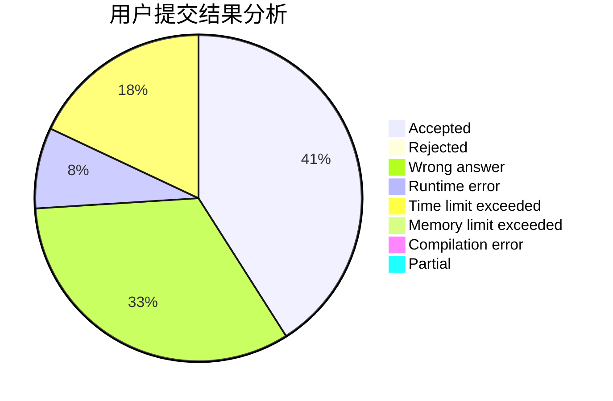
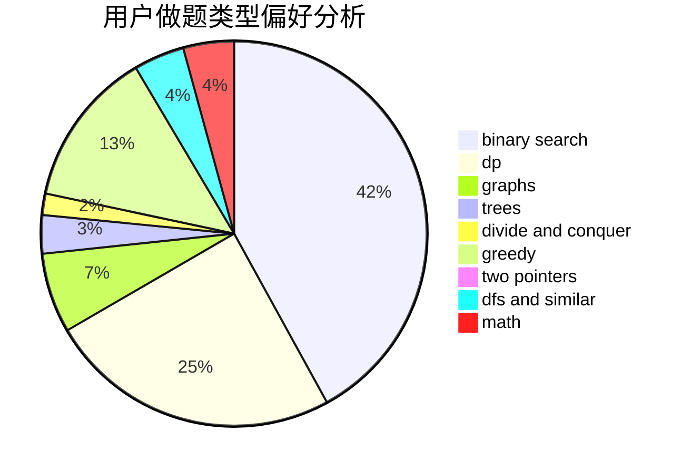

# shehebe

<!-- tabs:start -->

#### **用户提交结果分析**

#### **用户做题类型偏好分析**

<!-- tabs:end -->
# 推荐题目
[818D](https://codeforces.com/contest/818/problem/D)
[1004C](https://codeforces.com/contest/1004/problem/C)
[329B](https://codeforces.com/contest/329/problem/B)
[136C](https://codeforces.com/contest/136/problem/C)
[190C](https://codeforces.com/contest/190/problem/C)
[801C](https://codeforces.com/contest/801/problem/C)
[601A](https://codeforces.com/contest/601/problem/A)
[27A](https://codeforces.com/contest/27/problem/A)
[544A](https://codeforces.com/contest/544/problem/A)
[218D](https://codeforces.com/contest/218/problem/D)
