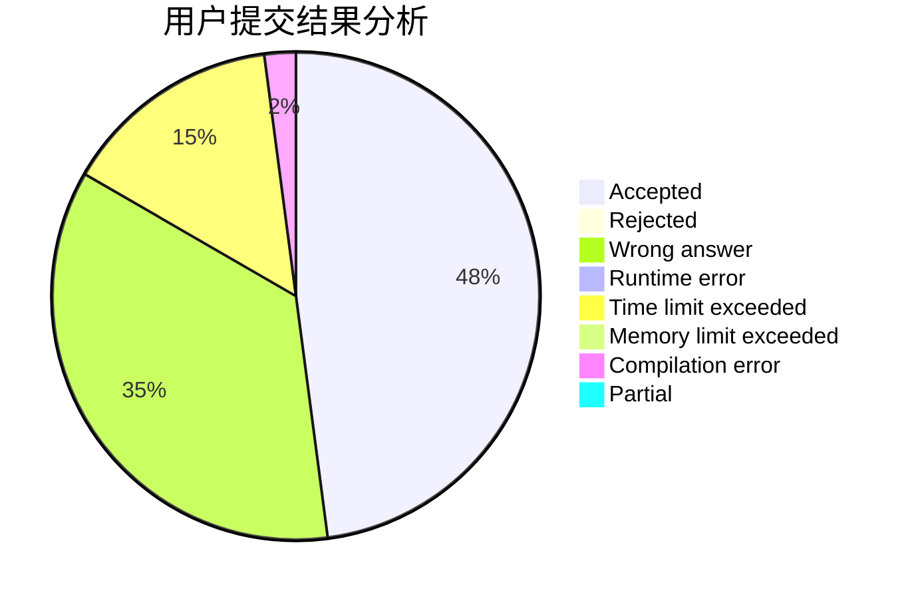
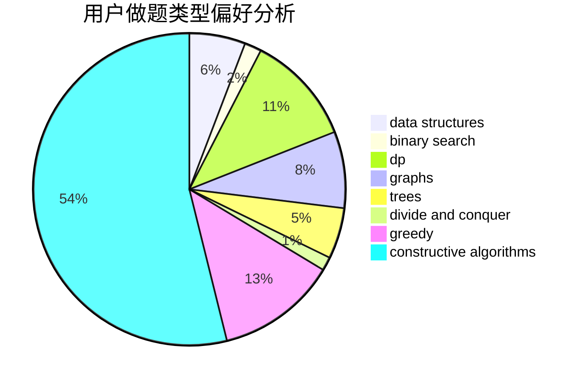
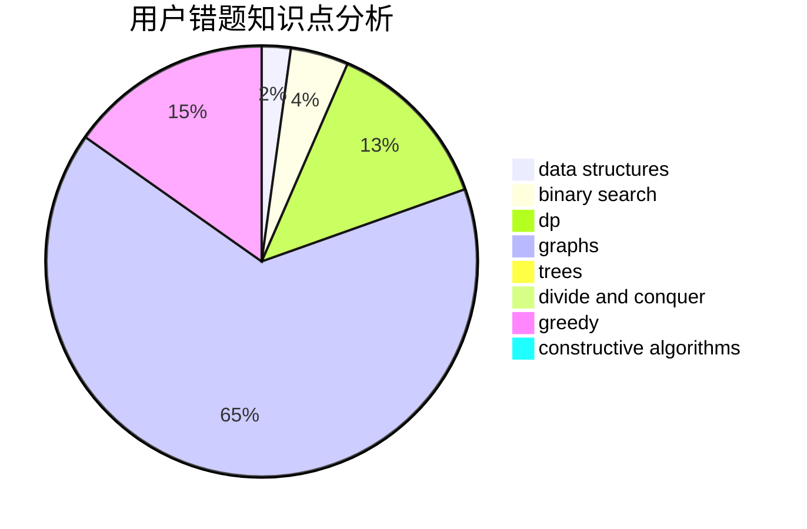

# shenfc

<!-- tabs:start -->

#### **用户提交结果分析**

#### **用户做题类型偏好分析**

#### **用户错题知识点分析**

<!-- tabs:end -->
# 推荐题目
[1396B](https://codeforces.com/contest/1396/problem/B)		brute force,
                        constructive algorithms,
                        games,
                        greedy		  
[1278F](https://codeforces.com/contest/1278/problem/F)		combinatorics,
                        dp,
                        math,
                        number theory,
                        probabilities		  
[1141D](https://codeforces.com/contest/1141/problem/D)		greedy,
                        implementation		  
[327A](https://codeforces.com/contest/327/problem/A)		brute force,
                        dp,
                        implementation		  
[911A](https://codeforces.com/contest/911/problem/A)		implementation		  
[1088B](https://codeforces.com/contest/1088/problem/B)		implementation,
                        sortings		  
[1151C](https://codeforces.com/contest/1151/problem/C)		constructive algorithms,
                        math		  
[1065F](https://codeforces.com/contest/1065/problem/F)		dfs and similar,
                        dp,
                        trees		  
[866E](https://codeforces.com/contest/866/problem/E)		dsu,graphs,sortings,trees		  
[505B](https://codeforces.com/contest/505/problem/B)		dfs and similar,
                        dp,
                        dsu,
                        graphs		  
