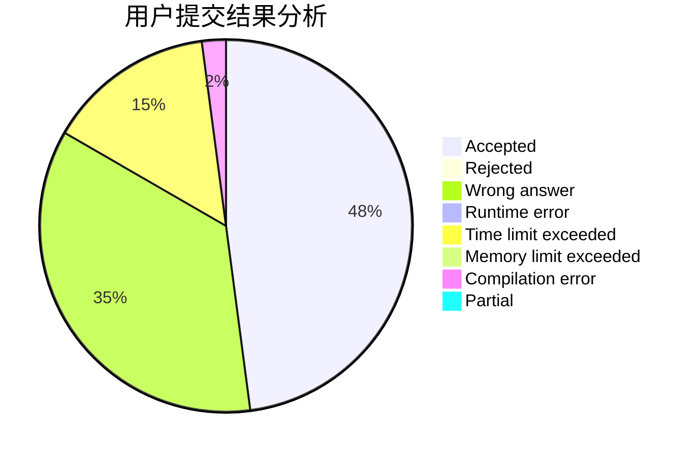
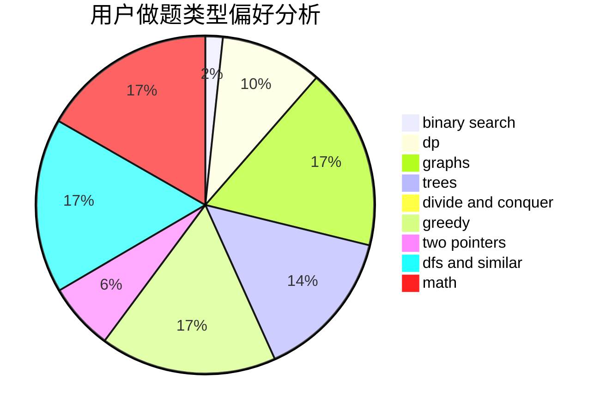

# shenfc

<!-- tabs:start -->

#### **用户提交结果分析**

#### **用户做题类型偏好分析**

<!-- tabs:end -->
# 推荐题目
[1396B](https://codeforces.com/contest/1396/problem/B)
[1278F](https://codeforces.com/contest/1278/problem/F)
[1141D](https://codeforces.com/contest/1141/problem/D)
[327A](https://codeforces.com/contest/327/problem/A)
[911A](https://codeforces.com/contest/911/problem/A)
[1088B](https://codeforces.com/contest/1088/problem/B)
[1151C](https://codeforces.com/contest/1151/problem/C)
[1065F](https://codeforces.com/contest/1065/problem/F)
[866E](https://codeforces.com/contest/866/problem/E)
[505B](https://codeforces.com/contest/505/problem/B)
